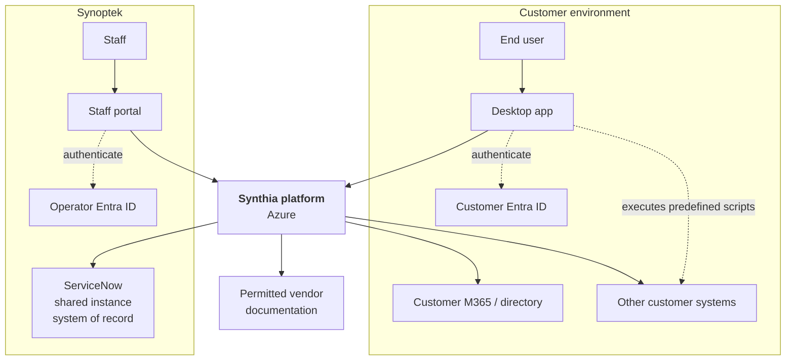
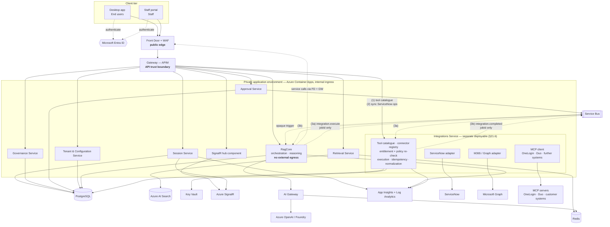
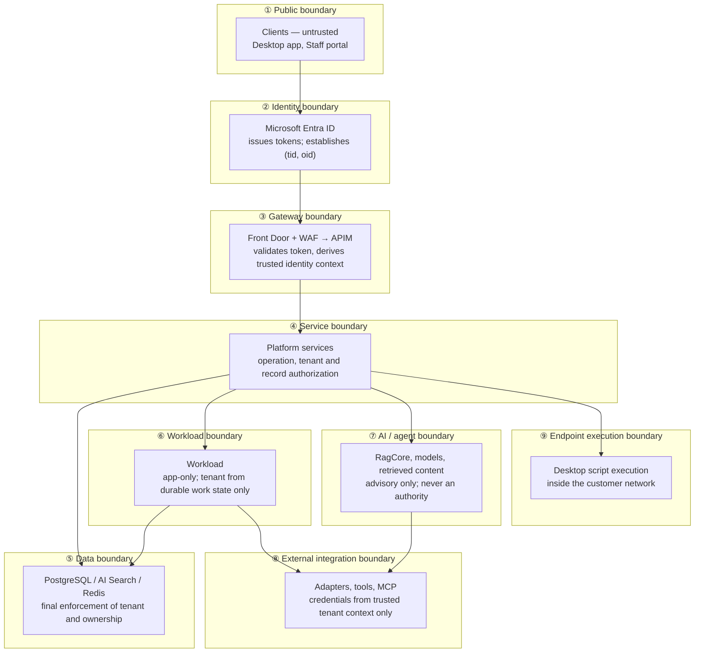
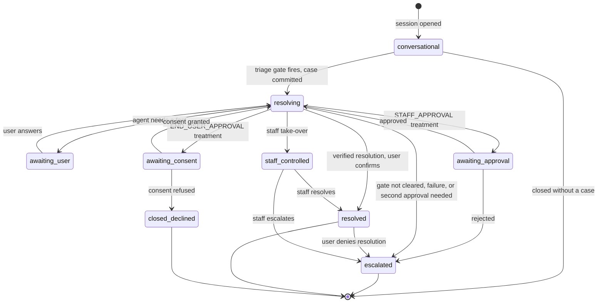
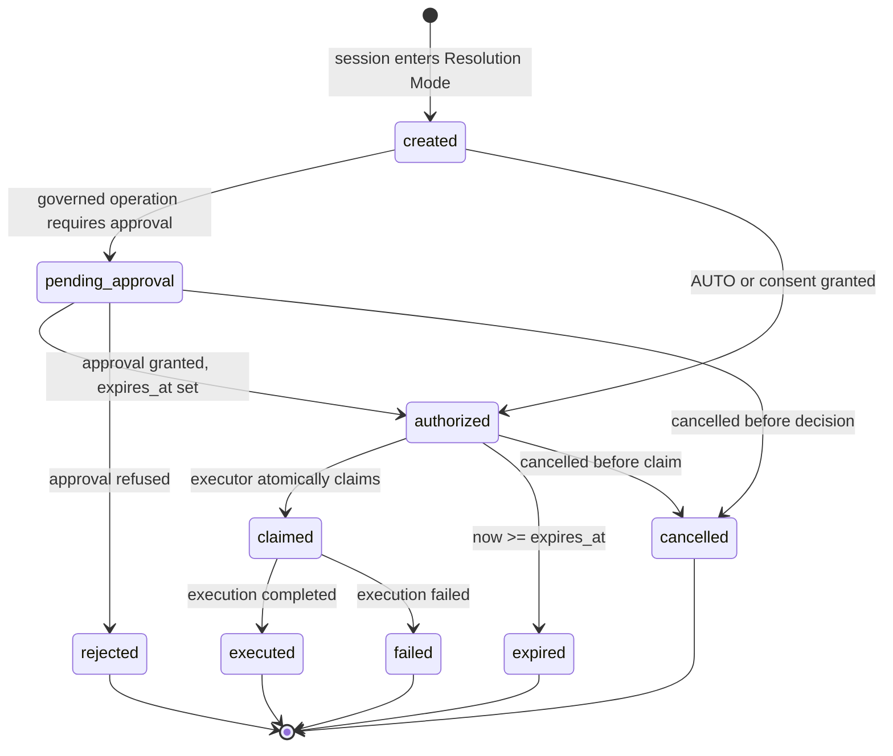
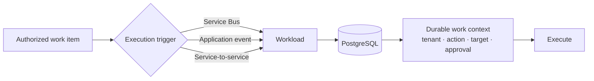
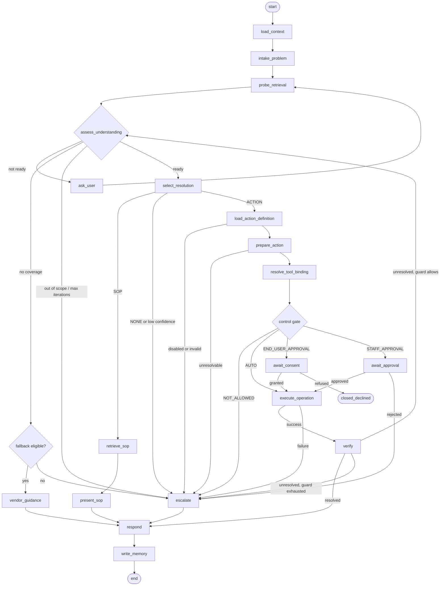
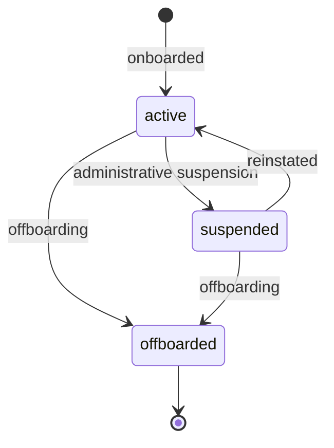

# Synthia — Platform Functional & Architecture Specification

**Status:** Reconciled source of truth
**Supersedes for reconciliation purposes:** Identity Plane, Synthia Overall Architecture Rev 1.0, RAG & Agentic Architecture v1.1, Synthia Product Functional Specification Alpha v0.2
**Date of reconciliation:** 15 September 2026
**Classification:** Confidential — Synoptek

---

## 1. Document Purpose

This document is the single reconciled Functional and Architecture Specification for the Synthia platform. It resolves the contradictions, terminology drift and duplicated decisions across four source documents written at different stages, and establishes exactly one architecture, one identity model, one tenancy model and one authorization model.

It is the authoritative input for the engineering phases that follow: database and schema design, service identification, service and API boundaries, asynchronous workflow design, RAG and agent implementation, security and authorization implementation, project scaffolding, and subsequent technical design documents.

It deliberately stops short of those activities. Where a decision belongs downstream, this document states the stable architectural constraint the downstream artefact must satisfy, not the artefact itself.

Nothing in this document is an assumption unless it is explicitly labelled as one. Seven material ambiguities in the source set were resolved by direct decision and are recorded in §39 with their answers. Residual items that could not be derived are in §40 and are labelled as open, not as settled.

---

## 2. Scope

### 2.1 In scope for this document

The complete functional and architectural model of the platform: actors, tenancy, identity, authorization, client surfaces, gateway and API boundaries, application services, the chat/session/work model, approval, background execution, retrieval, agent orchestration, tool and external integration, data ownership, isolation, realtime delivery, asynchronous messaging, audit, error handling, tenant lifecycle, canonical workflows and state models.

### 2.2 In scope for the Alpha build

| Capability | Alpha |
|---|---|
| Desktop app (Electron) with SSO and persistent session | In |
| Staff portal (Synthia Console) — Mission Control and Synthia Admin modules | In |
| Agent orchestration with control gate and approval | In |
| Retrieval over SOP/KB and historic incident corpora, tenant-scoped | In |
| Out-of-knowledge vendor-documentation fallback | In |
| Single-group approval workflow, platform-authoritative | In |
| Server-side execution through adapters and tools | In |
| Desktop execution of predefined scripts | In (§18.6) |
| ServiceNow as system of record, mirrored approvals | In |
| Microsoft Graph directory and productivity operations | In |
| Tenant registry with onboarding, suspension and offboarding operations | In |
| Thumbs-up/down feedback | In |

### 2.3 Explicitly out of scope

Listed in full with rationale in §37.

---

## 3. Source Documents and Precedence

### 3.1 Sources

| Rank | Document | Version / date | Role in this reconciliation |
|---|---|---|---|
| 1 | Synoptek Identity Plane | Architecture of record | Canonical identity, tenancy, trust and authority model |
| 2 | Synthia Overall Architecture | Rev 1.0, 27 Aug 2026 | Canonical platform structure, principles P01–P16, zones, integration model |
| 3 | RAG & Agentic Architecture | v1.1, 4 Sep 2026 | Canonical agent graph, retrieval design and evaluation model |
| 4 | Synthia Product Functional Specification | Alpha v0.2, 3 Sep 2026 | Canonical product behaviour and Alpha scope |

### 3.2 Precedence rule

```text
Identity Plane  >  Overall Architecture  >  RAG / Agent  >  Functional
```

A higher-precedence document overrides a lower one on conflict. Lower-precedence detail is preserved wherever it does not contradict the higher decision. Where a lower-precedence document contained a requirement that could not coexist with the Identity Plane, the conflict was raised as a question and decided rather than resolved silently. All such decisions are in §39.

### 3.3 Standing rule for this document's successors

This specification is now the single architecture source of truth for the platform. The Identity Plane remains normative for identity and trust and this document conforms to it; where this document adds detail, that detail is subordinate to the Identity Plane and must be amended there first if an identity rule needs to change.

Implementation documents — provisioning runbooks, POC plans, service designs, schema designs — derive from this document. They must never introduce or redefine an architectural rule of their own. If an implementation requirement conflicts with this document, implementation stops and the architecture is resolved first.

---

## 4. Canonical Terminology

Every concept has exactly one name. Synonyms from the sources are recorded only to show what they map to; they do not appear anywhere else in this document.

### 4.1 Principals and tenancy

| Canonical term | Meaning | Retired synonyms |
|---|---|---|
| **Operator tenant** | Synoptek's own Microsoft Entra tenant | Synoptek Entra plane |
| **Customer** | Any Entra tenant other than the Operator tenant that uses the platform | client org, customer plane |
| **Tenant** | A customer identity boundary represented by an Entra `tid` | — |
| **End user** | Any person acting on a customer surface, including a Synoptek employee doing so | customer end-user, service recipient |
| **Staff** | A Synoptek user holding one or more of `technician`, `senior_technician`, `administrator` | operator, technician/admin, human service agent |
| **Workload** | The non-human execution principal: managed identity, app-only token | Synthia AI agents (service identity), Automation Service, background driver *as a principal* |
| **`tid`** | Entra tenant ID from a validated human token | — |
| **`oid`** | Entra object ID of the acting user or workload service principal | — |

### 4.2 Surfaces and boundaries

| Canonical term | Meaning | Retired synonyms |
|---|---|---|
| **Public edge** | Azure Front Door + WAF, the sole public ingress | "APIM is the only public surface" |
| **Gateway** | Azure API Management, the API trust boundary | APIM edge |
| **AI Gateway** | Model and tool egress policy function: routing, metering, budgets, semantic cache, content safety. Not an identity boundary | — |
| **Customer portal** | Web surface for end users (architected; not built in Alpha) | — |
| **Desktop app** | Electron surface for end users; the Alpha hero surface | Synthia thin client, Synthia endpoint |
| **Staff portal** | Web surface for staff. Product name: *Synthia Console* | Command Center, Admin Command Center, operator console |
| **Mission Control** | Staff portal module: live sessions, approval queue, take-over | — |
| **Synthia Admin** | Staff portal module: platform dashboard | — |
| **Customer API / Staff API / Workload API** | The three resource audiences | customer plane / staff plane. `/automation/*` is explicitly **not** a name for the Workload API |

### 4.3 Work, session and governance

| Canonical term | Meaning | Retired synonyms |
|---|---|---|
| **Chat session** | One conversation between an end user and the platform. Carries an opaque session identifier and the durable authority context for its work. 1:1 with Case and Work item | thread, run, session |
| **Case** | The ServiceNow incident anchoring the chat session in the system of record | ticket |
| **Work item** | The platform's durable authority record for a chat session: tenant, requester, case reference, governed action, target, approval state, execution validity, outcome | job, operation record |
| **Operation** | A single proposed or executed action within a session, carrying an execution treatment | tool call, step, action |
| **Execution treatment** | The operation-policy outcome: `AUTO`, `END_USER_APPROVAL`, `STAFF_APPROVAL`, `NOT_ALLOWED` | gate outcome, autonomy level |
| **Control gate** | The composite Knowledge / Ability / Security evaluation | confidence score |
| **Approval** | A human decision authorising a governed operation, recorded immutably | verdict, sign-off, HITL interrupt |
| **Consent** | An end user's authenticated agreement to an operation affecting their own account or device | — |

### 4.4 AI, retrieval and integration

| Canonical term | Meaning | Retired synonyms |
|---|---|---|
| **RagCore** | Agent orchestration: the LangGraph state graph and its control logic | resolution engine (functional-facing name only), agent loop |
| **Retrieval Service** | RAG query, filter and rerank layer over Azure AI Search | RAG Core (as a name for retrieval), grounding service |
| **Knowledge source** | A corpus feeding an index | TekAssist-KB, TekAssist-Incident |
| **IDX-KB** | Index of SOP and procedural knowledge | IDX-SOP |
| **IDX-Incident** | Index of historic incident resolutions | — |
| **Tool** | A callable capability, native connector or MCP, tagged `read` or `action` | connector (when meaning a tool) |
| **Adapter** | The sole owner of all traffic to one external system | integration, connector (when meaning an adapter) |
| **Script** | A predefined, versioned, platform-owned executable unit in the script catalogue | — |
| **Tenant mapping** | The platform record mapping `tid` to the platform tenant, external identifiers and status | tenant registry entry, tenant config |
| **Audit event** | A durable business or security record. Distinct from telemetry | audit log (when meaning both) |

---

## 5. Business and Platform Context

Synoptek is a managed service provider operating an agentic IT service management platform for multiple customer organisations from one deployment.

The platform's purpose is to resolve customer support requests end to end where it can do so safely, and to diagnose, inform and assist Synoptek technicians the rest of the time. Every interaction is anchored to a case in Synoptek's ServiceNow instance so the existing human queue, audit trail and reporting remain the system of record.

The commercial and architectural drivers, carried from the Overall Architecture:

- Deliver AI-assisted incident handling and knowledge grounding to multiple customer tenants from a single platform.
- Preserve ServiceNow as the authoritative system of record while adding an agentic assist and orchestration layer above it.
- Keep Synoptek staff and customer users on strictly separate authorization models.
- Ship at alpha maturity without foreclosing a clean path to GA and additional tenants.

The binding constraints:

- Endpoints run inside customer networks. Sensitive logic, policy and data must not live on the endpoint, and the endpoint is never a decision-maker.
- Model capability, price and availability change rapidly. No hard coupling to a single provider.
- Agentic actions can be consequential. State-changing operations require human accountability.
- Per-tenant data residency, retention and PII obligations differ and are honoured individually.

### 5.1 Normative principles

The Overall Architecture's principles P01–P16 remain normative, as amended by this reconciliation. Three are restated here because this document changed them:

- **P01 (gateway-mediated access)** holds, and is strengthened: the public edge is Front Door + WAF, and there is no direct service-to-service application route (§13.4).
- **P02 (identity separation)** holds as *audience and surface* separation, not as separate identity providers (§11.1).
- **P03 (tenant isolation)** holds, with the enforcement point moved off the Gateway: the Gateway is stateless with respect to tenant status (§13.3).

---

## 6. Actors, Personas and Tenants

### 6.1 Actors

| Actor | Kind | Identity | Home tenant | Surfaces |
|---|---|---|---|---|
| **End user** | Human | Entra `(tid, oid)` | Any customer tenant, or the Operator tenant acting as a customer | Desktop app; Customer portal (post-Alpha) |
| **Staff** | Human | Entra `(tid, oid)`, `tid` = Operator tenant | Operator tenant only | Staff portal |
| **Workload** | Non-human | Managed identity, app-only token, `oid` only | Operator tenant | None — no user interface |

There is no other principal category. Agents, graphs, drivers and schedulers are software components that run under one of these principals; they are not principals themselves.

### 6.2 Persona derivation

Persona is a function of the surface and API audience, never of a claim the client chooses or a parameter the client supplies.

```text
Customer surface  +  Customer API   →  End user
Staff portal      +  Staff API      →  Staff, if Entra role-assigned
Any component     +  Workload API   →  Workload
```

A Synoptek employee using the Desktop app or Customer portal is an **end user for that request**, with end-user authorization against the Operator tenant's own customer context. A user cannot promote themselves by choosing a different claim, audience or request parameter.

### 6.3 Tenants

| Tenant type | Definition |
|---|---|
| **Operator tenant** | Synoptek. Home of all staff, of the Workload identity, and of both application registrations. Also onboarded as a customer tenant so Synoptek employees can use customer surfaces. |
| **Customer tenant** | Any other onboarded Entra tenant. Represented by a `tid` and a platform tenant mapping record. |

A tenant is operationally usable only while its tenant mapping status is `active` (§30).

### 6.4 Staff roles

Three roles, defined by the Identity Plane and binding:

```text
technician          senior_technician          administrator
     │                      │                        │
  its own              its own                   its own
capabilities         capabilities              capabilities
```

They are **disjoint capabilities, not a ranking**. There is no precedence, no seniority ordering and no implication between roles. `administrator` does not confer what `technician` confers.

The consequence is deliberate and load-bearing: **`administrator` may not approve governed work; `technician` may.** Approval is not an administrative act.

Authorization is set intersection:

```text
principal's roles  ∩  roles the operation accepts  ≠  ∅   →  permitted
                                                   = ∅   →  refused
```

An operation declares the roles it accepts. It never declares a minimum, because there is no scale on which to take one.

### 6.5 Alpha role assignment

Decided (§39, Q5). The Functional Specification's two AD groups map to the canonical roles as follows:

| Entra group | Canonical role | Staff portal module | May approve |
|---|---|---|---|
| `Synthia_Agents` | `technician` | Mission Control | Yes |
| `Synthia_Admins` | `administrator` | Synthia Admin | **No** |
| — | `senior_technician` | Defined; no Alpha assignment, no Alpha operation accepts it | n/a |

A person in both groups holds `{administrator, technician}` and sees both modules.

This mapping makes the Functional Specification's module gating and the Identity Plane's "administrator may not approve" rule the same statement rather than competing ones. The Alpha position of "one uniform technician group" is therefore a **policy configuration** — no Alpha operation declares `senior_technician` — and not a second role model. Introducing tiered approval later is a policy change, not an architecture change.

---

## 7. Functional Capabilities

Every capability below has an owning component in §32 and appears in a workflow in §31. Nothing in this list is invented; each traces to a source document in §39.

| ID | Capability | Primary actor | Owning context |
|---|---|---|---|
| F-01 | Authenticate on a customer surface and establish tenant context | End user | Identity (Entra + Gateway) |
| F-02 | Authenticate on the staff surface and establish role set | Staff | Identity (Entra + Gateway) |
| F-03 | Conversational interaction without committing a case | End user | Session |
| F-04 | Detect a genuine problem and commit a case (triage gate) | End user / RagCore | Session, Integration |
| F-05 | Refuse out-of-scope, non-ITSM requests | RagCore | Agent |
| F-06 | Clarify an underspecified problem through bounded iteration | RagCore | Agent |
| F-07 | Ground a problem in SOP/KB and historic incident knowledge | Retrieval Service | Retrieval |
| F-08 | Read current live system state through approved read tools | RagCore | Tool Execution |
| F-09 | Propose the next operation | RagCore | Agent |
| F-10 | Evaluate the control gate and assign an execution treatment | Policy | Governance |
| F-11 | Capture end-user consent for a self-scoped operation | End user | Approval |
| F-12 | Request, route and record staff approval for a governed operation | Staff | Approval |
| F-13 | Execute an approved server-side operation | Workload | Execution |
| F-14 | Execute an approved predefined script on the endpoint | End user (via Desktop app) | Execution |
| F-15 | Verify whether an executed operation actually resolved the issue | RagCore | Agent |
| F-16 | Deliver guidance from permitted vendor documentation when the corpus has no answer | RagCore | Agent |
| F-17 | Escalate to a human with full context | RagCore | Agent, Integration |
| F-18 | Stream live progress to the end user | Session | Realtime |
| F-19 | Present live sessions and the step trail to staff | Staff | Realtime, Session |
| F-20 | Take over a session as a human owner | Staff | Session |
| F-21 | Notify staff of pending approvals (live, persisted, email) | Platform | Realtime, Integration |
| F-22 | Notify end users of outcomes after a delay | Platform | Realtime |
| F-23 | Capture per-message feedback | End user | Session |
| F-24 | Present platform-wide operational metrics | Staff | Reporting |
| F-25 | Mirror session, action, approval and outcome to the case | Platform | Integration |
| F-26 | Ingest and index knowledge on a schedule | Platform | Ingestion |
| F-27 | Onboard, suspend and offboard a tenant | Staff | Tenant & Configuration |
| F-28 | Resume an interrupted session from durable state | Platform | Session, Agent |
| F-29 | Produce a durable audit record for every consequential action | Platform | Audit |

---

## 8. System Context



### 8.1 System boundary

**Inside the platform.** Public edge, Gateway, all platform application services, RagCore, Retrieval Service, adapters, Workload, the platform data stores, realtime infrastructure, messaging infrastructure, the script catalogue, the tenant registry, and the audit store.

**Outside the platform, consumed.** Microsoft Entra ID (customer and operator tenants), ServiceNow, Microsoft Graph and customer M365, customer-owned systems reached through tools, Azure OpenAI and Foundry model endpoints, permitted vendor documentation sources, MCP servers.

**Outside the platform, deployed by it.** The Desktop app runs on a customer-owned endpoint inside the customer network. It is inside the platform's release boundary and outside its runtime trust boundary. This distinction is load-bearing for §18.6.

---

## 9. Overall Architecture

### 9.1 Logical zones

| Zone | Responsibility | Components |
|---|---|---|
| **Customer plane** | Customer-owned identity and estate. Federated in, never managed | Customer Entra, customer M365, customer network, customer systems |
| **Client tier** | End-user and staff interaction surfaces | Desktop app, Staff portal, Customer portal (post-Alpha) |
| **Edge and gateway** | Public ingress, edge protection, token validation, API trust boundary | Front Door + WAF, Gateway (APIM) |
| **Application services** | Business logic, session and work ownership, governance, approval | Session, Governance, Approval, Tenant & Configuration |
| **AI plane** | Agent orchestration, retrieval, model access, safety | RagCore, Retrieval Service, AI Gateway, model endpoints, Content Safety |
| **Integration plane** | **All** capability execution and **all** traffic to external systems | **Integrations Service** (§21.6) — tool catalogue, connector registry, adapters, MCP client, credential resolution |
| **Execution** | Tenant-bound execution of approved work | Workload; Desktop script execution |
| **Platform data and records** | Durable state, retrieval store, cache, secrets, telemetry | PostgreSQL, Azure AI Search, Redis, Key Vault, App Insights / Log Analytics |
| **External systems** | System of record and customer systems | ServiceNow, Microsoft Graph, MCP servers, customer systems |

### 9.2 Runtime view



Internal application-to-application arrows in this diagram are logical. Every one of them physically traverses the public edge and Gateway (§13.4).

**RagCore reaches no external system.** Every arrow leaving the platform for ServiceNow, Microsoft Graph or an MCP server originates inside the Integrations Service, and Key Vault holds connector credentials for that service alone (§21.6). The two dotted paths marked `(3a)` and `(3b)` are the asynchronous execution seam: each message carries an opaque `jobId` and correlation context and **nothing else** (§27.2).

### 9.3 Deployment profile

Carried from the Identity Plane §18 and the Overall Architecture §12, reconciled.

| Area | Profile | Architectural purpose |
|---|---|---|
| Public edge | Azure Front Door + WAF | Sole public ingress; WAF and rate limiting |
| Gateway | Azure API Management, VNet-integrated | Token validation and API trust boundary |
| Application runtime | Azure Container Apps, internal environment | No public application ingress |
| **Integrations Service** | **Its own Container App, its own managed identity, internal ingress** | **Separate deployable (§21.6). It alone holds the Key Vault role for connector credentials and it alone has an egress path to external systems** |
| Service-to-service | Front Door → Gateway → target, via approved outbound/NAT | No peer-to-peer application bypass |
| Database | PostgreSQL Flexible Server, private access | Durable work, tenant mapping, audit |
| Retrieval | Azure AI Search, private endpoint | IDX-KB and IDX-Incident |
| Cache | Azure Redis, private endpoint | Tenant-scoped cache and semantic cache |
| Async | Azure Service Bus, Entra authentication only | Opaque triggers and ingestion eventing |
| Realtime | Azure SignalR | Server-to-client delivery |
| Models | Azure OpenAI and Foundry, private endpoint, brokered by the AI Gateway | Reasoning and embeddings |
| Secrets | Azure Key Vault with managed-identity access | Sole secret source |
| Observability | App Insights + Log Analytics | Distributed tracing, logs, metrics |
| Delivery | Azure DevOps → ACR; promotion by image digest | Immutable artefacts |

Exact SKUs, CIDRs, NSGs, private DNS, resource names and role assignments are provisioning concerns and belong in the runbook.

---

## 10. Trust and Security Architecture

### 10.1 Trust boundaries



### 10.2 What each boundary guarantees

| Boundary | Guarantee | Enforcement |
|---|---|---|
| ① Public | Nothing is trusted. All input is hostile until validated | WAF, rate limiting, TLS |
| ② Identity | The principal is established by Entra, not by the platform | Token signature, issuer, audience |
| ③ Gateway | Exactly one derivation of identity for the whole platform | APIM policy; closed `X-Idp-*` header contract; inbound copies deleted |
| ④ Service | Operation authorization, tenant admission, record ownership | Service-side policy against the role set and tenant registry |
| ⑤ Data | Final tenant and ownership enforcement; immutability of authority fields | Database permissions and row-level enforcement |
| ⑥ Workload | A non-human principal that cannot assert a customer tenant | Separate audience; tenant read from the work item only |
| ⑦ AI / agent | Model output and retrieved content can never confer authority | Structural separation of proposal from policy |
| ⑧ External | Credentials selected from trusted tenant context, never from content | Key Vault resolution keyed on the work item's tenant |
| ⑨ Endpoint | The endpoint executes; it never decides | Server-side decision, catalogue-bound scripts, no policy on the client |

### 10.3 Network trust model

Network placement is part of the identity trust model. A service may trust Gateway-derived identity only because the network path prevents an untrusted caller reaching it directly.

```text
Client
  ↓
Front Door + WAF
  ↓
Gateway (APIM)
  ↓
Private application service
  ↓
PostgreSQL / approved platform capability
```

The Gateway origin is protected by two independent controls: a network control limiting origin traffic to the Front Door backend path, and an application-level check of the platform's Front Door identifier. **Neither control is sufficient alone.** Application services accept application traffic only from the approved Gateway path.

#### 10.3.1 Gateway-to-service provenance — DEFERRED

**The Gateway-to-service hop currently carries one control, not two.** This is stated here because the paragraph above would otherwise be read as describing the whole chain.

A mechanism existed to give that hop its second, application-level control: the Gateway presented a client certificate, the container platform's ingress validated it and republished its hash, and each service refused any request whose forwarded hash it did not recognise. **That mechanism is deferred in full and removed from the active architecture.** See [ADR-0008](docs/adr/0008-defer-certificate-based-gateway-to-backend-provenance.md).

1. **It is intentionally not part of the current implementation.** Its removal is a decision, not an omission or an unfinished task.
2. **No replacement mechanism is introduced by this change.** Not a shared secret, an API key, a bearer header, an application-generated provenance token, nor service-tag or IP-based trust. The absence is deliberate and is asserted by tests.
3. **Application services remain internal-only and are not publicly exposed.** No application service publishes external ingress; the prohibition is unchanged and still guarded.
4. **The Gateway remains the API trust boundary** and the platform's single point of identity derivation. It still deletes every inbound copy of the `X-Idp-*` contract before validation (§11.5), so no contract can be smuggled in from outside the platform.
5. **Implementing any such mechanism requires a future architecture and security decision.** ADR-0008 records the re-entry condition: the decision is revisited and explicitly approved, and that ADR superseded, before work begins.
6. **No acceptance criterion depends on this mechanism.** `SC-DEMO-003b` is marked deferred alongside it, and `FR-IDENT-012` is marked deferred rather than represented as met.

**The residual risk, stated rather than implied.** A caller positioned inside the services' own network can reach a service directly and assert any organisation and any role, because services consume the `X-Idp-*` contract as authoritative and can no longer tell a Gateway-stamped contract from a supplied one. Tenant isolation, authorization and audit all operate downstream of that contract and will faithfully enforce decisions taken from a forged identity.

### 10.4 Agentic threat model

| Threat | Vector | Control |
|---|---|---|
| Prompt injection | Malicious content in a retrieved document, tool output or fetched vendor page | Retrieved and fetched content is data, never instruction; inbound content safety; the model cannot execute (§20.2) |
| Unsafe output | Model generates harmful or non-compliant text | Outbound content safety before the response returns |
| Cross-tenant leakage | Cache entry, index hit or row served to the wrong tenant | `tid` re-asserted per tier; mandatory retrieval filter; tenant-scoped cache keys; zero-leakage release gate (§25) |
| Over-autonomy | Agent performs a consequential action unsupervised | Execution treatment assigned by deterministic policy, not by the model (§17) |
| Tool abuse | A tool invoked beyond its intended scope | Per-tenant entitlement; action-tagged tools route through governance; least-privilege credentials |
| Target substitution | Model or content proposes a different tenant or target | Tenant and target read from the immutable work item (§11.6) |
| Exfiltration via egress | Adapter or tool sends data to an unexpected destination | Constrained egress; recipients never derived from untrusted content |
| Malicious approval | Forged or replayed approval | Approval is an authenticated Staff API operation; first valid verdict wins; immutable record (§17) |
| Endpoint script abuse | A script invoked outside its approved context, or a tampered catalogue | Catalogue is platform-owned and versioned; the client fetches the authorised instruction from the Customer API, never from the socket (§18.6) |

---

## 11. Identity and Authorization

This section conforms to the Identity Plane without amendment. Where the other sources differed, the Identity Plane's model was retained.

### 11.1 One identity model

All human users authenticate through Microsoft Entra ID. The platform does not become an identity provider, does not operate a user store, and does not run an identity broker, claims-resolution service or session service.

The primary human identity is **`(tid, oid)`**.

- `tid` identifies the Entra tenant.
- `oid` identifies the user within that tenant.
- `email`, `upn`, `preferred_username` and any user-supplied value are **not identity keys**.
- Tenant and user identity are never taken from headers, query parameters, route values, request bodies, chat text, retrieved documents, model output or messages.

Separation between the customer population and the staff population is achieved by **API audience and client surface**, not by separate identity providers. Both application registrations live in the Operator tenant: the customer application is multi-tenant, the staff application is single-tenant.

Federation from a customer's Entra tenant to an upstream provider is transparent to the platform. The token the platform accepts is always Entra-issued and always carries `(tid, oid)`. The platform does not accept a non-Entra token directly.

### 11.2 Workload identity

The Workload is a separate non-human principal using a managed identity and an app-only token. It never impersonates a human and never reuses a human token.

```text
Human request:                 Workload request:
  tid = human's Entra tenant     oid = Workload service principal
  oid = human's Entra user       customer tenant = resolved from the work item
```

The Workload token's `tid`, if present, is part of the Workload's own Entra provenance. It is **never** interpreted as the customer tenant and never replaces `work_item.tenant_id`.

### 11.3 Entra application model

| Resource API | Access | Consumers |
|---|---|---|
| **Customer API** | Delegated user | Desktop app, Customer portal (post-Alpha) |
| **Staff API** | Delegated user | Staff portal |
| **Workload API** | App-only | Workload |

All user-facing clients are public clients using authorization code with PKCE. The Desktop app uses the system browser, not an embedded authentication experience. The Workload API must not accept delegated user tokens. The Workload API path is `/workload/*`; `/automation/*` is not an alternate name for it.

### 11.4 Gateway authorization sequence

```text
1. Request enters through Front Door / WAF
2. Gateway validates the bearer token
3. Gateway establishes credential class — delegated or app-only
4. Gateway resolves identity — human (tid, oid) or workload oid
5. Gateway determines the API audience and persona
6. Gateway applies the operation's gateway-level authorization rules
7. Gateway forwards the trusted identity context
8. Service applies operation, tenant and record authorization
9. Data layer applies the final boundary
```

Authentication and authorization are separate concerns at separate layers:

```text
Entra       → authenticates the user
Gateway     → validates the token and establishes the trusted request identity
Service     → applies operation, tenant and record authorization
PostgreSQL  → provides the final data boundary
```

### 11.5 Gateway-to-service identity contract

One closed contract. Services do not invent alternative identity headers and **do not parse the token to create a second identity decision**.

| Header | Meaning | Service rule |
|---|---|---|
| `X-Idp-Tenant-Id` | Entra tenant of the current principal | Authoritative tenant identity for the request |
| `X-Idp-Principal-Id` | Entra object ID of the current principal | Authoritative principal identity |
| `X-Idp-Roles` | The complete role set, canonical order | Authoritative; absent, unordered, duplicated or invalid is a refusal |
| `X-Idp-Credential-Class` | `delegated` or `app` | Service refuses a class it does not support |
| `X-Idp-Client-Surface` | Client application identifier | Attribution and policy input only; never tenant authority |

The Gateway deletes any inbound copy of these headers before validation and sets them on the outbound request. A direct request bypassing that path is a network failure, not a second authentication path.

**Canonical `X-Idp-Roles` values**, lowercase, comma-separated, no spaces, ascending lexicographic order:

```text
end_user
technician
senior_technician
administrator
none
```

| Context | Value |
|---|---|
| Customer API, delegated | `end_user` |
| Staff API, delegated | Any non-empty subset of `administrator`, `senior_technician`, `technician` |
| Workload API, app-only | `none` |

`end_user` and `none` are single-member sets and never combine with anything. A set mixing a sentinel with a staff role is an invalid identity context and is refused.

Canonical ordering is a security property, not tidiness. It makes "token array order never decides anything" checkable at the boundary rather than trusted. A service refuses the header when it is absent, empty, unordered, duplicated, outside the canonical set, whitespace-padded, or of the wrong case. Matching is ordinal and case-sensitive.

**The role set must survive to the service.** Collapsing it to a single value destroys authority: a principal holding `{technician, administrator}` arriving as `administrator` alone has silently lost the capability that lets them approve.

### 11.6 Canonical authority rules

These apply to every synchronous request, asynchronous trigger, realtime event, AI interaction and external call.

1. **Identity is not transport metadata.** HTTP headers, query parameters, route values, request bodies, Service Bus messages, SignalR events, chat text, retrieved documents and model output are never authoritative sources of tenant, principal, role, approval or execution authority.
2. **Actor and target are different concepts.** The actor is the authenticated principal performing the operation. The target tenant is the trusted platform context being operated on. For end users the target is derived from `tid`. For staff it comes from the platform object being operated on. For Workload execution it comes from the approved work item.
3. **Async work inherits authority from durable state, not from the trigger.** A trigger wakes execution; the work item determines tenant, requester, action, target and approval state.
4. **On-behalf-of provenance is preserved.** When the Workload executes approved work, the executing actor is the Workload and the originating human remains `requested_by_oid`. The Workload does not become the human.
5. **Tenant binding is monotonic.** Once work is bound to a tenant, later components may consume that binding but never replace or widen it from untrusted input. Any tenant transition requires a new explicitly authorized operation.

### 11.7 End-user authorization

End users are isolated at two levels:

```text
Tenant boundary:  only their own tenant
Within it:        only their own user-owned records
```

An end user in Customer A cannot access data outside Customer A, and cannot read another Customer A user's private records. The data-access layer is the final enforcement point.

### 11.8 Staff authorization

A staff token represents the Operator tenant, not the customer being worked on. Staff authorization therefore **cannot use the token's `tid` as the customer target**.

```text
Staff identity
    +
selected chat session / work item / approval
    ↓
customer tenant
    ↓
tenant mapping
    ↓
customer data or action
```

Staff APIs must never accept a target `tenant_id` as a parameter and trust it. The customer context comes from the trusted platform object being operated on. A staff member may see work from multiple customers in one session without changing identity or tenant in Entra.

---

## 12. Client Applications and Surfaces

### 12.1 Surfaces

| Surface | Users | Persona | API audience | Alpha |
|---|---|---|---|---|
| Desktop app (Electron) | Customer employees; Synoptek employees | End user | Customer API | Built |
| Customer portal (web) | Customer employees; Synoptek employees | End user | Customer API | Architected, not built |
| Staff portal (Synthia Console, web) | Synoptek users only | Staff, if role-assigned | Staff API | Built |

### 12.2 Desktop app

The Desktop app is the Alpha hero surface. It is a presentation and interaction shell plus a constrained script execution arm (§18.6). It holds no business logic, no policy, no tenant data beyond the current session, and no secrets other than its own token material.

**First run and authentication.** With no session the app shows a single sign-in action. Sign-in occurs in the system browser using authorization code with PKCE, redirects through Entra to whatever provider the user's organisation has configured, and hands back to the app.

The signed-in identity establishes which tenant the user belongs to, and that tenant scopes everything downstream: which knowledge the platform consults, which customer systems tools may act on, and which case the work is filed under.

**Persistent session.** The app holds refresh-token material in the operating system secure store and refreshes access tokens silently. Token and refresh lifetimes are governed by the customer's Entra Conditional Access policy; the platform does not extend or shorten them.

A failed refresh returns the app quietly to the sign-in state and preserves any unsent draft. Per-user offboarding in the customer directory takes effect at the next refresh. **Tenant-level containment does not depend on this**; it is the server-side tenant status check (§30.3).

**Two modes.**

| Mode | Behaviour |
|---|---|
| Conversational | Ordinary assistant behaviour. No case, no scoring, no agent run. Greetings and small talk commit nothing |
| Resolution | Engaged the moment the user states any part of a problem. A case is committed and the agent loop begins |

**Live progress.** The user sees streamed status in plain language, expanding into a step list, delivered over the realtime channel. Never raw logs, credentials, internal identifiers or another user's data.

**Session history.** A list of the user's past and active sessions, each with its case number and state. Native desktop notification when the platform returns after a delay.

**Failure states.** Engine or connector failure stops the run, records the failure on the case and escalates rather than retrying blindly. Network loss shows offline and preserves the draft; no case commits until connectivity returns and a real request exists. Because session state is durable, an interrupted session resumes from its last saved state.

### 12.3 Staff portal

One web application entered through Operator-tenant authentication, exposing modules by role.

| Module | Role required | Contents |
|---|---|---|
| **Mission Control** | `technician` | Live sessions, step trail, approval queue, take-over, headline counts |
| **Synthia Admin** | `administrator` | Platform dashboard: sessions over time, token usage and approximate cost per tenant, most active tenant, gate-outcome breakdown, feedback rate |

Role gating in the UI is presentation. **The backend remains the security boundary.** A user who reaches a Mission Control operation without `technician` in their role set is refused at the service regardless of what the UI rendered.

### 12.4 Client constraints

- No tenant data, secrets or policy decisions are cached or evaluated on a client.
- A client never receives another tenant's data, another user's data, or any internal identifier not required for its own operation.
- Client releases may lead or lag the server because the contract is the published API surface.
- Endpoint compromise does not expose backend capability beyond the compromised user's own scope, with the single qualified exception in §35.4.

---

## 13. API and Gateway Architecture

### 13.1 The Gateway's responsibilities

The Gateway is the common trust boundary for all token-bearing API traffic. It owns:

- token validation — signature, issuer, audience, lifetime;
- credential-class determination — delegated or app-only;
- identity derivation — `(tid, oid)` or workload `oid`;
- audience and persona determination;
- role-set resolution and canonical serialisation;
- gateway-level operation authorization;
- emission of the closed `X-Idp-*` contract;
- correlation identifier guarantee;
- rate limiting and quota.

### 13.2 What the Gateway does not own

- **Tenant status.** The Gateway is stateless with respect to tenant registry state (§13.3).
- **Record-level authorization.** Services and the data layer own it.
- **Business policy.** Execution treatment is assigned by the Governance Service, not by gateway policy.
- **Identity for the AI plane.** The AI Gateway is not an identity boundary (§13.5).

### 13.3 Tenant admission is service-side

**The Gateway holds no tenant allow-list and does not read or cache tenant status.**

Tenant admission is a service-side check against the PostgreSQL tenant registry. A request bearing an otherwise valid user token is refused when its tenant is not `active`.

If performance requires caching, the cache is a service-side optimisation of the registry with a bounded lifetime that **fails closed** on an unknown or stale status. PostgreSQL remains authoritative.

This is deliberate: putting tenant state at the Gateway creates a second authorization state and a second place the tenant registry can be wrong.

### 13.4 No direct service-to-service path

Every application API call — client-to-service, service-to-service, and Workload-to-service — traverses the public edge and the Gateway.

```text
Service A / Workload
    ↓  approved outbound path / NAT
Front Door + WAF
    ↓
Gateway (APIM)
    ↓
Service B
```

There is no private peer route that bypasses the edge and Gateway for application APIs. A service must not call another service by its internal address. The receiving service does not trust identity headers supplied by the calling service; the Gateway re-establishes the trusted identity for each hop.

When Service A needs Service B to act under the same human principal, it forwards the same user token through this path. A service must not silently substitute its own identity for an operation intended to remain under the user's authority.

**This rule governs calls between platform services.** Calls to Azure data and model services the platform consumes — PostgreSQL, AI Search, Redis, Key Vault, Service Bus, SignalR, model endpoints — are data-plane dependencies over private endpoints and are not application API calls in this sense.

**The RagCore → Integrations Service path is governed by this rule and is its most load-bearing instance** (§21.6.5). Both synchronous paths traverse Front Door, the WAF and the Gateway; the Gateway derives identity for the hop; the Integrations Service does not trust an identity header RagCore supplied. A direct route between the two MUST NOT exist, and a request carrying a well-formed but self-supplied identity contract is the shape a bypass actually takes.

**Accepted consequence:** the hop count on the RagCore → Retrieval → adapter path increases materially. This is a named constraint against the latency objective (§34.2).

### 13.5 The AI Gateway

The AI Gateway is a **model and tool egress policy function**. It owns routing between model providers, provider-normalised token metering, per-tenant budgets and throttles, semantic cache, and bidirectional content safety on model calls.

It is **not** an identity boundary. It never establishes or carries tenant, principal, role, approval or execution authority. A call that reaches a platform service still traverses the Gateway and is authorized there and at the service.

### 13.6 Public surface

Exactly one anonymous operation is exposed:

```text
GET /health
```

It is answered at the Gateway with a fixed success response, makes no backend call, and exposes no identity, tenant data, dependency state or configuration. Service-local health endpoints exist for platform probes and are not public API operations.

---

## 14. Application Service Architecture

### 14.1 Bounded contexts

Eleven contexts. These are the business responsibility boundaries, not a technical partitioning.

**Three of them deploy together as the Integrations Service** — `Tool Execution`, `Integration — ServiceNow` and `Integration — Microsoft Graph` (§21.6, ADR-0007). Their responsibilities below are unchanged by that; only their runtime placement is. A context becomes a separately deployed service **only** by explicit architectural decision recorded as an ADR, never by implementation convenience.

| Context | Owns |
|---|---|
| **Session** | Chat session lifecycle, conversation content, presence, step trail, feedback |
| **Work** | The work item: durable authority record, state, execution validity, claim |
| **Governance** | Operation catalogue, action definitions, tool bindings, execution-treatment policy, script catalogue metadata |
| **Approval** | Approval requests, verdicts, consent records |
| **Agent (RagCore)** | Graph orchestration, control logic, checkpoint state, proposals |
| **Retrieval** | Query construction, tenant filtering, hybrid search, rerank, confidence and margin |
| **Tool Execution** | Tool binding resolution, entitlement, credential resolution, invocation, idempotency |
| **Integration — ServiceNow** | All ServiceNow traffic |
| **Integration — Microsoft Graph** | All Graph and directory traffic |
| **Tenant & Configuration** | Tenant mapping, status, lifecycle, external identifiers, entitlements |
| **Audit** | Durable audit events |

Full conceptual service boundaries — inputs, outputs, events, owned data, authorization boundary, synchronous or asynchronous nature — are in §32.

### 14.2 Responsibility rule

No capability in this document is described as being handled by "the platform". Every capability in §7 has exactly one owning context, and every context has a non-overlapping responsibility. Where two contexts touch the same entity, one owns it and the other consumes it; the owner is named in §33.

### 14.3 Component naming and prior documents

Two components from the Overall Architecture do not survive as named:

- **Identity Service.** The Identity Plane forbids a principal-resolution service on the request path. Identity is derived once, at the Gateway. What that component was reaching for — tenant registry, mapping and configuration — is owned by **Tenant & Configuration**.
- **Admin service.** Subsumed into **Tenant & Configuration** plus the reporting surface of the Staff portal.

**Approvals Live Service** survives as the **Approval** context, with its verdict ingress changed from the realtime hub to the Staff API (§17.3).

---

## 15. Chat, Session and Work Architecture

This section resolves the most load-bearing ambiguity in the source set. Decided (§39, Q2).

### 15.1 The canonical model

```text
Chat session  1 ── 1  Case (ServiceNow incident)
      │
      1
      │
      1
  Work item  1 ── 0..1  Approval
      │
      1
      │
      0..*
  Operation
```

| Relationship | Cardinality | Rule |
|---|---|---|
| Chat session : Case | 1 : 1 | A session commits exactly one case on entering Resolution Mode |
| Chat session : LangGraph thread | 1 : 1 | One `thread_id` per session |
| Chat session : Work item | 1 : 1 | The work item is the session's durable authority record |
| Work item : Approval | 1 : 0..1 | **At most one approval per work item, and therefore per case** |
| Work item : Operation | 1 : 0..* | A session may perform several operations; iteration is expected |

### 15.2 What each object is

**Chat session.** One conversation between one end user and the platform. Identified by an opaque session identifier. It carries conversational content, presence and the step trail. It is not an identity token and contains no authoritative tenant information of its own.

**Case.** The ServiceNow incident. The system-of-record anchor. Created when the triage gate fires (§16.2), updated throughout, closed at a terminal session state.

**Work item.** The platform's durable authority record for the session, and the only source of execution authority. It holds, conceptually:

```text
work_item
  ├── session_id (opaque)
  ├── tenant_id
  ├── case_ref
  ├── requested_by_oid
  ├── requester_role_set (at request time)
  ├── governed_action           ← the one approval-bearing operation
  ├── resolved_target
  ├── approval_requirement
  ├── approval_state
  ├── approved_by_oid / approved_at        (when approval occurs)
  ├── execution_validity (expires_at, cancelled_at)
  ├── execution_state
  └── outcome
```

Identity-bearing fields come from a validated human request. They are **never** supplied later by a queue message, realtime event, model output or Workload request.

**Operation.** A single proposed or executed action within the session, with its own execution treatment, policy decision, result and audit event. Operations are records of what happened; they are not authority records.

### 15.3 The single-approval rule and its derived consequence

One case has at most one approval. Iteration in reasoning, clarification, retrieval, proposal and verification is expected and unlimited within guard bounds. Operations classified `AUTO` may occur any number of times within a session.

**Derived rule, stated explicitly because it is not in any source document:** when the agent determines that a *second* operation in the same session requires `STAFF_APPROVAL`, the session **escalates** rather than raising a second approval. The single approval on the work item has been consumed.

This follows necessarily from a 1:1 work item and a 1:0..1 approval, but it is a behavioural consequence someone should agree to rather than discover. It is recorded as **OQ-01** in §40 for confirmation, with the alternative being that a second governed operation opens a new session and case linked to the first.

### 15.4 Session state model



| State | Meaning | Transition initiator | Terminal |
|---|---|---|---|
| `conversational` | No case, no agent run | End user | No |
| `resolving` | Agent loop active | Platform | No |
| `awaiting_user` | Suspended on a clarifying question | Agent | No |
| `awaiting_consent` | Suspended pending end-user consent | Agent | No |
| `awaiting_approval` | Suspended pending staff approval | Agent | No |
| `staff_controlled` | Human owns the conversation; agent proposes nothing further | Staff | No |
| `resolved` | Verified and confirmed | End user or staff | Yes |
| `escalated` | Handed to a human with full context | Agent or staff | Yes |
| `closed_declined` | Consent refused; user directed to alternative routes | End user | Yes |

`awaiting_user`, `awaiting_consent` and `awaiting_approval` persist **indefinitely**. Losing the realtime connection does not change session state (§26.4).

### 15.5 Work item state model



| Transition | Initiator | Authorization | Side effects |
|---|---|---|---|
| `created` | End user via Customer API | End-user authorization, active tenant | Case created; audit event |
| `→ pending_approval` | Governance | Deterministic policy | Approval request created; staff notified |
| `→ authorized` (via approval) | Staff via Staff API | `technician` role; tenant from the work item | `approved_by_oid`, `approved_at`, `expires_at = approved_at + 15 min`; audit event; mirrored to case |
| `→ authorized` (via consent) | End user via Customer API | Requester is the work item's `requested_by_oid` | Consent recorded; `expires_at` set; audit event |
| `→ authorized` (AUTO) | Governance | Deterministic policy | Policy decision recorded; **no approval record** |
| `→ claimed` | Executor | Workload app-only, or end user for the desktop path | Atomic claim; idempotency boundary |
| `→ executed` / `failed` | Executor | Claim held | Outcome recorded; audit event with full actor chain |
| `→ expired` | Platform | — | No execution; requires fresh authorization |
| `→ cancelled` | End user or staff | Owner or `technician` | Only before claim (§29.5) |

**Terminal states:** `executed`, `failed`, `rejected`, `expired`, `cancelled`.

### 15.6 Immutability

These fields are immutable after creation, enforced **at the database permission boundary, not only in application code**:

```text
tenant_id
requested_by_oid
requester_role_set
governed_action
resolved_target
approval_requirement
approved_by_oid   (once recorded)
approved_at       (once recorded)
```

The executor may update only execution-owned fields: `execution_state`, claim and lease state, `outcome`, `executed_by`, execution mechanism metadata and execution timestamps.

**LangGraph checkpoint state is working state and is never an authority record.** The graph reads authority fields from the work item; it cannot rewrite them. This is the structural reason a compromised or misbehaving agent cannot retarget approved work.

---

## 16. Workflow and State Models

### 16.1 The resolution loop

Iterative, not plan-then-execute. A session may loop through propose, gate, act and verify several times before closing or handing off, subject to the single-approval rule (§15.3).

| Stage | What it does | Authority |
|---|---|---|
| **Intake and classify** | Normalise the request; establish tenant, user and case context; classify category and disposition | Classification determines the problem path. It **never** authorizes an action |
| **Ground** | Retrieve procedural and historical evidence; read current live state through approved read tools where freshness matters | Evidence only |
| **Propose** | Choose the next best step: one operation, a question to the user, guidance, handoff or closure | Proposal only |
| **Gate** | Evaluate the control gate; assign an execution treatment | **Deterministic policy. This is the only authorization point** |
| **Act** | Execute permitted or approved operations through Tool Execution or the Desktop path | Authority from the work item |
| **Verify** | Read back real state and determine whether the step actually advanced the issue | A successful connector response is **not** proof of resolution |
| **Persist and observe** | Persist session, work and checkpoint state; update the case; emit telemetry and audit | — |

### 16.2 The triage gate

A case is committed the moment the user states and articulates a genuine problem. Greeting and small-talk turns create nothing. Classification, context-gathering and diagnosis all happen after the case exists.

Case creation is itself an operation and is classified `AUTO` by the operation catalogue. This is what reconciles automatic case creation with the principle that write-backs are approval-gated: approval-gating applies to *consequential* operations, and the operation catalogue is what decides which are consequential. Case lifecycle writes — create, journal, state transition, close — are `AUTO` by catalogue entry, not by exception.

### 16.3 Scope guardrail

In either mode the platform stays inside Synoptek's service function. A non-ITSM request is declined and steered back. Enforcement is layered:

1. System prompt constraint — the agent is an ITSM agent bound by defined rules;
2. Content safety below the AI layer, so out-of-scope or unsafe content does not reach the model unchecked;
3. `NOT_ALLOWED` treatment at the operation-policy gate for anything that attempts to act outside the catalogue.

An IT question with no organisational answer is **not** out of scope. It routes to the vendor-documentation fallback (§20.6).

### 16.4 Agent execution state

The graph's own state machine is subordinate to the work item's. It may suspend indefinitely at three interrupt points:

| Interrupt | Answered by | Transport for the prompt | Transport for the answer |
|---|---|---|---|
| Clarifying question | The end user only | Realtime channel to the user's session | Customer API |
| Consent | The end user only (the work item's requester) | Realtime channel to the user's session | **Customer API — authenticated, bound to the work item** |
| Approval | Staff holding `technician` | Realtime channel to Mission Control, plus persisted queue and email | **Staff API — authenticated, fresh token** |

No interrupt is answered over the realtime channel. The channel delivers the prompt; an authenticated API operation delivers the decision.

---

## 17. Approval Architecture

Decided (§39, Q1): **the platform is authoritative; ServiceNow is mirrored.**

### 17.1 Authority

The Approval context owns the approval decision and its record. PostgreSQL holds the authoritative approval record. The approval recorded there, combined with an active tenant and an unexpired execution window, is the sole authority for executing a governed operation.

A change made directly in ServiceNow does **not** authorize execution. ServiceNow receives a mirror of the request, the decision and the outcome so the existing queue, notification path and incident audit trail continue to work. An inbound ServiceNow state change is an untrusted signal that may prompt the platform to look at its own record; it can never be the record.

### 17.2 Gates

Two distinct human gates, not to be confused:

| Gate | Who decides | What it authorizes | API |
|---|---|---|---|
| **Consent** | The end user who owns the work item | An operation affecting that user's own account or device | Customer API |
| **Approval** | Staff holding `technician` | A consequential, shared, privileged or material operation | Staff API |

Consent is never a substitute for approval. Where the execution treatment is `STAFF_APPROVAL`, consent does not satisfy it. Where the treatment is `END_USER_APPROVAL`, consent is the required human decision.

**Consent is an authenticated API operation, not an inference from chat text.** The consent prompt may be rendered in the conversation, but the decision is captured as a Customer API call bound to the work item and recorded against the end user's `oid`. A free-text "yes" in the transcript is evidence of intent and is never the authority.

### 17.3 Verdict ingress

**The approval verdict is submitted as an authenticated Staff API request bearing a fresh staff token.**

The realtime channel delivers the notification and the result. It is never the ingress for the decision:

```text
Realtime:   "Approval 123 is waiting"
Staff API:  "Approve approval 123"
```

The intent behind having one verdict ingress — a single place where approver authorization, idempotency and audit are enforced — is fully preserved. That single place is the Staff API approval operation, not a socket method.

### 17.4 Routing and notification

1. An operation assigned `STAFF_APPROVAL` creates an approval request bound to the exact operation, its target and its work item.
2. All eligible active staff are notified: pushed live to Mission Control over the realtime channel, and by email through the ServiceNow notification path.
3. The request is **persisted**, so staff who were offline see the full pending queue on next sign-in. Queue rehydration reads PostgreSQL, never missed socket messages.
4. The first eligible staff member to act resolves it. Duplicate, retried and double-clicked verdicts all hit one pending-to-decided transaction: first valid verdict wins, the rest are no-ops.
5. The outcome is written to the work item, mirrored to the case, and delivered to the end user's session.

Alpha routes every approval to the single `technician` group. Tiered routing is a policy change, not an architecture change (§6.5).

### 17.5 Approval request content

The approval payload must let a technician decide on the strength of understanding what will actually run, not a summary. For an operation that executes a script, the request expands to show **every individual command the script will run**, each with its plain-language description alongside the raw command, together with the script's catalogue identifier and version.

This requirement is functional, load-bearing, and the reason the script catalogue must be predefined and versioned (§18.6).

### 17.6 Verdicts

| Verdict | Effect |
|---|---|
| **Approve** | The operation proceeds as proposed. `expires_at` is set. No modification of the operation is possible |
| **Reject** | The operation does not execute. The session escalates |
| **Reject and take over** | As reject, plus the session transitions to `staff_controlled` and the staff member becomes the conversation owner |

There is no "reject and refine" path. A technician cannot return a modified operation to the agent; the approval is bound to the exact operation presented, and a different operation is a different proposal requiring its own gate evaluation.

### 17.7 Lifetime rules

| Clock | Rule |
|---|---|
| **Pending approval** | **Indefinite.** No timeout, no auto-reject, no system-synthesized verdict. Unless a human acts, nothing changes. Staleness is an operational visibility concern surfaced in the queue, never a state transition |
| **Post-approval execution** | **15 minutes from `approved_at`.** After that the work item is `expired` and requires fresh authorization |

These are two different clocks and both are binding. The consequence of the second is severe and deliberate: an approved operation whose execution is delayed past fifteen minutes will not run. This is a hard service-level constraint on the execution path (§18.5) and on message delivery (§27.3).

### 17.8 No synthetic approver

For operations assigned `AUTO`, **no approval record is created** and `approved_by` remains null. The policy decision is recorded as a policy decision.

`approved_by` therefore always means a human approved. Reporting that counts approvals must not count `AUTO` operations.

---

## 18. Workload and Background Execution

### 18.1 The execution principal

Execution of a governed operation is performed by the **Workload**: a non-human principal with its own managed identity and app-only token, holding no customer-tenant authority of its own.

```text
Workload identity
     ↓
loads work item by opaque session/job identifier
     ↓
verifies: approved or AUTO-authorized · tenant active · not cancelled · now < expires_at
     ↓
atomically claims the work
     ↓
executes only the stored action against the stored target
     ↓
records outcome and audit
```

The Workload authenticates as itself. It never reuses the human's token and never becomes the human. The customer tenant is resolved **only** from the durable work item.

### 18.2 Alpha runtime placement

Decided (§39, Q4): **for Alpha, the RagCore runtime holds the Workload managed identity and performs the execution leg as the Workload.**

```text
RagCore runtime
  ├── serving a user request      → delegated context, Customer/Staff API audience
  └── executing approved work     → Workload managed identity, Workload API audience
```

After an approval or consent resolves, the graph resumes and the execution leg authenticates as the Workload against the Workload API, served by the Work context. The Workload verifies and claims the work, then **hands the effect to the Integrations Service** over the asynchronous seam of §21.6.5; it performs no external call itself.

**Named consequence, partially discharged.** One runtime still holds two *platform* credential classes: a delegated context and the Workload's app-only credential. A compromise of the RagCore runtime yields both. The controls that remain are: database-enforced immutability of authority fields (§15.6), the claim boundary, tenant resolution from durable state only, and the audit chain.

**What the Integrations Service changes.** The highest-value credentials — per-organisation connector credentials for ServiceNow, Microsoft Graph and every third-party system — **no longer resolve in the RagCore runtime at all**. That service holds the Key Vault role; RagCore's identity does not (§21.6.3, §21.4). A compromise of the orchestrator therefore no longer yields customer-system credentials, which was the most damaging part of the original co-location.

What remains outstanding for OQ-02 is the narrower question of separating the delegated and Workload *platform* credential classes within RagCore. The recommended structure is unchanged: split runtimes of the same orchestrator — a user-facing instance on delegated context and a resume instance holding the Workload identity, sharing the checkpointer and work store.

### 18.3 Workload data access

The Workload accesses PostgreSQL using its managed identity rather than a stored credential. The database permission model prevents it from changing identity-bearing authorization fields on an existing work item (§15.6). The protection is enforced at the database permission boundary, not only in application code.

### 18.4 Workload access to external systems

```text
Workload identity
     ↓
validated work item
     ↓
customer platform tenant
     ↓
tenant mapping → external system identifier
     ↓
credential reference for that tenant and system
     ↓
Key Vault, via managed identity
     ↓
adapter or tool → external system
```

The external credential is selected from trusted tenant context. It is **never** selected by a tenant identifier supplied by request text, model output, message content or an arbitrary parameter.

### 18.5 Triggers

Execution may be woken by a Service Bus message, an application event, a service-to-service call or another controlled platform trigger.

**The trigger is an untrusted wake-up signal.** It carries only the opaque work identifier and correlation information. It never carries or overrides tenant, requester, role, action, target or approval state.



An event containing a tenant identifier or user identifier does not become authoritative merely because it originated inside the platform.

The fifteen-minute execution window (§17.7) applies from `approved_at` regardless of trigger latency. A trigger that arrives after the window finds an `expired` work item and does not execute.

### 18.6 Desktop script execution

Decided (§39, Q6): **in scope for Alpha.** Resolution is routed to a predefined script for a known use case, which the Desktop app executes on the endpoint. The platform does not generate scripts at runtime.

**The decision is server-side. The endpoint executes; it never decides.**

| Property | Rule |
|---|---|
| Script catalogue | Platform-owned, versioned, server-side. Each entry carries its commands, per-command plain-language descriptions, parameter schema, risk tier and default execution treatment |
| Selection | The agent proposes a script by catalogue identifier. The Governance Service assigns the execution treatment from the catalogue entry, not from the model |
| Authorization | Always end-user consent, because the action affects the user's own device. Plus staff approval where the catalogue entry's treatment requires it |
| Instruction delivery | The Desktop app fetches the authorised execution instruction from the **Customer API**, authenticated, bound to the work item. It is never delivered over the realtime channel and never inferred from conversation content |
| Client policy | The client holds no catalogue, no policy and no risk logic. It executes what it is instructed to execute, or nothing |
| Execution actor | `executed_by` = the end user. `execution_method` = desktop script. Audit additionally records the catalogue identifier, script version, parameters and exit status |
| Result | Posted back through the Customer API. The agent's verify stage reads real state; a successful exit code alone is not proof of resolution |
| Failure | Stops the run, records the failure on the case, escalates. No blind retry |

**Two consequences that must be accepted:**

1. **Desktop execution requires the user to be present and authenticated.** Unlike Workload execution, it cannot complete while the user is absent. An approved desktop operation whose user does not return within the fifteen-minute execution window expires and requires fresh authorization. The rule that approved work executes regardless of user presence holds for the Workload path only.
2. **This is the platform's only execution path inside the customer network.** It is the highest-value target in the architecture and is treated as such in §35.4.

Mechanisms that are not derivable from the source documents — script distribution and integrity verification on the endpoint, whether scripts may run elevated, and result attestation — are open items **OQ-03**, **OQ-04** and **OQ-05** in §40. They are implementation-level but security-critical, and they are named rather than assumed.

### 18.7 After authorization

Once work is authorized, execution no longer depends on the requester's current access token. A user's token may expire, or the user's access may be withdrawn, while authorized work waits.

```text
authorized work item  +  active tenant  +  executing principal  →  execution
```

Revoking the original user's access does not by itself cancel authorized work. The work item becomes non-executable when it is cancelled, when the execution window expires, or when the tenant is no longer active.

This is the fundamental reason a separate Workload identity exists.

---

## 19. RAG Architecture

### 19.1 Thesis

Retrieval is a **router**, not a context provider.

In a conventional assistant, weak retrieval yields a weaker answer. Here, retrieval selects which governed operation is proposed. A wrong incident match loads the wrong action definition, which proposes the wrong operation. Retrieval quality is therefore a **safety property**, and the optimisation target is precision@1 with calibrated confidence, not precision@k.

This does not make retrieval an authority. It makes retrieval error a safety risk that the control gate and approval must catch (§20.2).

### 19.2 Corpora and indexes

| Index | Content | Granularity | Chunking |
|---|---|---|---|
| **IDX-Incident** | Historic incident resolutions: symptom, resolution reference, metadata | Record | None — records are short and atomic |
| **IDX-KB** | SOP and procedural knowledge | Section | Semantic/section chunking with overlap tuned on real documents |

The two never share a schema or analyzer. Incident retrieval is primary; SOP retrieval is conditional on an SOP-typed resolution.

### 19.3 Tenant scope

Decided (§39, Q3): **strictly tenant-scoped.**

`tid` is a **mandatory filter** on every query against both indexes. There is no cross-tenant grounding. A tenant's incident content is never retrievable in another tenant's session.

The Overall Architecture's references to a cross-tenant incident corpus, cross-tenant grounding and the erasure of a tenant's contributions to a shared corpus are superseded. The corresponding erasure obligation reduces to erasing the tenant's own records, embeddings and derived cache.

A curated cross-tenant corpus of de-identified, reviewed, generalised resolution patterns remains a possible future capability. It would require a contribution-consent and de-identification pipeline that no source document specifies, and it is out of scope (§37).

### 19.4 Index topology

One shared index per corpus with a mandatory `tid` filter. Not index-per-tenant.

A dedicated per-tenant index remains available as the **residency-pinning** mechanism for a tenant with hard data-sovereignty requirements. It is not the isolation mechanism; the filter is.

**Known consequence:** on a shared approximate-nearest-neighbour graph built over all tenants' vectors, a highly selective tenant pre-filter can degrade recall for small tenants. This is monitored rather than architected around: load-testing uses the smallest tenant, not the average, and small-tenant recall is tracked over time.

### 19.5 Embedding strategy

Embed the **symptom or description field only** for query-time matching. Resolution references and resolution text are carried as payload metadata, not as embedded content.

Embedding the whole record matches partly on how an incident was fixed, collapsing incidents that share a fix but differ in symptom. For a router, that is precisely the failure to avoid.

### 19.6 Hybrid retrieval

ITSM text is saturated with exact-match tokens: error codes, configuration-item names, KB numbers, hostnames, SKUs. Dense vectors blur these; sparse lexical matching recovers them.

The sparse leg is weighted and load-bearing, not decorative, and the evaluation set includes identifier-dominated queries.

### 19.7 Rerank

Rerank the top-k before committing. Because the probe reruns each clarify iteration, the reranker is gated for cost: rerank a small top-k only, or run cheap hybrid each iteration and invoke the reranker only above a minimum floor. This is a cost and latency lever and is topology-neutral.

### 19.8 Confidence and calibration

**A raw similarity score is never treated as a probability.**

The gate uses absolute score **plus margin** (top-1 minus top-2), with thresholds calibrated on a labelled set and a calibration-error check per release. Near-ties therefore route differently from confident singletons at the same top-1 score.

Thresholds are **global application constants**, not per-tenant configuration. This keeps the loop uniform across tenants and is consistent with the Alpha decision to defer configurable thresholds.

### 19.9 Memory

| Kind | Scope | Store | Authority |
|---|---|---|---|
| Short-term | One session thread | Checkpointer in PostgreSQL, keyed tenant:user:session | Working state only |
| Long-term | A user's profile and prior outcomes | Tenant-namespaced store over vector search | **Advisory only** |

Long-term recall may sharpen a clarifying question. It ranks **below** the incident index and **never overrides a match**. A user's stale prior incident must not bias the current diagnosis.

### 19.10 Ingestion

A scheduled job runs on a configured cadence, defaulting to 24 hours, supporting incremental sync and full rebuild.

| Step | Rule |
|---|---|
| Sources | ServiceNow KB and SOP content; platform-resolved sessions in PostgreSQL; manually resolved incidents from ServiceNow |
| Merge | The two resolved sources are normalised, deduplicated and merged into one canonical historical-resolution dataset |
| Stamp | Every record carries tenant, source system, source record identifier, resolution source, timestamps, version and lineage |
| Index | SOP content into IDX-KB; historical resolutions into IDX-Incident; both tenant-filtered |
| Idempotency | Watermarks, checkpoints and stable document identifiers make the pipeline incremental, idempotent and re-runnable without duplicate indexing |
| Derivation | Azure AI Search is a **derived** store. ServiceNow is the system of record; PostgreSQL holds platform operational data |

Because grounding is served from a periodically refreshed index, live state that must be current is read through approved read tools at query time rather than from the index.

### 19.11 Evaluation as a release gate

Retrieval routes to governed operations and can silently regress into routing to the wrong ones. A labelled golden set with adversarial cases gates every change that can move retrieval behaviour: embedding swap, re-chunk, prompt change or threshold change.

Mandatory adversarial case classes: out-of-corpus, **cross-tenant bait**, type-confusable pairs, near-tie pairs.

| Gate | Threshold |
|---|---|
| Cross-tenant leakage rate | **0 — hard fail otherwise** |
| Wrong-action selection rate | ≤ 1% aggregate; ≤ 0.1% high-risk tier, or approval forced regardless of confidence |
| Type-confusion rate | ≤ 2% |
| Precision@1 | ≥ 0.85 |
| SOP faithfulness / context precision / context recall | ≥ 0.9 / ≥ 0.7 / ≥ 0.6 |
| Match-confidence calibration error | ≤ 0.05 |

Every safety metric is segmented by risk tier. The golden set is living: every production wrong-action or bad-escalation becomes a regression case.

---

## 20. Agent Architecture

### 20.1 Position in the stack

```text
End user
  ↓
Customer API  ────────────────  authenticated; tenant established
  ↓
Chat session / work item  ────  tenant bound, monotonic
  ↓
Agent orchestration  ─────────  decides WHAT the user wants
  ↓
Retrieval  ───────────────────  decides WHAT EVIDENCE is available, within the tenant
  ↓
Operation proposal  ──────────  decides WHAT IS PROPOSED
  ↓
Control gate  ────────────────  decides WHAT IS ALLOWED  ← deterministic policy
  ↓
Approval where required  ─────  decides WHETHER A HUMAN AGREES  ← human, outside the model
  ↓
Execution  ───────────────────  decides NOTHING; performs the stored action
```

### 20.2 The separation that matters

| Question | Decided by | Never decided by |
|---|---|---|
| What does the user want? | Model and retrieval | — |
| What evidence can be retrieved? | Retrieval Service, tenant-filtered | Model, user text |
| Which tenant is authoritative? | Validated token, or the work item | Model, retrieved content, chat text, message content, parameters |
| What action is allowed? | Governance Service, deterministic code | Model, model confidence, retrieval score |
| Is a human required? | Operation catalogue entry for the resolved action | Model-chosen category |
| Does the human agree? | Staff or end user, via an authenticated API | Model, realtime channel, external system |
| What is executed? | The stored action and target on the work item | Anything re-derived at execution time |

**SOP matches, historical resolutions, model output and model confidence are evidence for reasoning, not execution authority.** The model proposes; trusted policy code determines whether and how it may execute. This is enforced structurally in the graph, not by prompt discipline: no side-effecting tool is callable directly from the agent loop.

### 20.3 Graph topology



Three nodes suspend indefinitely on a durable checkpoint and hold no worker or process: `ask_user`, `await_consent`, `await_approval`.

### 20.4 Node contracts

| Node | Intent | Commits | Interrupts |
|---|---|---|---|
| `load_context` | Establish identity and prime memory from the tenant-namespaced store | No | No |
| `intake_problem` | Seed the working problem statement from the first user turn | No | No |
| `probe_retrieval` | Measure corpus coverage and expose ambiguity shape; **commits nothing** | No | No |
| `assess_understanding` | Decide readiness on two axes; choose the single most informative question | No | No |
| `ask_user` | Obtain a clarifying answer without losing loop state | No | **Yes** — user only |
| `select_resolution` | Commit a resolution type and reference with calibrated confidence and margin | **Yes** | No |
| `retrieve_sop` | Fetch the referenced procedure, tenant-filtered | No | No |
| `present_sop` | Deliver grounded step-by-step guidance. **Terminal; no re-entry into governance** | No | No |
| `vendor_guidance` | Deliver disclaimed guidance from permitted vendor documentation (§20.6) | No | No |
| `load_action_definition` | Load the governance contract for the resolved action | No | No |
| `prepare_action` | Assemble and validate parameters against schema | No | **Yes** — user only, if a required parameter is missing |
| `resolve_tool_binding` | Determine how execution happens and enforce tenant entitlement | No | No |
| `await_consent` | Obtain the end user's authenticated consent | No | **Yes** |
| `await_approval` | Obtain authenticated staff approval | No | **Yes** |
| `execute_operation` | Perform the one authorized side effect | **Yes** | No |
| `verify` | Read back real state and judge whether the issue advanced | No | No |
| `escalate` | Clean human handoff with full context: transcript, probe candidates, reason | **Yes** | No |
| `respond` | Final user-facing message | No | No |
| `write_memory` | Persist an outcome record, idempotent | **Yes** | No |

### 20.5 Confidence axes

Two axes, never conflated:

- **Understanding confidence** — is the problem well specified?
- **Grounding confidence** — can the corpus actually resolve it?

They have separate thresholds and separate consequences. The loop exits when both clear their bars and the score margin clears its floor. It escalates on no coverage, out of scope, or maximum iterations.

Neither axis ever authorizes anything. They determine whether the agent is ready to propose, not whether a proposal may execute.

### 20.6 Out-of-knowledge vendor fallback

A distinct, in-scope case: the user asks a genuine IT question that has **no answer** in the tenant's SOPs, KB or historic incidents.

| Property | Rule |
|---|---|
| Eligibility | Only for a **configured** set of IT areas, defined per deployment |
| Sources | Only **permitted vendor documentation** sources on an allow-list. Not the open web |
| Approval | **None required.** These are generic, publicly accessible answers; a technician gate would add friction for no safety gain |
| Disclaimer | Mandatory and explicit: the guidance is not from the organisation's knowledge base or from Synoptek IT, is generic IT support drawn from vendor documentation, and may be incomplete or wrong |
| Execution | **None.** The fallback returns guidance for the user to act on. It never runs a script or command |
| Content handling | Fetched content is **untrusted data**, never instruction. It passes inbound content safety and its rendering passes outbound content safety |
| Boundary | Out-of-scope non-ITSM requests are still declined by the scope guardrail. The fallback applies only to genuine IT questions |

Anything the user subsequently wants executed re-enters the normal control gate.

The permitted area list, the vendor source allow-list and the exact disclaimer wording are inherited open items (§40).

### 20.7 Guard bounds

Iteration is bounded: maximum clarify iterations, maximum verify loops, maximum operations per session. Exhausting a guard escalates. These are global constants in Alpha.

---

## 21. Tool, MCP and External Integration Architecture

### 21.1 Layering

```text
                 ┌─ RagCore ──────────────────────────────────────────────┐
Agent proposes a tool-bound operation                                     │
      ↓                                                                   │
Governance:      operation catalogue → execution treatment                │
      ↓                                                                   │
Work:            authority record → atomic claim → durable job record     │
                 └──────────────────────────────────────────────────────┬─┘
      ↓  APIM (synchronous)  ·  Service Bus (asynchronous)               │
                 ┌─ Integrations Service (§21.6) ───────────────────────┴─┐
Tool Execution:  re-verify entitlement, registration, version, window     │
                 → connector binding → credential reference               │
      ↓                                                                   │
Adapter or MCP:  external contract, retries, rate limits, idempotency     │
                 └──────────────────────────────────────────────────────┬─┘
      ↓                                                                   │
External system                                                           ┘
```

The layering is unchanged from the original design; **the deployment boundary now falls between Work and Tool Execution.** Everything above it decides; everything below it executes.

### 21.2 Tools

A tool is a callable capability, native connector or MCP-discovered, resolved at request time from the tenant's entitlement and the Governance binding.

Every tool carries a **sensitivity tag**:

| Tag | Meaning | Path |
|---|---|---|
| `read` | Retrieves state; no side effect | May execute inline within the agent loop, subject to entitlement |
| `action` | Has a side effect | **Must** traverse the control gate and, where required, approval. Never callable directly from the agent loop |

**MCP-discovered tools inherit exactly the same governance as native ones.** Discovery is not entitlement, and a tool appearing on an MCP server does not become callable.

There is no global toolset. Tools resolve per tenant, least-privilege.

### 21.3 Adapters

External systems are reached only through dedicated adapters that encapsulate the external contract behind a stable internal interface.

| Adapter | External system | Owns |
|---|---|---|
| **ServiceNow adapter** | ServiceNow shared instance | All ServiceNow reads and writes; tenant stamping on every record |
| **Microsoft Graph adapter** | Microsoft Graph and Entra | All Graph and directory interaction, reads and writes |

Rate limits, retries, backoff, idempotency keys and dead-letter handling live **inside** the adapter, not in callers. No other component calls ServiceNow or Graph directly.

**Every adapter is hosted by the Integrations Service** (§21.6). The adapter set is open — OneLogin, Duo and further third-party systems are reached as MCP servers through the same service (ADR-0005) — but ServiceNow and Microsoft Graph remain the only two with dedicated bounded contexts. **RagCore hosts no adapter and reaches no external system.**

### 21.4 Credential resolution

Credentials are resolved from trusted tenant context only, through Key Vault, using managed identity. Decided (§39, Q7): **Key Vault is the sole secret source.** No second credential store participates in the runtime path.

**Resolution happens inside the Integrations Service and nowhere else** (§21.6.3). That service's managed identity holds the Key Vault role for connector credentials; **RagCore's identity does not hold it**, so no connector credential is reachable from the orchestrator's runtime even in principle. This is the control that §35.2 previously recorded as absent.

| Credential class | Scope |
|---|---|
| ServiceNow | Platform-level, for the single shared instance |
| Microsoft Graph per customer | Per tenant, established at onboarding |
| Other customer systems | Per tenant and per system |
| Signing profiles | Per tenant |

Credentials are never surfaced in chat, in the step trail, in telemetry or in audit. Audit stores stable principal identifiers and non-secret credential references.

### 21.5 Egress

Egress is constrained and auditable. A recipient, endpoint or destination is **never** derived from retrieved content, model output or chat text.

---

### 21.6 The Integrations Service

The `Tool Execution`, `Integration — ServiceNow` and `Integration — Microsoft Graph` contexts (§14.1) deploy together as **one separate service, parallel to RagCore**. It is the platform's only path to any external system.

This is a deployment decision recorded in ADR-0007, taken under the rule in §14.1 that a bounded context becomes a separately deployed service only by explicit architectural decision. The contexts themselves and their responsibilities are unchanged; what changes is that they no longer run inside the orchestrator.

#### 21.6.1 Responsibilities

The Integrations Service owns, exclusively:

| Responsibility | Note |
|---|---|
| **Tool catalogue** | The tenant-resolved capability set a caller may use |
| **Connector registry** | How a capability executes: connector, endpoint, signing profile, idempotency policy |
| **Tenant tool configuration** | Per-organisation entitlement — which capabilities an organisation may use |
| **Access checks** | Entitlement and registration, re-evaluated at execution time |
| **Policy checks at execution** | Every authority *fact* re-verified before any effect (§21.6.6) |
| **Operation execution** | The invocation itself, against the stored action and stored target |
| **MCP client** | The client half of every MCP conversation |
| **MCP connector and server integration** | Discovery, contract validation, transport |
| **External API calls** | ServiceNow, Microsoft Graph, OneLogin, Duo and every further system |
| **Credential lookup** | Per organisation and per system, from Key Vault via managed identity |
| **Result normalization** | Provider output parsed into platform types at the boundary |
| **Idempotency — external** | Boundary 2 (§29.4): the derived key carried to the external system |
| **Execution records** | The durable record of what was attempted externally |
| **Integration telemetry, audit and trace** | Emitted for every invocation, correlated to the platform journey |

#### 21.6.2 Non-responsibilities

The Integrations Service does **not** own, and MUST NOT implement:

| Not owned | Owner |
|---|---|
| User conversation | Session (§32.1) |
| Reasoning and graph orchestration | RagCore (§32.5) |
| **Tool-selection reasoning** | RagCore. The service executes the capability it is instructed to execute and chooses nothing |
| Approval waiting and the approval UI | Approval (§32.4), Staff portal |
| Graph interrupt and resume | RagCore (§32.5) |
| **Execution-treatment assignment** | Governance (§32.3). Treatment is deterministic governance's decision and MUST NOT be re-derived here |
| **Role-set intersection** | Governance and Approval. Roles are a request-time, Gateway-derived concept |
| Final verification of the issue, and the conclusion drawn from it | RagCore (§21.6.9) |
| The decision to close a case | RagCore and Session |
| Idempotency — platform (the atomic claim) | Work (§32.2). The claim belongs with the authority record |

**The service executes; it never decides.** This is §Principle-III's separation applied at a deployment boundary: it repeats checks so that a compromised or mistaken caller cannot cause an unauthorized effect, but it never *originates* an authorization.

#### 21.6.3 Deployment boundary

| Property | Rule |
|---|---|
| Runtime | Its own Container App, internal ingress, its own managed identity |
| Egress | **The only component with a network path to ServiceNow, Microsoft Graph or an MCP server** |
| Secrets | **The only component holding the Key Vault role for connector credentials.** RagCore's identity does not hold it |
| Database | The shared PostgreSQL instance. It owns the `integration` schema and reads platform state through published views only |
| Scaling and failure | Independent of RagCore. An Integrations outage suspends execution; it does not stop conversation (§21.6.11) |

#### 21.6.4 Trust boundary

**The Integrations Service is not a trust boundary, and it is not an identity boundary. The Gateway remains both** (§13.1).

| Rule | |
|---|---|
| Token parsing | The service MUST NOT parse an access token. It consumes only the closed `X-Idp-*` contract APIM emits (§11.5) |
| Caller identity | It MUST NOT trust an identity header supplied by RagCore. The Gateway re-establishes trusted identity on the hop (§13.4) |
| Reachability | No direct path from RagCore may exist — not pod to pod, not container to container, not by internal address |
| Tenant | **Never taken from a request field, a message payload, a token's `tid`, model output or tool output.** Resolved only as §21.6.7 describes |
| Authority | It re-verifies authority; it never accepts an asserted one. A caller stating "this was approved" establishes nothing |

#### 21.6.5 Communication paths

Exactly three, and no other path exists.

**(1) Tool catalogue — synchronous, RagCore → APIM → Integrations**

```text
RagCore  →  Front Door + WAF  →  APIM  →  Integrations Service
           app-only workload credential, distinct app role
           carries an opaque sessionId or workItemId — never a tenant
```

**(2) Synchronous ServiceNow operations — RagCore → APIM → Integrations → ServiceNow**

```text
RagCore  →  Front Door + WAF  →  APIM  →  Integrations Service  →  ServiceNow
```

Used where the platform must know the outcome before proceeding — case creation is the governing example, because a session that cannot commit a case cannot enter Resolution Mode (§22.5).

**(3) Normal tool execution — asynchronous, both directions over Service Bus**

```text
RagCore  →  integration_job row committed  →  outbox  →  Service Bus  →  Integrations
                                                { jobId, correlationId, kind }

Integrations  →  result written to durable state  →  Service Bus  →  RagCore
                                                { jobId, correlationId, kind }
```

**The durable job record is the mechanism, and it is the same one §18.5 already requires of execution triggers.** RagCore selects the capability and its parameters and writes them to the job record in the same transaction as the state change. The message carries only the opaque identifier. Integrations reads the instruction from the record, never from the message.

```text
The message causes work to happen.
The durable job record provides the instruction, the authority and the tenant context.
```

A service that executed what a message told it to would turn an at-least-once redelivery, or a malformed publish, into an ungoverned external call.

#### 21.6.6 Execution-time checks

Every check below is performed by the Integrations Service **at execution time, against durable state**, even where the caller has already retrieved the catalogue and even where governance has already gated the operation. Prior retrieval is not standing permission.

| Check | Failing behaviour |
|---|---|
| Organisation is `active` | No execution (§29.5) |
| Work is authorized, not cancelled, within its execution window | No execution |
| Organisation is entitled to the capability | Refused, distinctly from unreachable (§FR-EXT-022) |
| Capability is registered in the catalogue | Refused — discovery is not entitlement (§21.2) |
| Catalogue version matches what was authorized | Refused — the approval bound a version |
| Capability is reached past the control gate | Refused — an `action` is never callable from the agent loop |

**What it does not re-derive:** the execution treatment, and the role-set intersection. Those are deterministic governance's decisions (§32.3) and re-deriving them would create a second policy authority that can disagree with the first.

The division is: **Integrations re-verifies every fact. Governance and Approval remain the sole authority for every decision.**

#### 21.6.7 Tenant propagation

**The tenant is never propagated. It is re-derived at every boundary.**

| Path | Source |
|---|---|
| Asynchronous execution | The durable job record |
| Synchronous call | The durable object the opaque identifier names — the chat session or the work item |
| Never | A request parameter, a message field, the caller's token `tid`, model output, tool output |

A workload-audience token's `tid` is the Operator tenant and is **never** the customer tenant (§11.2). The legitimate provenances of a tenant binding are exactly those of §11.6; the Integrations Service introduces no new one.

Credential selection follows the tenant and never precedes it: organisation → tenant mapping → external system identifier → credential reference → Key Vault (§18.4, §21.4).

#### 21.6.8 Idempotency

The two boundaries of §29.4 are **split across the two services**, and both remain required.

| Boundary | Owner | Mechanism |
|---|---|---|
| **1 — platform** | **RagCore (Work)** | The atomic claim on the work item. Protects against duplicate delivery and concurrent executors |
| **2 — external** | **Integrations Service** | The derived idempotency key carried to the external system. Protects against a duplicate external effect |

The key is **derived, never random** — a deterministic function of the organisation, the work item and the operation — so a redelivered command produces the same key and therefore the same external effect exactly once. Integrations derives it **after** recovering the tenant from durable state, never from the message.

Neither boundary substitutes for the other, and the split does not weaken either: the claim still protects the platform, the key still protects the far side.

#### 21.6.9 Execution records, telemetry and audit

| Concern | Rule |
|---|---|
| **Execution record** | The Integrations Service owns the durable record of what was attempted externally — connector, endpoint, derived key, external reference, normalized outcome — in its own schema |
| **Platform conclusion** | The `operation` record remains the platform's conclusion and remains RagCore-owned (§33). The two are distinct: *what was attempted* and *what the platform concluded* are different facts |
| **Audit** | **One audit store, unchanged** (§28.1). The actor chain records the Integrations principal as the executing principal, with the execution method, alongside the requester and the approver |
| **Telemetry** | Emitted per invocation. It MUST NOT carry credentials, tokens, secret material or cross-tenant information, and it MUST NOT answer an audit question |
| **Correlation** | W3C Trace Context propagates across the APIM hop and across Service Bus. One correlation identifier spans the whole journey, on every log, span, message, execution record and audit record. **A custom propagation header MUST NOT replace it** (§28) |

**Verification is split deliberately.** The verification *call* is an external call and belongs to the Integrations Service, which reports what it observed as `server_confirmed`, `client_attested` or `contradicted`. The *conclusion* — whether the platform may tell a user the issue is resolved — is RagCore's. A service that both acted and judged its own success would be reporting an attestation as a confirmation.

#### 21.6.10 Result normalization

Provider output is **data** (§FR-EXT-017). It is size-checked and contract-checked at the boundary before it leaves the Integrations Service, and it MUST NOT become an instruction, a destination, an identity, a tenant or a source of authority. Output that is malformed, oversized or off-contract is rejected at the boundary rather than passed inward.

#### 21.6.11 Failure and retry responsibilities

| Failure | Responsibility |
|---|---|
| Transient external failure on a **read** | Integrations. Retried with backoff inside the adapter |
| **Side-effecting operation** | **Not automatically retried, by anyone.** A failed authorized action requires fresh human authorization (§29.3). Adapter-internal retry is permitted only where the external contract is idempotent and the key is carried |
| External system unreachable | Integrations reports *temporarily unavailable*, distinctly from *not entitled*. Neither is presented to the user as a failure of their request |
| ServiceNow outage | Integrations queues write-backs and replays them idempotently (§22.5) |
| Duplicate command delivery | Absorbed by the claim (RagCore) and by the derived key (Integrations) |
| Command dead-lettered | **Not automatically replayed.** Dead-lettered work a human approved is a governance failure and surfaces as approved-but-not-executed; recovery is fresh authorization |
| Result message lost | The work item remains authorized until its window expires, then requires fresh authorization. Stalled work surfaces operationally |
| Integrations Service unavailable | Execution suspends; conversation, retrieval and guidance continue. Capabilities requiring an effect fall back to manual resolution or escalation, explicitly and visibly |

---

## 22. ServiceNow Integration

### 22.1 Role

ServiceNow is the **enterprise ITSM system of record**. The platform complements the ITSM queue rather than replacing it. PostgreSQL holds platform operational data; Azure AI Search holds derived retrieval data; ServiceNow holds the authoritative case.

ServiceNow is **not** the workflow authority for platform approvals (§17.1).

**All ServiceNow traffic is owned by the Integrations Service** (§21.6). Case creation, work notes, the approval mirror, state transitions, outcomes and escalation all originate there. **RagCore never calls ServiceNow.** Where the platform must know the outcome before proceeding — case creation being the governing example, since a session that cannot commit a case cannot enter Resolution Mode (§22.5) — the call is the synchronous path of §21.6.5(2); otherwise it is the asynchronous path of §21.6.5(3).

### 22.2 Topology

A **single shared Synoptek cloud instance** holds incidents for all tenants. Per-customer separation is logical: a tenant field with row-level access control, and the adapter stamping the tenant on every record.

The tenant mapping maps `Entra tid → platform tenant → ServiceNow tenant identifier`. That identifier is the customer's discriminator **within** the shared instance. It is an external system identifier, not an identity claim, and is never accepted from an end-user request as an authority source.

This makes shared-instance access-control isolation a specific control to design and test, not an assumption. It is an inherited dependency (§40): the tenant field and its access-control model require confirmation with the business and the ServiceNow owner.

### 22.3 What the platform writes

| Event | Write |
|---|---|
| Triage gate fires | Create the incident: short description, category, tenant, end user |
| Each turn and agent step | Work notes |
| Operation proposed and gated | Work note recording the policy decision and treatment |
| Approval requested | Mirror of the approval request |
| Approval decided | Mirror of the verdict, approver and timestamp |
| Operation executed | Work note with outcome |
| Session terminal | State transition and resolution |
| Escalation | Full context: transcript, candidates, reason; queue routing |

All of these are classified `AUTO` in the operation catalogue (§16.2). Field-level mapping onto Synoptek's existing taxonomy belongs to a ServiceNow integration specification and is an inherited open item.

### 22.4 Direction of authority

```text
Platform → ServiceNow:  case lifecycle, work notes, approval mirror, outcome
ServiceNow → Platform:  notification routing only
```

An inbound ServiceNow state change is an untrusted signal. It may prompt the platform to reconcile its own record; it never sets platform state and never authorizes execution.

### 22.5 Resilience

Write-backs are idempotent so retries cannot double-post. If ServiceNow is unavailable, write-backs queue and replay; reads serve last-known context where safe. A ServiceNow outage does not block the agent loop, but it does block case creation, and a session that cannot commit a case cannot enter Resolution Mode.

---

## 23. Microsoft Graph Integration

### 23.1 Role

The Microsoft Graph adapter owns all Graph and directory interaction for customer tenants: directory and productivity context reads, and directory operations such as credential resets.

The source material was inconsistent here — one section scoped the adapter to reads, another to all directory interaction and manipulations. Reconciled: **the adapter owns both reads and writes.** Writes are governed operations; scoping them out of the adapter would create a second Graph path, which is forbidden.

**The adapter is hosted by the Integrations Service** (§21.6), which owns all Graph traffic and the per-organisation Graph credentials. **RagCore never calls Microsoft Graph.**

### 23.2 Governance

| Operation class | Treatment |
|---|---|
| Directory and productivity reads | `AUTO` for entitled read tools |
| Self-scoped credential operations on the requesting user's own account | `END_USER_APPROVAL` where tenant policy permits, otherwise `STAFF_APPROVAL` |
| Operations affecting another user, a group, a policy or a shared resource | `STAFF_APPROVAL` |
| Anything outside the catalogue | `NOT_ALLOWED` |

Treatment comes from the operation catalogue entry for the resolved action, never from the model's categorisation.

### 23.3 Credentials and consent

Graph access for a customer tenant depends on the service principal created by administrator consent during onboarding (§30.1), and on per-tenant credentials resolved from Key Vault via trusted tenant context.

The platform **consumes** the customer's identity estate for authentication and reads, and **operates on it** only through explicitly catalogued, governed operations. It never manages customer objects outside that catalogue.

### 23.4 Resilience

Token caching, throttling compliance and retry live inside the adapter. Graph throttling is absorbed by the adapter and surfaces to the caller as a delayed or failed operation, never as a partial state change.

---

## 24. Data and Information Architecture

### 24.1 Stores

| Store | Holds | Classification | Authority |
|---|---|---|---|
| **PostgreSQL** | Tenant mapping, chat sessions, work items, approvals, consent records, operations, governance config, script catalogue, graph checkpoints, long-term memory index, audit events | Operational + audit | **Authoritative for all platform state** |
| **ServiceNow** | Cases for all tenants | Customer-confidential | Authoritative for the ITSM record |
| **Azure AI Search** | IDX-KB, IDX-Incident: chunked content and embeddings | Customer-confidential | **Derived** — rebuildable from sources |
| **Redis** | Cache, semantic cache, ephemeral coordination | Transient | None — no durable state, short TTL |
| **Key Vault** | Secrets, credential material, signing profiles | Secret | Authoritative for secrets |
| **Log Analytics / App Insights** | Telemetry, correlated logs and traces | Operational, PII-scrubbed | None |

**PostgreSQL is the single durable store for platform state.** A second durable store for graph checkpoints is explicitly not part of this architecture: separating the checkpoint from the work record would split working state from the authority record that governs it.

### 24.2 Data classification and lifecycle

- Data is classified per tenant: confidential, operational, transient, secret. Handling follows the class.
- Residency: retrieval indexes, persistence and model endpoints can be pinned to a tenant's required region where a contract demands it. Otherwise the platform default region applies.
- Encryption in transit throughout; encryption at rest with customer-managed keys as the platform standard.
- Retention and right-to-erasure are configurable per tenant and per class. Erasure removes the tenant's records, their embeddings and derived cache. Because retrieval is strictly tenant-scoped (§19.3), there is no cross-tenant corpus from which contributions must additionally be withdrawn.
- PII is minimised in prompts and telemetry and scrubbed in guardrail and logging pipelines.
- Chat content mirrored into ServiceNow inherits ServiceNow retention and residency. Pre-case drafts held on a client are transient and never leave the client until a case exists.

Detailed retention windows and PII rules are an inherited open item (§40).

### 24.3 Conceptual data ownership

Full table in §33.

---

## 25. Tenant Isolation

Isolation is enforced at every tier, never assumed from the edge. A single edge check fails the moment an internal component is compromised.

| Tier | Mechanism | Enforcement point |
|---|---|---|
| **Gateway** | Tenant *identity* derived from the validated token and emitted in the closed header contract. **No tenant status, no allow-list** | Gateway policy |
| **Service** | Tenant admission against the registry, fail-closed; operation authorization; target tenant from trusted platform context only | Service authorization |
| **Data** | Tenant column and row-level enforcement; immutability of authority fields | Database permissions |
| **Retrieval** | Mandatory `tid` filter on every query against both indexes | Retrieval Service query construction |
| **Cache** | Tenant-namespaced keys; semantic-cache hits scoped to the tenant | Cache key construction |
| **Memory** | Tenant-namespaced long-term store | Store namespace |
| **Tools** | Per-tenant entitlement; per-tenant credential resolution from trusted context | Tool Execution |
| **System of record** | Tenant field with row-level access control; adapter stamps the tenant on every record | ServiceNow access control + adapter |
| **Realtime** | Tenant- and session-scoped groups; a client receives only its own session's events | Hub group membership derived from trusted context |
| **Telemetry** | Tenant tag on every record, from trusted context | Logging middleware |
| **Async** | Messages carry an opaque identifier only; tenant read from durable state | Work context resolution |

### 25.1 Cross-tenant operations

There are exactly two legitimate cross-tenant capabilities, both intentional:

1. **Staff operating across customer tenants.** Required by the managed-service model. Controlled by: staff authentication scoped to the Operator tenant; role-set intersection per operation; and target tenant resolved from the trusted platform object being operated on, never from a client-supplied parameter.
2. **Platform-wide operational reporting.** The Synthia Admin dashboard aggregates across tenants. It presents aggregates and tenant-level metrics; it is not a route to another tenant's session content or customer data.

There are no others. In particular there is no cross-tenant retrieval, no cross-tenant cache, and no cross-tenant memory.

### 25.2 Noisy neighbour

Contained by per-tenant token budgets and rate limits at the AI Gateway and Gateway, and by autoscaling stateless services on load.

---

## 26. Realtime and Notification Architecture

### 26.1 Role

Azure SignalR provides server-to-client delivery for: live step trail to the end user; live session list and step trail to Mission Control; pending approvals appearing without refresh; execution progress and completion; end-user outcome notification after a delay; tenant offboarding events.

WebSocket is the transport; Azure SignalR is the service. They are not two mechanisms.

### 26.2 The realtime channel is not an authorization boundary

**A socket may tell a client that something exists or that state changed. It must never be the mechanism by which a consequential decision is authorized.**

```text
Realtime:   "Approval 123 is waiting"
Staff API:  "Approve approval 123"      ← authorized with a fresh staff token
```

This applies to every consequential transition without exception: approval verdicts, end-user consent, session take-over, cancellation, and desktop execution instructions.

Two-way use of the channel is permitted for conversational content and presence — an end user's chat message, a technician's chat message after take-over, typing and liveness signals. None of those is a consequential state transition.

### 26.3 Connection authorization

A client negotiates a connection with an authenticated request. Group membership — which session's and which tenant's events a connection receives — is derived from the trusted identity context at negotiation time and from the platform objects the principal is entitled to see. A client never asks to join a group by identifier.

### 26.4 Presence versus work

**Closing an idle connection ends presence, not work.**

| Concept | Meaning | Durable |
|---|---|---|
| Presence | A client currently has an open connection | No |
| Live session list | Sessions with a connected client, shown in Mission Control | No |
| Session state | Where the conversation is in its lifecycle | **Yes** |
| Work item state | Where the governed work is in its lifecycle | **Yes** |

Idle connections are closed after a defined period to control load. A suspended session survives that close and resumes when the user returns. Disconnection never cancels a work item, never withdraws an approval request, and never changes a session state.

The one qualified exception is the desktop execution path, where the *user's* absence — not the connection's — prevents execution within the validity window (§18.6).

### 26.5 Notification matrix

| Audience | Event | Channels |
|---|---|---|
| Staff | Approval pending | Live push to Mission Control; persisted queue rehydrated from PostgreSQL on sign-in; email via the ServiceNow notification path |
| Staff | Session activity, escalation | Live push to Mission Control |
| End user | Agent progress and step trail | Live push to the session |
| End user | Consent requested | Live push, answered via Customer API |
| End user | Outcome after a delay | Live push; native desktop notification |
| End user | Tenant offboarded | Tenant-scoped event; client clears local session state and returns to sign-in |

Notification delivery is best-effort. PostgreSQL is the source of truth for anything a client must not miss. On reconnect a client rehydrates from the API, never from missed socket messages.

---

## 27. Async Messaging and Events

### 27.1 Uses

| Use | Mechanism |
|---|---|
| Execution trigger after authorization | Service Bus message, application event, or service-to-service call |
| **Tool execution command — RagCore → Integrations** | **Service Bus, its own queue** (§21.6.5) |
| **Execution result — Integrations → RagCore** | **Service Bus, its own queue** |
| Ingestion orchestration | Scheduled job with Service Bus eventing |
| Deferred and background work | Service Bus |

The execution command and the execution result use **queues of their own**, separate from the resume trigger. Each lifecycle has its own expiry and dead-letter semantics, and mixing them in one queue would make dead-letter triage ambiguous.

### 27.2 The trigger contract

**Every trigger is untrusted.** A trigger message carries:

```text
one opaque identifier — the work item, or the integration job
correlation identifiers
```

It does **not** carry, and may not carry, tenant, requester, role, action, target, parameters, approval state, command content, credentials or any other authority-bearing value. A consumer that reads authority from a message is defective regardless of where the message came from.

```text
The event causes work to happen.
The durable record provides the instruction, the authority and the tenant context.
```

**The integration job identifier is an opaque platform identifier of the same class as the work identifier.** It names a durable row; it carries no tenant, no actor, no action and no authority, and it grants nothing. The Integrations Service reads its instruction from the row that identifier names, never from the message that carried it (§21.6.5).

### 27.3 Delivery semantics

| Property | Rule |
|---|---|
| Delivery | At-least-once. Duplicates are expected |
| Idempotency — internal | The atomic claim on the work item. Duplicate delivery cannot cause the same work item to execute twice |
| Idempotency — external | The idempotency key carried to the external system. Duplicate invocation cannot cause the same external effect twice |
| Expiry | Messages carry the same fifteen-minute bound as the execution window. An expired message dead-letters rather than executing |
| Dead letter | Dead-lettered work is **not** automatically replayed. It surfaces for operational handling |
| Ordering | Not assumed anywhere |

The two idempotency boundaries are distinct and both required. The claim protects the platform; the key protects the external system.

### 27.4 Events emitted

Conceptual, for the service-design phase. Each carries the opaque work or session identifier and correlation context, and nothing authority-bearing.

| Event | Emitted by | Consumed by |
|---|---|---|
| `session.case_committed` | Session | Integration, Audit |
| `operation.gated` | Governance | Audit, Session |
| `approval.requested` | Approval | Realtime, Integration, Audit |
| `approval.decided` | Approval | Agent trigger, Realtime, Integration, Audit |
| `consent.decided` | Approval | Agent trigger, Realtime, Audit |
| `work.authorized` | Work | Execution trigger |
| `integration.execute` | Agent — RagCore | **Integrations Service** |
| `integration.completed` / `integration.failed` | **Integrations Service** | Agent — RagCore |
| `work.executed` / `work.failed` | Execution | Agent, Realtime, Integration, Audit |
| `session.state_changed` | Session | Realtime, Integration, Audit |
| `tenant.status_changed` | Tenant & Configuration | Realtime, all services' cache invalidation |
| `ingestion.completed` | Ingestion | Observability |

---

## 28. Audit and Observability

### 28.1 Audit is not telemetry

Telemetry explains system behaviour. Audit records authoritative business and security actions. They are separate concerns, separate stores and separate retention.

### 28.2 The actor chain

For any consequential action the audit model preserves the full lifecycle rather than assuming the requester executed it:

```text
requested_by  →  approved_by  →  executed_by
```

| Actor | Meaning | Mutability |
|---|---|---|
| `requested_by` | The human who initiated the work. From the immutable `requested_by_oid` on the work item | Immutable |
| `approved_by` | The staff member who approved, when approval was required. Null for `AUTO` operations | Immutable once recorded |
| `executed_by` | The principal that actually performed the action. **Never assumed** to be the requester or the approver | Recorded per execution attempt |

### 28.3 Execution actor model

`executed_by` is deliberately polymorphic:

| Execution path | `executed_by` | Additional context |
|---|---|---|
| Workload execution | Workload | Workload identity, execution mechanism |
| Desktop script execution | The end user | Desktop client, script catalogue identifier and version, parameters, exit status |
| Direct authenticated service operation | The authenticated human or approved platform principal | API and operation |
| Microsoft Graph operation | Workload or the human that invoked it | Graph operation, downstream principal |
| Adapter or third-party connector | Workload or the human that invoked it | Connector, target system, credential reference |
| MCP or native tool | Workload or the human that invoked it | Tool, server, target system |

**The downstream identity an external system sees is not automatically the platform's `executed_by`.** Audit distinguishes the platform execution actor from any downstream principal or credential used:

```text
requested_by      = end user A
approved_by       = staff B
executed_by       = Workload
execution_method  = Microsoft Graph
downstream_actor  = platform application principal
target_tenant     = tenant from the immutable work item
```

### 28.4 Audit record requirements

A consequential audit record answers at minimum:

- which tenant was involved;
- which chat session, work item and case were involved;
- who requested the action;
- who approved it, where approval was required;
- who actually executed it;
- what execution mechanism was used;
- whether a downstream system, adapter, Graph operation, MCP server or tool was involved;
- which action was performed and against which target;
- **which control-gate decision and execution treatment applied, and on what evidence**;
- when the request, approval and execution occurred;
- what the result was, including the verify outcome where applicable;
- which correlation and trace identifiers connect it to surrounding telemetry.

Authoritative actor and tenant values come from the validated request, the immutable work item, the approval record or the authenticated execution context. They are **never** accepted from headers, queue messages, chat text, model output or client-supplied audit fields.

Audit is append-oriented. Historical actor identities are never rewritten.

Bearer tokens, managed-identity credentials, connector secrets and other sensitive credentials are never stored in telemetry or audit. Stable principal identifiers and non-secret credential references are stored instead.

### 28.5 Telemetry

A correlation identifier originates at the public edge, is guaranteed by the Gateway, and is propagated through every tier:

```text
Client → edge → Gateway → service → AI Gateway → model → retrieval → policy → trigger → executor → external system
```

Three pillars go to the shared observability stack: distributed traces, metrics and structured logs, all tenant-tagged from trusted context.

AI-specific signals are first-class: tokens by model and tenant, cache-hit ratio, guardrail actions, per-model latency, cost per resolution, control-gate outcome distribution, and retrieval confidence and margin distributions.

Identity attributes used in telemetry come from trusted identity or work context, never from arbitrary headers or message content.

### 28.6 Auditability of the agent

Because the graph is durably checkpointed, an auditor can reconstruct what the agent knew, what it retrieved, what it proposed and what the policy decided at every step of a session. Retrieval evidence supporting a committed resolution is recorded with the operation, so a wrong-action incident can be traced to the retrieval that routed it.

---

## 29. Error Handling, Retry and Idempotency

### 29.1 Principle

**Fail toward humans.** When confidence, coverage, governance or execution is unsatisfied, the session escalates cleanly with full context rather than guessing or retrying blindly.

### 29.2 Failure classes

| Class | Behaviour |
|---|---|
| Retrieval unavailable | No ungrounded action. The session escalates, or degrades to guidance with an explicit low-confidence signal where policy permits |
| Model provider unavailable | The AI Gateway fails over to an alternate binding. With none available, assist degrades to retrieval-only or a graceful message |
| ServiceNow unavailable | Write-backs queue idempotently and replay. Case creation failure prevents entry to Resolution Mode |
| Adapter or tool failure | The run stops, the failure is recorded on the case, the session escalates. **No blind retry of a side-effecting operation** |
| **Integrations Service unavailable** | Execution suspends; conversation, retrieval and guidance continue. A capability requiring an external effect falls back to manual resolution or escalation, explicitly and visibly. Commands remain queued within their window and dead-letter rather than executing once it passes |
| **Execution result lost** | The work item remains authorized until its window expires, then requires fresh authorization. The effect may already have occurred, so recovery reads real state rather than re-executing |
| Desktop execution failure | Result posted back with exit status; run stops; session escalates |
| Trigger lost | The work item remains authorized until its window expires, then requires fresh authorization. Operational visibility surfaces stalled work |
| Duplicate trigger | Absorbed by the atomic claim |
| Client disconnect | Presence lost; session and work unaffected |
| Runtime restart | Stateless compute; state is external. The session resumes from its durable checkpoint |

### 29.3 Retry policy

| Layer | Retry |
|---|---|
| Read operations | Retried with backoff inside the adapter or tool |
| Side-effecting operations | **Not automatically retried by the platform.** Adapter-internal retry is permitted only where the external contract is idempotent and the idempotency key is carried |
| Trigger delivery | At-least-once by the messaging layer; absorbed by the claim |
| Failed authorized work | Does **not** re-fire automatically. Whether a failed-then-retried action should be permitted to re-fire under an attempt sub-key is an inherited open decision (§40) |

### 29.4 Idempotency boundaries

```text
Boundary 1 — platform:   atomic claim on the work item
                         protects against duplicate delivery and concurrent executors

Boundary 2 — external:   idempotency key carried to the external system
                         protects against duplicate external effect on retry
```

Both are required. Neither substitutes for the other.

### 29.5 Cancellation and expiry

| Event | Rule |
|---|---|
| Cancellation | A server-side state transition, permitted **before** execution is claimed. Once claimed, cancellation does not interrupt the in-flight execution; the result is recorded normally |
| Expiry | `now >= expires_at` makes an authorized work item non-executable. It is not an error and produces no execution |
| Tenant deactivation | An authorized work item whose tenant is no longer active does not execute |

### 29.6 Degradation modes

- Model or provider outage → gateway failover; otherwise retrieval-only or a graceful message.
- ServiceNow unavailable → write-backs queue and replay; reads serve last-known context where safe.
- Retrieval store unavailable → no ungrounded action; guidance withheld or explicitly low-confidence per policy.
- Realtime unavailable → the platform continues; clients poll the API for state; no state is lost.

---

## 30. Tenant Lifecycle, Onboarding and Offboarding

### 30.1 Onboarding

```text
1. Administrator consent in the customer's Entra tenant
      → creates the service principal for the multi-tenant customer application
2. Platform tenant mapping record created, status = active
      → tid, platform tenant, ServiceNow tenant identifier, entitlements
3. Per-tenant credentials established and stored in Key Vault
4. Connectors and tool entitlements configured
5. Desktop app deployed to the customer's users
```

Step 2 is **architecturally mandatory and must be performed through an authorized platform operation** on the Staff API by a principal holding `administrator`. The tenant registry is the platform's authoritative operational control; its records cannot originate outside the platform.

For Alpha the surrounding steps are operationally manual and the console wizard is deferred. "Offline onboarding" means the *workflow* is manual, not that the authoritative record is created outside the platform.

### 30.2 Tenant states



| State | Effect |
|---|---|
| `active` | Requests accepted; work executes |
| `suspended` | Requests refused; authorized work does not execute; records retained |
| `offboarded` | Requests refused; work does not execute; retention and erasure policy applies |

Transitions are Staff API operations requiring `administrator`, and each produces an audit event.

### 30.3 Offboarding

Three distinct effects, not to be confused:

| Effect | Control | Speed |
|---|---|---|
| **Stop future sign-in** | Remove the platform's service principal from the customer's Entra tenant | Immediate for new token issuance |
| **Stop platform access** | Mark the tenant `suspended` or `offboarded` in PostgreSQL. Every service checks this authoritative state | **Immediate — this is the real control** |
| **Stop existing client sessions quickly** | Publish a tenant-scoped realtime event; clients clear local session state and return to sign-in | Immediate for connected clients |

**Service-principal removal does not retroactively invalidate already-issued bearer tokens.** The platform therefore does not depend on it for containment. A request arriving with a cryptographically valid token is still refused when its tenant is not `active`.

The realtime offboarding event is **server-directed client session invalidation**, not token revocation. The server remains secure because every operation performs the authoritative tenant-status check regardless.

### 30.4 Residual revocation window

An already-issued access token may remain cryptographically valid until it expires. This architecture does not claim instantaneous per-user token revocation. Tenant-wide containment is immediate through tenant status; the residual per-principal window is bounded by token lifetime and is an accepted residual risk (§35.1).

---

## 31. End-to-End Canonical Workflows

Each workflow follows the same frame: actor → entry point → authentication → authorization → service → data → async boundary → external dependency → result → audit.

### 31.1 End-user authentication and session start

```text
Actor:        End user (customer tenant)
Entry:        Desktop app
AuthN:        Entra, authorization code + PKCE, system browser; customer tenant MFA/CA applied
AuthZ:        Gateway → Customer API audience → end_user → tenant = tid
Service:      Session Service; tenant admission checked against the registry
Data:         Chat session created in PostgreSQL, state = conversational
Async:        None
External:     None
Result:       Session open; conversational mode
Audit:        Session created
```

### 31.2 Staff authentication

```text
Actor:        Staff (Operator tenant)
Entry:        Staff portal
AuthN:        Entra, authorization code + PKCE; Operator tenant MFA/CA applied
AuthZ:        Gateway → Staff API audience → Operator tid required → complete role set collected and
              serialised in canonical order; refused outright if no recognised staff role
Service:      Staff portal backend; modules exposed by role
Data:         Cross-tenant operational views, scoped to the objects the role set permits
Async:        None
External:     None
Result:       Mission Control and/or Synthia Admin available
Audit:        Staff session established
```

### 31.3 Synoptek employee on a customer surface

```text
Actor:        Synoptek employee
Entry:        Desktop app
AuthN:        Entra, Operator tenant
AuthZ:        Customer API audience → end_user, regardless of staff roles held
Result:       End-user permissions against the Operator tenant's own customer context
```

The same person on the Staff portal is Staff. The surface and audience decide; the user cannot promote themselves.

### 31.4 Synchronous request with an AUTO operation

```mermaid
sequenceDiagram
    actor U as End user
    participant D as Desktop app
    participant G as Edge + Gateway
    participant S as Session
    participant R as RagCore
    participant RS as Retrieval
    participant GV as Governance
    participant I as Integrations Service
    participant SB as Service Bus
    participant SN as ServiceNow

    U->>D: "I can't log into Concur"
    D->>G: Customer API, bearer token
    G->>S: trusted identity context
    S->>S: triage gate fires
    S->>G: sync — create case (AUTO), opaque sessionId
    G->>I: workload audience, app-only
    I->>I: resolve organisation from the session record
    I->>SN: create case, tenant-stamped
    SN-->>I: case reference
    I-->>S: case reference
    S->>R: start session graph
    R->>RS: probe retrieval, tid-filtered
    RS-->>R: candidates, confidence, margin
    R->>G: sync — read tool catalogue, opaque sessionId
    G->>I: workload audience, app-only
    I-->>R: capabilities entitled to this organisation
    R->>R: assess, propose operation
    R->>GV: evaluate control gate
    GV-->>R: treatment = AUTO
    R->>R: write integration job — capability, version, parameters
    R->>SB: integration.execute { jobId, correlationId }
    SB->>I: deliver
    I->>I: read the job; recover organisation; re-verify entitlement,<br/>registration, version, window
    I->>I: resolve credential from Key Vault
    I->>I: invoke with derived idempotency key; normalize result
    I->>I: write execution record; update job result fields
    I->>SB: integration.completed { jobId, correlationId }
    SB->>R: deliver
    R->>R: read the result; verify real state; conclude
    R-->>S: resolution
    S-->>D: streamed steps and answer
    S->>G: work notes, state
    G->>I: → ServiceNow
```

```text
Authorization:  end_user, own tenant, own records
Data:           session, work item, operations, integration job in PostgreSQL `platform`;
                execution record in `integration`; case in ServiceNow
Sync:           catalogue read and case creation — RagCore → APIM → Integrations
Async:          tool execution — command and result, each carrying jobId and correlation only
External:       every external call originates in the Integrations Service
Audit:          operation with gate decision, executed_by, target, result
```

### 31.5 Staff approval and Workload execution

```mermaid
sequenceDiagram
    actor U as End user
    participant R as RagCore
    participant GV as Governance
    participant A as Approval
    participant SIG as Realtime
    actor ST as Staff
    participant G as Edge + Gateway
    participant W as Workload
    participant SB as Service Bus
    participant I as Integrations Service
    participant X as External system

    R->>GV: evaluate control gate
    GV-->>R: treatment = STAFF_APPROVAL
    R->>A: create approval request bound to the operation
    A->>SIG: notify Mission Control
    A->>A: persist pending record
    R->>R: interrupt; checkpoint; suspend indefinitely
    SIG-->>ST: "approval waiting"
    ST->>G: Staff API — approve, fresh staff token
    G->>A: trusted identity context, role set
    A->>A: authorize technician; validate tenant from the work item
    A->>A: first valid verdict wins; record approved_by, approved_at
    A->>A: set expires_at = approved_at + 15 min
    A-->>SIG: notify end user's session
    A->>R: trigger — opaque identifier only
    R->>W: execution leg as Workload, app-only, Workload API
    W->>W: load work item; verify approved, active, not cancelled, not expired
    W->>W: atomic claim — idempotency boundary 1
    W->>W: write integration job — stored action, stored target, parameters
    W->>SB: integration.execute { jobId, correlationId }
    SB->>I: deliver
    I->>I: read the job; recover organisation from it
    I->>I: re-verify organisation active, entitlement, registration,<br/>catalogue version, execution window
    I->>I: resolve per-organisation credential from Key Vault
    I->>X: invoke with derived idempotency key — boundary 2
    X-->>I: result
    I->>I: normalize; write execution record; update job result fields
    I->>SB: integration.completed { jobId, correlationId }
    SB->>W: deliver
    W->>W: record outcome, executed_by = Integrations principal,<br/>on_behalf_of = requester
    R->>R: verify real state; draw the conclusion
```

```text
Authorization:  staff technician for the verdict; Workload app-only for the claim;
                Integrations app-only for the effect;
                tenant from durable state at every boundary, never propagated
Async:          every message carries an opaque identifier and correlation only
External:       the Integrations Service alone; credential from trusted tenant context
Idempotency:    boundary 1 — the claim, in RagCore; boundary 2 — the derived key,
                in the Integrations Service. Both required
Audit:          requested_by → approved_by → executed_by, execution method,
                downstream principal, target tenant, result
```

### 31.6 End-user consent and desktop script execution

```mermaid
sequenceDiagram
    actor U as End user
    participant D as Desktop app
    participant R as RagCore
    participant GV as Governance
    participant A as Approval
    participant S as Session
    participant W as Work

    R->>GV: evaluate control gate for a catalogued script
    GV-->>R: treatment = END_USER_APPROVAL (or STAFF_APPROVAL first)
    R->>S: consent prompt
    S-->>D: rendered in the conversation
    U->>D: agrees
    D->>A: Customer API — consent, authenticated, bound to the work item
    A->>A: verify caller is the work item's requester
    A->>W: record consent; authorize; set expires_at
    R->>D: (via Customer API fetch) authorised execution instruction
    D->>D: execute catalogued script, version-bound
    D->>S: Customer API — result and exit status
    R->>R: verify real state
```

```text
Authorization:  the consenting user must be the work item's requested_by_oid
Instruction:    fetched from the Customer API, authenticated; never from the realtime channel
Execution:      executed_by = end user; execution_method = desktop script
Constraint:     requires the user present within the 15-minute window; otherwise expires
Audit:          script catalogue id and version, parameters, exit status, verify outcome
```

### 31.7 Service-to-service call

```text
Service A / Workload
    → approved outbound path / NAT
    → Front Door + WAF
    → Gateway
    → Service B
```

There is no direct application call from A to B. The Gateway derives identity again for the next hop. B does not trust identity headers supplied by A.

**RagCore → Integrations Service is the governing instance** (§21.6.5). The synchronous catalogue read and the synchronous system-of-record operations both take this path, on the workload audience with an app-only credential and a distinct app role. The call carries an opaque identifier and never a tenant; the Integrations Service resolves the organisation from the durable object that identifier names.

### 31.8 Retrieval

```text
Actor:        RagCore, under the session's tenant binding
AuthZ:        tenant from the chat session; mandatory tid filter applied by the Retrieval Service
Service:      Retrieval Service → Azure AI Search, hybrid + rerank
Data:         IDX-Incident primary; IDX-KB conditional on an SOP-typed resolution
Result:       Candidates with calibrated confidence and margin — evidence, never authority
Audit:        Retrieval evidence recorded against the committed resolution
```

A cross-tenant result is a release-blocking defect, not a quality metric.

### 31.9 Take-over

```text
Actor:        Staff holding technician
Entry:        Mission Control
AuthN/Z:      Staff API, fresh token; tenant from the selected session
Service:      Session Service transitions the session to staff_controlled
Effect:       Agent proposes nothing further. Staff becomes an additional sender in the conversation.
              Chat only — never remote control of the endpoint
Realtime:     End user sees a banner that a person has joined; subsequent messages are one-to-one
Audit:        Take-over event with actor, session, tenant, timestamp
```

Take-over is an authenticated state transition, not a socket message.

### 31.10 Out-of-knowledge fallback

```text
Trigger:      no_coverage at the clarify loop, and the request is a genuine IT question
Eligibility:  the topic is within the configured permitted areas for the deployment
Source:       permitted vendor documentation allow-list only
Handling:     fetched content is untrusted data; inbound and outbound content safety applied
Approval:     none required
Output:       guidance with the mandatory disclaimer
Execution:    none — anything executable re-enters the control gate
Audit:        fallback used, source, topic area
```

### 31.11 Knowledge ingestion

```text
Actor:        Scheduled platform job
AuthN/Z:      Platform identity, managed identity to stores
Sources:      ServiceNow KB/SOP; platform-resolved sessions in PostgreSQL;
              manually resolved incidents from ServiceNow
Process:      normalise → deduplicate → merge → sanitise → stamp tenant and lineage
              → chunk → embed → index
Async:        Service Bus eventing; checkpointed and idempotent
Result:       IDX-KB and IDX-Incident refreshed, tenant-stamped
Audit:        Run record with watermark, counts and outcome
```

### 31.12 Tenant onboarding and offboarding

```text
Onboarding:   administrator consent → Staff API tenant-registry operation (administrator role)
              → credentials in Key Vault → entitlements → client deployment
Offboarding:  Staff API status transition (administrator) → service-principal removal
              → tenant-scoped realtime event → clients clear local state
Control:      PostgreSQL tenant status is the authoritative operational control at every request
Audit:        Status transition with actor, tenant, timestamp, reason
```

### 31.13 Failure and retry

```text
Side-effecting failure  → stop the run, record on the case, escalate. No blind retry
Duplicate trigger       → absorbed by the atomic claim
Expired window          → no execution; fresh authorization required
Dead letter             → not auto-replayed; surfaced operationally
Runtime restart         → resume from the durable checkpoint
```

### 31.14 Audit

```text
Every consequential action emits a durable record answering the §28.4 question set.
Actor and tenant values come only from the validated request, the immutable work item,
the approval record or the authenticated execution context.
```

---

## 32. Conceptual Service Boundaries

Business responsibility boundaries, not a technical partitioning. A later service-design phase can derive the service list from this without reinterpreting responsibilities. Contexts are not split further here purely on technical preference.

### 32.1 Session

| | |
|---|---|
| **Responsibility** | Chat session lifecycle, conversation content, step trail, presence, feedback, triage gate |
| **Inputs** | End-user messages; agent progress events; staff take-over; work state changes |
| **Outputs** | Session state; streamed step trail; conversation history |
| **Owns** | Chat session, message, step-trail entry, feedback |
| **Exposes** | Customer API: create session, send message, list sessions, submit feedback. Staff API: list live sessions, read session, take over |
| **Emits** | `session.case_committed`, `session.state_changed` |
| **Consumes** | `work.executed`, `work.failed`, `approval.decided`, `consent.decided` |
| **External** | None directly |
| **AuthZ boundary** | End user: own tenant, own sessions. Staff: `technician`, tenant from the session |
| **Nature** | Synchronous, with realtime fan-out |

### 32.2 Work

| | |
|---|---|
| **Responsibility** | The durable authority record: creation, state, execution validity, atomic claim, outcome |
| **Inputs** | Session creation; governance decisions; approval and consent outcomes; execution results |
| **Outputs** | Work item state; claim grants |
| **Owns** | **Work item** — the platform's authority record |
| **Exposes** | Workload API: load work item, claim, record outcome. Internal read for Session and Approval |
| **Emits** | `work.authorized`, `work.executed`, `work.failed` |
| **Consumes** | `approval.decided`, `consent.decided`, `tenant.status_changed` |
| **External** | None |
| **AuthZ boundary** | Authority fields immutable at the database permission boundary; executor may write only execution-owned fields |
| **Nature** | Synchronous; the claim is the concurrency boundary |

### 32.3 Governance

| | |
|---|---|
| **Responsibility** | Operation catalogue, action definitions, tool bindings, script catalogue metadata, control-gate evaluation, execution-treatment assignment |
| **Inputs** | Proposed operation, resolved target, tenant, requester role, retrieval confidence signals |
| **Outputs** | Execution treatment and policy decision with reasons |
| **Owns** | Operation catalogue, action definition, action-to-tool binding, script catalogue entry, policy decision record |
| **Exposes** | Internal: evaluate gate; load action definition; resolve binding. Staff API: read catalogue |
| **Emits** | `operation.gated` |
| **Consumes** | Tenant entitlement changes |
| **External** | None |
| **AuthZ boundary** | Deterministic code. **Never influenced by model output except as a confidence input that can only withhold, never authorize** |
| **Nature** | Synchronous |

### 32.4 Approval

| | |
|---|---|
| **Responsibility** | Approval requests, staff verdicts, end-user consent, idempotent decision, approval mirroring |
| **Inputs** | Governance treatment; staff verdict; end-user consent |
| **Outputs** | Approval and consent records; authorization of the work item |
| **Owns** | Approval request, approval decision, consent record |
| **Exposes** | Staff API: list pending, read request, submit verdict. Customer API: submit consent |
| **Emits** | `approval.requested`, `approval.decided`, `consent.decided` |
| **Consumes** | `operation.gated` |
| **External** | ServiceNow mirror via the adapter |
| **AuthZ boundary** | Verdict requires `technician` and the tenant from the pending record. Consent requires the caller to be the work item's requester |
| **Nature** | Synchronous decision; asynchronous notification |

### 32.5 Agent — RagCore

| | |
|---|---|
| **Responsibility** | Graph orchestration, clarification, proposal, verification, checkpoint state; execution leg under Workload identity in Alpha |
| **Inputs** | Session messages; retrieval results; governance decisions; approval and consent outcomes; execution results |
| **Outputs** | Proposed operations; clarifying questions; guidance; escalations |
| **Owns** | Graph checkpoint state, long-term memory records |
| **Exposes** | Internal: start session graph, resume |
| **Emits** | Progress events |
| **Consumes** | `approval.decided`, `consent.decided`, execution triggers |
| **External** | Model endpoints via the AI Gateway |
| **AuthZ boundary** | Runs under the session's tenant binding. **Proposes only; never authorizes** |
| **Nature** | Long-running, durably suspendable |

### 32.6 Retrieval

| | |
|---|---|
| **Responsibility** | Query construction, mandatory tenant filtering, hybrid search, rerank, confidence and margin |
| **Inputs** | Problem statement, tenant, corpus selector |
| **Outputs** | Candidates with calibrated confidence and score margin |
| **Owns** | Query and ranking policy |
| **Exposes** | Internal: probe, retrieve SOP |
| **Emits** | Retrieval telemetry |
| **Consumes** | None |
| **External** | Azure AI Search; embedding model via the AI Gateway |
| **AuthZ boundary** | **Tenant filter is mandatory and non-bypassable.** A query without a resolved tenant is refused |
| **Nature** | Synchronous |

### 32.7 Tool Execution

| | |
|---|---|
| **Responsibility** | Tool catalogue, connector registry, tenant entitlement, access and policy re-checks, credential resolution, invocation, result normalization, idempotency key management, execution records |
| **Inputs** | The durable integration job — authorized operation, connector binding, organisation |
| **Outputs** | Normalized tool result; outcome classification |
| **Owns** | Tool catalogue, connector registry, tenant tool configuration, **execution record** |
| **Exposes** | Workload API: read tool catalogue; synchronous system-of-record operations. **Execution itself is not exposed as an endpoint** — it is reached only as a Service Bus command (§21.6.5) |
| **Emits** | `integration.completed`, `integration.failed`; execution telemetry and audit |
| **Consumes** | `integration.execute` |
| **External** | Adapters, MCP servers, native connectors, Key Vault |
| **AuthZ boundary** | App-only workload credential class with its own app role. **Tenant, action and target read from durable state only** — never from a message, a parameter or a token `tid` |
| **Nature** | **Deployed as the Integrations Service (§21.6).** Asynchronous for execution; synchronous for catalogue and system-of-record operations |

### 32.8 Integration — ServiceNow

| | |
|---|---|
| **Responsibility** | All ServiceNow traffic; tenant stamping; idempotent write-back; notification routing |
| **Owns** | External contract, retry, backoff, idempotency, dead-letter |
| **Exposes** | Workload API, through the Integrations Service: create case, journal, transition, mirror approval, escalate |
| **External** | ServiceNow shared instance |
| **AuthZ boundary** | Platform-level credential; tenant discriminator from trusted context |
| **Nature** | **Hosted by the Integrations Service (§21.6).** Synchronous with queued replay on failure. **No other component calls ServiceNow** |

### 32.9 Integration — Microsoft Graph

| | |
|---|---|
| **Responsibility** | All Graph and directory traffic, reads and writes |
| **Owns** | External contract, token caching, throttling compliance, retry |
| **Exposes** | Catalogued directory and productivity operations, through the Integrations Service |
| **External** | Microsoft Graph |
| **AuthZ boundary** | Per-tenant credential resolved from trusted tenant context |
| **Nature** | **Hosted by the Integrations Service (§21.6).** Synchronous. **No other component calls Graph** |

### 32.10 Tenant and Configuration

| | |
|---|---|
| **Responsibility** | Tenant mapping, status and lifecycle; external identifiers; entitlements; credential references |
| **Inputs** | Administrative operations |
| **Outputs** | Tenant context; admission decisions |
| **Owns** | **Tenant mapping** — authoritative |
| **Exposes** | Staff API: onboard, suspend, reinstate, offboard, read. Internal: resolve tenant, check status |
| **Emits** | `tenant.status_changed` |
| **External** | Key Vault for credential references |
| **AuthZ boundary** | `administrator` for all lifecycle operations |
| **Nature** | Synchronous; cacheable service-side with a bounded, fail-closed cache |

### 32.11 Audit

| | |
|---|---|
| **Responsibility** | Durable, append-oriented audit events |
| **Inputs** | Consequential events from every context |
| **Owns** | **Audit event** |
| **Exposes** | Staff API: read audit, scoped by role and tenant |
| **AuthZ boundary** | Write-only for producers; read requires an appropriate staff role |
| **Nature** | Asynchronous write, synchronous read |

### 32.12 Ingestion

| | |
|---|---|
| **Responsibility** | Scheduled knowledge acquisition, normalisation, deduplication, chunking, embedding, indexing |
| **Owns** | Ingestion run record, watermarks, document identity |
| **External** | ServiceNow, Azure AI Search, embedding model |
| **AuthZ boundary** | Platform identity; every record tenant-stamped |
| **Nature** | Asynchronous, scheduled, idempotent |

---

## 33. Conceptual Data Ownership

No schema, columns, indexes, keys or ORM concerns. This exists so a later database-design phase can derive an unambiguous schema.

| Entity | Business purpose | Owner | Tenant scope | Source of truth | Lifecycle | Consumers |
|---|---|---|---|---|---|---|
| **Tenant mapping** | Map `tid` to platform tenant, external identifiers, status, entitlements | Tenant & Configuration | Per tenant | PostgreSQL | Onboard → active ⇄ suspended → offboarded | All services, Gateway-independent |
| **Chat session** | One conversation | Session | Tenant + owning user | PostgreSQL | Created → terminal state | Session, Agent, Approval, Staff portal, Integration |
| **Message** | Conversation content | Session | Tenant + owning user | PostgreSQL (mirrored to case) | Append-only within a session | Session, Agent, Staff portal |
| **Step-trail entry** | User-visible agent progress | Session | Tenant + owning user | PostgreSQL | Append-only within a session | Session, Staff portal |
| **Feedback** | Per-message thumbs signal | Session | Tenant + owning user | PostgreSQL | Created, revisable | Session, reporting |
| **Work item** | **Durable authority record for the session's governed work** | Work | Per tenant | PostgreSQL | Created → authorized → claimed → terminal | Work, Approval, Execution, Agent, Audit |
| **Operation** | A proposed or executed action with its gate decision | Governance | Per tenant | PostgreSQL | Append-only | Governance, Audit, Staff portal |
| **Approval request** | A pending human decision | Approval | Per tenant | PostgreSQL | Pending → approved \| rejected \| cancelled | Approval, Staff portal, Realtime, Integration |
| **Approval decision** | The immutable verdict | Approval | Per tenant | PostgreSQL | Created once, immutable | Work, Audit, Integration |
| **Consent record** | End-user authorization of a self-scoped operation | Approval | Per tenant + user | PostgreSQL | Created once, immutable | Work, Audit |
| **Operation catalogue entry** | What an operation is and how it is treated | Governance | Global, tenant-overridable by entitlement | PostgreSQL | Versioned config | Governance, Agent, Staff portal |
| **Action definition** | Governance contract for an action: enabled, risk tier, approval requirement, parameter schema | Governance | Global with tenant scoping | PostgreSQL | Versioned config | Agent, Governance |
| **Connector binding** | How an action executes: connector, endpoint, signing profile, idempotency policy | **Tool Execution** | Per tenant | PostgreSQL, `integration` schema | Versioned config | Tool Execution |
| **Script catalogue entry** | A predefined executable unit, its commands, descriptions, parameters, risk tier | Governance | Global with tenant entitlement | PostgreSQL | Versioned config | Governance, Approval payload, Desktop execution |
| **Tool entitlement** | Which tools a tenant may use | Tenant & Configuration | Per tenant | PostgreSQL | Config | Tool Execution (read), Agent |
| **Integration job** | **The durable instruction handed to the Integrations Service: organisation, capability, version, parameters, and the result written back against it** | Agent — RagCore | Per tenant | PostgreSQL | Created → dispatched → completed \| failed | Tool Execution (reads the instruction; writes **only** the result fields) |
| **Execution record** | What was attempted externally: connector, endpoint, derived key, external reference, normalized outcome | **Tool Execution** | Per tenant | PostgreSQL, `integration` schema | Append-only | Tool Execution, Audit |
| **Graph checkpoint** | Agent working state for durable suspend and resume | Agent | Per tenant + session | PostgreSQL | Created → superseded → retained per policy | Agent only |
| **Long-term memory record** | User profile and prior outcomes; **advisory** | Agent | Per tenant + user | PostgreSQL | Written on outcome, idempotent | Agent only |
| **Case** | The ITSM record | Integration — ServiceNow | Per tenant, logical within a shared instance | **ServiceNow** | Created → updated → resolved/closed | Platform via adapter; Synoptek ITSM users |
| **Index document — IDX-KB** | SOP and procedural knowledge chunk | Ingestion | Per tenant | **Derived** from ServiceNow KB | Rebuilt on cadence | Retrieval |
| **Index document — IDX-Incident** | Historic resolution record | Ingestion | Per tenant | **Derived** from ServiceNow and PostgreSQL | Rebuilt on cadence | Retrieval |
| **Credential reference** | Pointer to secret material | Tenant & Configuration | Per tenant and system | PostgreSQL (reference); **Key Vault** (material) | Created at onboarding; rotated | Tool Execution, adapters |
| **Audit event** | Durable record of a consequential action | Audit | Per tenant | PostgreSQL | Append-only, immutable | Staff portal, compliance |
| **Ingestion run** | Watermarks and outcome of a run | Ingestion | Global with per-tenant counts | PostgreSQL | Created → completed | Operations |

### 33.1 Source-of-truth rules

1. **PostgreSQL is authoritative for all platform state**, including the authority record, approvals and audit. One database, two schemas: `platform`, owned by RagCore, and `integration`, owned by the Integrations Service. **The Integrations Service reads platform state only through published views, holds no write grant on any platform base table, and may update only the result fields of an integration job, addressed by its identifier. It cannot alter the instruction it was given** — an executing service able to rewrite its own instruction could perform an operation other than the one governance authorized.
2. **ServiceNow is authoritative for the ITSM case.** The platform does not become a second system of record for incidents.
3. **Azure AI Search is derived.** Loss of an index is a rebuild, not data loss.
4. **Redis is authoritative for nothing.**
5. **Key Vault is authoritative for secret material**; PostgreSQL holds only non-secret references.

---

## 34. Non-Functional Requirements

| Attribute | Target | Mechanism | Status |
|---|---|---|---|
| Availability — platform APIs | 99.9% monthly | Stateless compute, health-probed autoscale, zonal redundancy | Committed |
| Assisted-response latency | P95 < 4 s grounded, < 1.5 s cached | Semantic cache, streaming, retrieval tuning | **Business to confirm** (§34.2) |
| Tenant isolation | Zero cross-tenant exposure | Isolation at every tier (§25); zero-leakage release gate | Committed, release-gated |
| Security posture | Zero trust; no standing secrets | Managed identity + RBAC, private endpoints, Key Vault | Committed |
| Scalability | Linear | Independent horizontal scaling per service; stateless compute | Committed |
| Recoverability | RPO ≤ 15 min, RTO ≤ 1 h for platform state | Point-in-time restore on PostgreSQL, IaC redeploy, image pull | Committed |
| Retrieval index recovery | Re-derivable, RTO ≤ 2 h | Re-run ingestion | Committed |
| Auditability | 100% of consequential actions | §28 audit model | Committed |
| Cost efficiency | Per-tenant token and compute budget | Provider-normalised metering, cache ROI, budgets at the AI Gateway | Committed |

### 34.1 Approval-path timing

The fifteen-minute post-approval execution window (§17.7) is a hard non-functional constraint on the execution path. Trigger delivery, claim and execution must complete within it. This makes messaging latency a correctness concern, not only a performance one.

### 34.2 Latency under the no-direct-path rule

The prohibition on direct service-to-service calls (§13.4) means every internal hop is an edge and Gateway round trip. On the grounded-response path — Session → RagCore → Retrieval → Governance → Tool Execution → adapter — this is a material addition to the latency budget.

The P95 < 4 s objective was set before this rule was reconciled into the architecture, and the source material itself flags the KPI as pending business confirmation. **The objective must be re-baselined against a measured hop count before it is committed.** This is an open item (§40).

### 34.3 Cold start

Container Apps scale-to-zero adds start-up latency to latency-sensitive paths. Minimum replicas are required on the hot paths — RagCore, Retrieval, Session — and are a deployment concern derived from this constraint.

---

## 35. Security Risks and Controls

Only risks that remain after the architecture's controls are applied.

### 35.1 Accepted residual risks

| Risk | Treatment |
|---|---|
| A user token remains valid until expiry after access is withdrawn | Service-side authorization and tenant status reduce exposure; token lifetime is the ultimate bound. Tenant-wide containment is immediate; per-principal containment is not |
| Realtime connections may outlive an access decision | The connection delivers; it never authorizes. Consequential actions require a fresh authenticated request. Offboarding events close the experience quickly |
| Authorized work may continue after the original user is revoked | By design. Execution is governed by the work item, tenant status and the execution window, not by the requester's token |
| Browser or client access-token theft | Public-client authentication, in-memory handling, short-lived access tokens. Reduced, not eliminated |
| Centralised customer credentials are a high-value store | Managed identity to Key Vault; credential lookup keyed on trusted tenant context only |
| Staff can access many customer tenants | Required by the managed-service model. Bounded by role-set intersection and by target tenant coming from trusted platform context |
| Shared ServiceNow instance holds all tenants | Tenant field with row-level access control plus adapter stamping. **This is a control to design and test, not an assumption** |
| Small-tenant retrieval recall on a shared index | Monitored with smallest-tenant load testing; isolation itself is not affected |

### 35.2 Credential-class co-location in the Alpha runtime

**Risk.** For Alpha, the RagCore runtime holds both a delegated request context and the Workload's app-only managed identity (§18.2). Compromise of that runtime yields both.

**What still holds.** Database-enforced immutability of authority fields; the atomic claim; tenant resolution from durable state only; the execution window; the full audit chain. A compromised runtime cannot retarget approved work to another tenant or rewrite who requested or approved it.

**What does not hold.** Runtime separation of credential classes. A compromised runtime could execute operations the Workload is entitled to execute, within the tenant bindings of work items it can reach.

**Treatment.** Accepted for Alpha, recorded as a GA structural item (OQ-02). Compensating controls for Alpha: least-privilege Workload permissions scoped to exactly the operations the catalogue contains; alerting on Workload execution volume and on execution without a preceding gate decision; and audit review of executions whose `approved_by` is null outside the expected `AUTO` catalogue.

### 35.3 Retrieval as a safety surface

**Risk.** Retrieval routes to governed operations. A wrong top-1 match proposes the wrong operation.

**Treatment.** Precision@1 and calibrated confidence with margin as release gates; wrong-action selection rate segmented by risk tier with a 0.1% ceiling on high-risk operations or forced approval regardless of confidence; type-confusion measured explicitly; the control gate and approval as the catch. **Retrieval error is contained by governance, not prevented by retrieval.**

### 35.4 Endpoint script execution

**Risk.** The Desktop app is the platform's only execution path inside a customer network. A compromised endpoint, a tampered script catalogue delivery, or an unauthorised instruction would execute with the signed-in user's local authority.

**Controls established here.** The decision is server-side; the catalogue is platform-owned and versioned; the client holds no policy; the instruction is fetched from an authenticated Customer API call bound to the work item and never from the realtime channel; every execution requires end-user consent and, where the catalogue demands it, staff approval; the approval payload discloses every command; execution is bound to a catalogue identifier and version; the result is verified against real state rather than trusted from an exit code.

**Controls not yet established.** Script distribution and integrity verification on the endpoint; whether scripts may run elevated; result attestation. These are open items OQ-03 to OQ-05 and are security-critical. **The Alpha build should not ship endpoint execution of elevated or destructive catalogue entries until they are decided.**

### 35.5 Prompt injection and untrusted content

Retrieved documents, tool output and fetched vendor documentation are **data, never instruction**. Inbound content safety applies before the model; outbound applies before a response returns. Structurally, no side-effecting tool is reachable from the agent loop, so a successful injection can at most produce a bad proposal, which the control gate and approval must catch. Guardrail decisions are logged with correlation identifiers.

### 35.6 Control summary

| Threat | Primary control | Secondary |
|---|---|---|
| Identity forgery | Gateway token validation; closed header contract; inbound header deletion | Private ingress restriction |
| Tenant escalation | Target tenant from trusted platform context only | Data-tier enforcement; monotonic binding |
| Privilege escalation via surface choice | Persona from surface and audience | Role-set intersection at the service |
| Role-set collapse | Complete set carried in canonical order; refusal on any deviation | Ordinal, case-sensitive matching |
| Approval forgery or replay | Authenticated Staff API with a fresh token; first valid verdict wins; immutable record | Audit chain |
| Work retargeting | Database-enforced immutability of authority fields | Claim boundary; audit |
| Duplicate execution | Atomic claim | External idempotency key |
| Stale authorization | Fifteen-minute execution window; tenant status check at execution | Cancellation |
| Model-driven authorization | Structural separation: the model proposes, policy decides | Catalogue-bound operations |
| Cross-tenant retrieval | Mandatory tenant filter | Zero-leakage release gate; adversarial test cases |
| Credential misuse | Key Vault via managed identity; tenant-context-keyed resolution | Audit of credential references, never material |

---

## 36. Architectural Constraints

Standing constraints that bind all downstream work.

1. Microsoft Entra ID is the only identity provider. The platform never issues, stores or brokers user credentials.
2. `(tid, oid)` is the human identity. No other value is an identity key.
3. Front Door + WAF is the sole public ingress. APIM is the sole API trust boundary.
4. Every application API call, including service-to-service and Workload-to-service, traverses the edge and the Gateway.
5. Services never parse the access token to derive identity. The Gateway-derived header contract is closed.
6. The Gateway holds no tenant state.
7. Staff roles are disjoint capabilities; authorization is set intersection; the complete set reaches the service in canonical order.
8. A staff token's `tid` is never the customer target.
9. The Workload never carries customer-tenant authority. Tenant comes from the work item.
10. Triggers are untrusted and carry only opaque identifiers.
11. Authority fields on a work item are immutable, enforced at the database permission boundary.
12. The realtime channel never authorizes a consequential action.
13. Model output, retrieved content, fetched content and chat text never confer authority.
14. Retrieval is strictly tenant-scoped; the tenant filter is mandatory and non-bypassable.
15. No side-effecting tool is callable directly from the agent loop.
16. Execution treatment is assigned by deterministic policy from the operation catalogue, never by the model.
17. Approval is human; there is no system-synthesized verdict and no timeout-driven approval.
18. One case has at most one approval.
19. PostgreSQL is the single durable store for platform state.
20. Key Vault is the sole source of secret material.
21. ServiceNow is the system of record for cases and is not an authority for platform approvals.
22. Adapters are the only path to ServiceNow and Graph.
23. Scripts are predefined, versioned and platform-owned. The platform does not generate scripts at runtime.
24. The endpoint executes; it never decides.
25. Every consequential action produces a durable audit record with the full actor chain.

---

## 37. Explicit Out-of-Scope Items

### 37.1 Out of scope for Alpha, architected for later

| Item | Reason |
|---|---|
| Customer portal (web) | Deferred product scope. The surface, audience and authorization model are defined and unchanged |
| Tiered approval and `senior_technician` operations | Deferred. Requires only policy configuration, not architecture change (§6.5) |
| Governance configuration UI — threshold and security-flag editing | Deferred. Thresholds are global constants in Alpha |
| Tenant onboarding wizard | Deferred. The tenant-registry operations exist; the console surface does not |
| Per-tenant and per-category configurable thresholds | Deferred with governance configuration |
| Live service-state monitoring inside the admin module | A ServiceNow service flow, not a platform function |
| Runtime-generated scripts and open-ended agency | Explicitly deferred beyond Alpha. Alpha routes to predefined catalogue entries only |
| Agent-monitoring-agent oversight | Noted as a future need; the audit and telemetry model leaves room for it |

### 37.2 Out of scope for the platform entirely

| Item | Reason |
|---|---|
| Custom identity broker, user credential store or session service | Forbidden by the identity model |
| Non-Entra identity providers accepted directly | The platform accepts Entra-issued tokens only. Upstream federation inside a customer's Entra is transparent and permitted |
| Cross-tenant retrieval corpus | Decided (§19.3). A curated, de-identified, consent-based corpus would require a pipeline no source document specifies and would be a separate decision |
| A second durable store for graph checkpoints | Would split working state from the authority record |
| Approval authority in an external system | Decided (§17.1) |
| Remote control of a customer endpoint | Take-over is chat only. Script execution is catalogue-bound, not interactive control |
| Multi-region and disaster recovery beyond zonal redundancy | Single-region active with point-in-time restore. A documented option, not a committed capability |

### 37.3 Deliberately not produced by this document

Database schema, migrations, ORM models, API implementation, service implementation, project structure, container configuration, CI/CD, infrastructure as code, Azure provisioning steps, coding standards and implementation tickets. This document provides the stable architectural decisions from which those are derived.

---

## 38. Architecture Decision Summary

Only decisions established by the reconciled sources or required to resolve an identified contradiction.

**ADR-001 — Entra ID is the only identity provider; separation is by API audience.**
*Decision.* All humans authenticate through Entra. Customer and staff populations are separated by API audience and client surface, not by separate identity providers. Both application registrations live in the Operator tenant.
*Rationale.* The platform does not become an identity provider. Audience separation is enforceable at the Gateway; "separate planes" is not.
*Consequences.* One multi-tenant and one single-tenant application registration. A person may be both staff and end user with different tokens. Upstream federation inside a customer's Entra is transparent.

**ADR-002 — Front Door + WAF is the public edge; APIM is the API trust boundary.**
*Decision.* Front Door is not optional. The Gateway origin is protected by a network control and an application-level edge-identifier check, neither sufficient alone.
*Consequences.* Direct Gateway-origin access is refused. Edge policy and API policy are separate concerns at separate components.

**ADR-003 — The Gateway is the sole identity derivation point; services consume a closed header contract.**
*Decision.* Services do not parse the token to create a second identity decision.
*Consequences.* One identity model. Header injection is a network failure, not a second authentication path. Services must refuse malformed role headers outright.

**ADR-004 — The Gateway holds no tenant state.**
*Decision.* No tenant allow-list, no tenant status at the Gateway. Tenant admission is a fail-closed service-side check against the registry.
*Consequences.* One tenant registry. A service-side cache is permitted if bounded and fail-closed. Edge-level tenant blocking is not available.

**ADR-005 — No direct service-to-service application route.**
*Decision.* Every application API call traverses the edge and Gateway, including Workload-to-service.
*Consequences.* Uniform identity derivation per hop; no peer-to-peer bypass. Material latency cost on multi-hop paths, requiring the latency objective to be re-baselined.

**ADR-006 — Staff roles are disjoint capabilities; authorization is set intersection.**
*Decision.* Three independent roles, no ranking, no implication. `administrator` may not approve; `technician` may. The complete set reaches the service in canonical lexicographic order.
*Consequences.* Operations declare accepted role sets, never minimums. Collapsing the set destroys authority. Token array order can never change a decision.

**ADR-007 — Alpha role mapping: `Synthia_Agents` → `technician`, `Synthia_Admins` → `administrator`.**
*Decision.* `senior_technician` is defined but unassigned and accepted by no Alpha operation.
*Consequences.* Module gating and the "administrator may not approve" rule become the same statement. Tiered approval later is a policy change.

**ADR-008 — Chat session, case and work item are 1:1:1; one case has at most one approval.**
*Decision.* One session, one `thread_id`, one case, one work item, at most one approval. Iteration and multiple `AUTO` operations are permitted within the session.
*Consequences.* The authority record is unambiguous. A second operation requiring staff approval escalates rather than raising a second approval (OQ-01).

**ADR-009 — The platform is authoritative for approval; ServiceNow is mirrored.**
*Decision.* The Staff API approval operation is the decision point; PostgreSQL holds the authoritative record; ServiceNow receives a mirror.
*Consequences.* `approved_by` is an Entra `oid`, consistent with the rest of the actor chain. ServiceNow queue, email and incident audit continue to work. An inbound ServiceNow change never authorizes execution.

**ADR-010 — Approval verdicts enter through the Staff API, not the realtime channel.**
*Decision.* The realtime channel delivers notification and result. The verdict is an authenticated Staff API request with a fresh token.
*Consequences.* The single-ingress property — one place for approver authorization, idempotency and audit — is preserved at the API rather than at a hub method.

**ADR-011 — Two clocks: indefinite pending, fifteen-minute execution window.**
*Decision.* Pending approval never times out. Post-approval execution validity is fifteen minutes from `approved_at`.
*Consequences.* Human latency is first-class and holds no resources. Execution delivery becomes a correctness constraint. Delayed execution expires and requires fresh approval.

**ADR-012 — No synthetic approver for AUTO operations.**
*Decision.* `AUTO` records a policy decision, not an approval. `approved_by` is null.
*Consequences.* `approved_by` always means a human approved. Approval counts exclude `AUTO`.

**ADR-013 — Execution is performed by the Workload principal; Alpha co-locates it in the RagCore runtime.**
*Decision.* The executing principal is the Workload with app-only authorization and tenant from the work item. For Alpha the RagCore runtime holds the Workload managed identity and performs the execution leg.
*Consequences.* Identity model satisfied; graph resume and verify preserved. Two credential classes share one runtime — an accepted Alpha risk with compensating controls, and a GA structural item.

**ADR-014 — Authority fields are immutable at the database permission boundary.**
*Decision.* Tenant, requester, action, target, approval requirement and recorded approval are immutable after creation, enforced by database permissions.
*Consequences.* A compromised executor cannot retarget work. Graph checkpoint state is never an authority record.

**ADR-015 — Triggers are untrusted and carry only opaque identifiers.**
*Decision.* Service Bus, application events, resume drivers and schedulers wake work; the work item provides authority.
*Consequences.* Trigger mechanism can change without touching the identity model. Consumers reading authority from a message are defective by definition.

**ADR-016 — Two idempotency boundaries.**
*Decision.* An atomic claim protects the platform; an idempotency key protects the external system.
*Consequences.* At-least-once delivery is safe. Failed-then-retried external actions remain an open decision.

**ADR-017 — Retrieval is strictly tenant-scoped.**
*Decision.* Mandatory `tid` filter on both indexes. No cross-tenant grounding.
*Consequences.* Cross-tenant leakage is a release-blocking defect. The erasure obligation simplifies. Cross-tenant learning requires a separate, consent-based, de-identified corpus that is out of scope.

**ADR-018 — One shared index per corpus with a mandatory filter; per-tenant indexes are for residency.**
*Decision.* Shared index, filter as the isolation mechanism. Dedicated indexes pin residency.
*Consequences.* Simple ingestion; small-tenant recall on a shared graph is monitored, not architected around.

**ADR-019 — Retrieval is a router; retrieval quality is a safety property.**
*Decision.* Optimise precision@1 with calibrated confidence and margin. Gate releases on safety metrics.
*Consequences.* Near-ties route differently from confident singletons. A calibration set is required. Retrieval error is contained by governance, not prevented.

**ADR-020 — The model proposes; deterministic policy decides.**
*Decision.* No side-effecting tool is callable from the agent loop. Execution treatment comes from the operation catalogue entry for the resolved action.
*Consequences.* Enforced structurally, not by prompt discipline. Model confidence can withhold but never authorize.

**ADR-021 — Control gate is Knowledge, Ability and Security as independent gates.**
*Decision.* Knowledge is evidence from understanding and grounding confidence. Ability is entitlement and binding. Security is operation policy. Any one can hold or stop the flow; none averages away another.
*Consequences.* No single blended score. Knowledge alone can never authorize.

**ADR-022 — Four execution treatments.**
*Decision.* `AUTO`, `END_USER_APPROVAL`, `STAFF_APPROVAL`, `NOT_ALLOWED`.
*Consequences.* End-user consent is a distinct gate, never a substitute for staff approval. `NOT_ALLOWED` routes to escalation.

**ADR-023 — Consent is an authenticated API operation.**
*Decision.* Consent is captured through the Customer API bound to the work item, not inferred from chat text.
*Consequences.* A conversational "yes" is evidence of intent, never authority.

**ADR-024 — Desktop executes predefined catalogue scripts; the decision stays server-side.**
*Decision.* In scope for Alpha. Catalogue is platform-owned and versioned; instruction is fetched from the Customer API; `executed_by` is the end user.
*Consequences.* Desktop execution requires user presence within the execution window. Distribution integrity, elevation and attestation remain open and gate what may ship.

**ADR-025 — ServiceNow is the system of record on a shared instance with tenant-field isolation.**
*Decision.* One shared instance; adapter stamps the tenant; the ServiceNow tenant identifier is an in-instance discriminator held in the tenant mapping.
*Consequences.* Shared-instance access-control isolation is a specific control to design and test. Platform-level ServiceNow credential; per-tenant credentials for customer-owned systems.

**ADR-026 — Adapters own all external system traffic.**
*Decision.* The ServiceNow adapter owns all ServiceNow traffic; the Graph adapter owns all Graph traffic including writes.
*Consequences.* No second path to either system. Retries, rate limits and idempotency live in the adapter.

**ADR-027 — PostgreSQL is the single durable store; Key Vault is the sole secret source.**
*Decision.* No second durable store for checkpoints; no second credential store in the runtime path.
*Consequences.* Working state and authority record stay together. Credential custody outside Key Vault, if it exists operationally, provisions into Key Vault and does not participate at runtime.

**ADR-028 — The realtime channel is delivery, never authority.**
*Decision.* Presence and content may flow both ways; no consequential transition is authorized over the socket.
*Consequences.* Idle disconnection ends presence, not work. Clients rehydrate from the API, never from missed messages.

**ADR-029 — Tenant status in PostgreSQL is the containment control.**
*Decision.* Offboarding removes the service principal and sets tenant status; every request checks status.
*Consequences.* Immediate tenant-wide containment. No instantaneous per-user token revocation is claimed.

**ADR-030 — Audit preserves a three-part actor chain with a polymorphic executor.**
*Decision.* `requested_by` → `approved_by` → `executed_by`, plus execution mechanism and downstream principal.
*Consequences.* The platform can always answer who requested, who approved, who executed and against which tenant, across every execution path including the desktop one.

---

## 39. Traceability to Source Documents

### 39.1 Decided questions

Seven material ambiguities were raised rather than assumed, and decided.

| ID | Question | Decision | Effect on the architecture |
|---|---|---|---|
| Q1 | Approval authority: platform or ServiceNow? | **Platform-authoritative, ServiceNow-mirrored** | Identity Plane §11.1 retained intact. Functional §4.2's operational goals delivered through mirroring. ADR-009 |
| Q2 | Chat session : work item : case cardinality? | **1:1:1; one `thread_id`; one approval per case** | §15 canonical model. Tighter than the three-level alternative; requires the derived escalation rule (OQ-01). ADR-008 |
| Q3 | Cross-tenant incident grounding? | **Strictly tenant-scoped** | Identity Plane §15 and RAG §9.6 retained. Overall Architecture §5/§8.1/§17 cross-tenant statements superseded. ADR-017 |
| Q4 | Is RagCore the Workload or does it trigger one? | **Alpha: RagCore runtime holds the Workload identity. GA: research** | Identity model satisfied; credential-class co-location accepted as an Alpha risk. ADR-013, §35.2, OQ-02 |
| Q5 | AD group to role mapping? | **`Synthia_Agents` → `technician`; `Synthia_Admins` → `administrator`; `senior_technician` unassigned** | Module gating and the no-administrator-approval rule unify. ADR-007 |
| Q6 | Desktop endpoint execution in Alpha? | **In scope: predefined catalogue scripts, executed from the desktop on a server-side decision** | New execution path fully specified where derivable; three mechanisms remain open. ADR-024, §18.6, §35.4 |
| Q7 | Key Vault or Delinea? | **Key Vault only** | Sole secret source retained. No second credential store in the runtime path. ADR-027 |

### 39.2 Conflict resolutions

| Conflict | Sources | Resolution | Precedence applied |
|---|---|---|---|
| Separate IdPs vs audience separation | OA P02 vs IP §5.1/§7.1, and OA §6.1 internally | Audience and surface separation. Both registrations in the Operator tenant | IP > OA |
| Backend re-validates the token | OA §6.1 vs IP §9.4 | Gateway is the sole derivation point | IP > OA |
| `tid` allow-list at APIM | OA P03/§7 vs IP §4.4 | Gateway is stateless on tenant; service-side fail-closed check | IP > OA |
| Front Door optional | OA §6.2 vs IP §3.2/§18 | Front Door + WAF is the public edge, not optional | IP > OA |
| Direct internal service calls | OA/RA implied vs IP §3.3/§19 | No direct application route | IP > OA > RA |
| "Identity Service" component | OA §5 vs IP §17 | No principal-resolution service; folded into Tenant & Configuration | IP > OA |
| SignalR hub as sole verdict ingress | RA ADR-010/§8 vs IP §13.1 | Staff API is the verdict ingress; single-ingress intent preserved | IP > RA |
| Approval owned by ServiceNow | FR §4.2 vs IP §11.1 | Decided Q1: platform-authoritative | Raised, decided |
| Post-approval window vs no timeout | IP §11.1/§11.3 vs RA §8.5 | Two clocks; both retained | Scope clarification |
| `system:auto` approver | RA §7.4 vs RA principle 9 and IP §16.2 | No synthetic approver; `approved_by` null for `AUTO` | IP > RA; resolves RA's internal contradiction |
| Execution treatments: 2 vs 3 vs 4 | RA vs FR §5.3 vs OA §9.3 | Four treatments | OA > RA > FR |
| Cross-tenant index | OA §5/§8.1/§17 vs OA §7/§9.2 vs RA §9.6 vs IP §15 | Decided Q3: tenant-scoped | Raised, decided |
| Index-per-tenant vs shared + filter | OA §7 ambiguity vs RA ADR-003 | Shared + mandatory filter; per-tenant for residency | RA fills an OA ambiguity |
| "RagCore" naming | OA §5/§9.1 vs RA §9 | RagCore = orchestration; Retrieval Service = retrieval | OA > RA |
| Cosmos DB for checkpoints | RA §5 vs IP §17 and OA §8.1 | PostgreSQL only | IP > OA > RA |
| Key Vault vs Delinea | FR §6.4/§7.2 vs OA P09 and IP §17 | Decided Q7: Key Vault | Raised, decided |
| Graph adapter: reads only vs all interaction | OA §10 vs OA P11 | Reads and writes; writes are governed operations | Internal OA resolution |
| Case creation timing | FR §2.2.1 vs RA §7.5 | Created at triage-gate fire, classified `AUTO` | RA's escalate behaviour does not exclude earlier creation |
| Approval-gated write-backs vs automatic case creation | OA P05 vs FR §2.2.1 | Case-lifecycle writes are `AUTO` by catalogue entry | OA §9.3 provides the mechanism |
| Idle session closed server-side | FR §3.2.2 vs RA §8.5 | Connection closes; work persists | RA > FR |
| WebSocket vs SignalR | FR §6.3 vs IP §13 | Azure SignalR; WebSocket is its transport | IP > FR |
| Customer portal exists vs deferred | IP §5.1 vs FR | Architected, not built in Alpha | Scope deferral, not an architecture change |
| Single technician group vs three roles | FR §4.1 vs IP §5.2 | IP's role model; Alpha is a policy configuration | IP > FR, plus Q5 |
| Out-of-knowledge fallback | FR §5.4 vs RA `no_coverage → escalate` | Supported with modification: a read-only branch ahead of escalate | Additive; violates no rule |
| Non-Entra customer IdPs | FR §2.1 vs IP §22.4 | Upstream federation is transparent; only Entra tokens accepted | Not a conflict on the correct reading |
| ServiceNow per-tenant vs shared | IP §4.3 vs OA §7 | Shared instance; IP's identifier is the in-instance discriminator | Not a conflict on the correct reading |
| "Synthia AI agents" as a persona | FR §1.1 vs IP §2 | Not a principal. The non-human principal is the Workload | IP > FR |
| Staff surface naming | IP §2 vs OA §5 vs FR §3 | Staff portal; product name Synthia Console; two modules | IP > OA > FR |

### 39.3 Worked traceability examples

```text
Decision:   The executing principal is the Workload with app-only authorization
            and tenant resolved from the durable work item.
Source:     Identity Plane §4.2, §9.3, §11.2, §12.
Precedence: Identity Plane > Overall Architecture > RAG/Agent > Functional.
Resolution: Identity Plane decision retained in full. RAG/Agent's inline
            execute_action is reconciled by running the execution leg under the
            Workload identity (Q4, Alpha option a). The principal is not negotiable;
            its runtime placement was.
```

```text
Conflict:   RAG/Agent ADR-010 makes the SignalR hub the sole ingress for approval
            verdicts. Identity Plane §13.1 states the realtime channel must never
            be the mechanism by which a consequential approval is authorized,
            and gives the exact counter-example.
Resolution: Identity Plane wins. The verdict is an authenticated Staff API request.
            "One verdict ingress" survives as a property of the Staff API approval
            operation: one place for approver authorization, idempotency and audit.
            The hub retains notification and result delivery.
```

```text
Conflict:   Overall Architecture describes the incident corpus as cross-tenant in
            §5, §8.1 and §17, and as tenant-partitioned in §7 and §9.2. RAG/Agent
            makes zero cross-tenant leakage a hard release gate. Identity Plane
            §15 binds retrieval to the session's tenant.
Resolution: Raised as a question rather than resolved by precedence, because the
            cross-tenant reading was a stated product capability. Decided:
            strictly tenant-scoped. The Overall Architecture's cross-tenant
            statements are superseded, and the erasure obligation regarding a
            shared corpus becomes inapplicable.
```

---

## 40. Open Questions and Decisions Required

None of these blocks the next engineering phase. Each is genuinely underdetermined and is named rather than assumed.

**OQ-01 — Second governed operation in one session**
*Question.* One case has at most one approval (ADR-008). When a session needs a second `STAFF_APPROVAL` operation, does it escalate, or does it open a new linked session and case?
*Affected area.* Session and work state models, escalation policy, case linkage.
*Why it cannot be inferred.* The single-approval rule is decided; its consequence for a second governed operation is not stated in any source.
*Recommended decision.* Escalate. It is the conservative reading and matches "fail toward humans".
*Impact if unresolved.* The agent has no defined behaviour for a case that needs two approvals, which will surface in the first multi-step remediation.

**OQ-02 — GA separation of credential classes**
*Question.* Should the GA architecture split the RagCore runtime into a user-facing instance on delegated context and a resume/execution instance holding the Workload identity?
*Affected area.* Service topology, deployment, Workload permission scope.
*Why it cannot be inferred.* Decided as research for GA (Q4).
*Recommended decision.* Yes, split runtimes sharing the checkpointer and work store. It satisfies the same graph-resume requirement without co-locating credential classes.
*Impact if unresolved.* The Alpha risk in §35.2 persists into GA.

**OQ-03 — Script distribution and integrity on the endpoint**
*Question.* Are catalogue scripts pre-deployed with the client, fetched per execution, or both? How does the client verify integrity and provenance?
*Affected area.* Desktop execution, release process, endpoint threat model.
*Why it cannot be inferred.* No source document specifies it; the functional document flags the mechanics as undefined.
*Recommended decision.* Fetch per execution over the authenticated Customer API, bound to the work item, with the catalogue entry's content hash checked before execution and no local script cache that can drift from the catalogue.
*Impact if unresolved.* The endpoint execution path cannot be safely built.

**OQ-04 — Script privilege level**
*Question.* May a catalogue script run elevated on the endpoint, and if so under what treatment?
*Affected area.* Desktop execution, control gate policy, risk tiering.
*Why it cannot be inferred.* Not addressed anywhere.
*Recommended decision.* No elevation in Alpha. Elevated scripts require `STAFF_APPROVAL` unconditionally plus a separate decision before they ship.
*Impact if unresolved.* An unbounded local privilege surface inside customer networks.

**OQ-05 — Result attestation**
*Question.* How much does the platform trust a result posted back by the Desktop app?
*Affected area.* Verify stage, audit fidelity.
*Why it cannot be inferred.* Not addressed. The verify stage's principle — a success response is not proof of resolution — points at the answer without specifying a mechanism.
*Recommended decision.* Treat the client-reported result as a claim. Where a server-side read tool can confirm the effect, verify against it; where it cannot, mark the outcome as client-attested in the audit record.
*Impact if unresolved.* Audit records overstate what the platform knows.

**OQ-06 — Latency objective re-baseline**
*Question.* What is the achievable P95 grounded-response latency given the no-direct-service-path rule?
*Affected area.* Non-functional requirements, architecture acceptance.
*Why it cannot be inferred.* The objective predates the reconciliation, and the source flags the KPI as pending business confirmation.
*Recommended decision.* Measure the hop count on a representative grounded path, then set the objective. Do not carry the current figure forward unmeasured.
*Impact if unresolved.* A committed SLO the architecture may not be able to meet.

**OQ-07 — Retry of a failed authorized action**
*Question.* Should a failed-then-retried action be permitted to re-fire under an attempt sub-key, or must it require fresh authorization?
*Affected area.* Idempotency, execution state model.
*Why it cannot be inferred.* Raised as an open decision in the source and not resolved there.
*Recommended decision.* Fresh authorization. Re-firing a failed side effect without a human seeing the failure is the wrong default for consequential operations.
*Impact if unresolved.* Ambiguous behaviour on the most sensitive path in the system.

**OQ-08 — Inherited items from the source documents**
Carried forward unchanged and unresolved, grouped by origin:

*Functional Specification.* Per-gate thresholds and any veto rule. Whether a senior-technician tier is ultimately required. Agency beyond deterministic routing. Agent-monitoring-agent oversight. Desktop SSO redirect scope-proofing. The permitted IT-area list, vendor source allow-list and exact disclaimer wording. ServiceNow field mapping and incident-versus-request classification. Retention, residency and PII rules.

*RAG/Agent.* Interrupt and resume payload contracts for the three suspension points. The background resume driver's trigger semantics and reconciliation with the checkpoint. The Mission Control pending-queue rehydration view.

*Overall Architecture.* Confirmation of the ServiceNow tenant field and its access-control model with the business and the ServiceNow owner. Whether data sovereignty is required at all. Live-incident-state-via-adapters as a beta strategy. Whether the AI Gateway is a distinct instance or a Gateway product. Active-passive versus single-region with geo-restore. Minimum replicas on hot paths. Azure OpenAI quota versus provisioned throughput.

---

## 41. Final Architecture Summary

> Users authenticate with their own Microsoft Entra ID. For a human request, `(tid, oid)` establishes the principal. Customer surfaces treat the caller as an end user; the staff surface grants staff capability only to Operator-tenant users holding the appropriate Entra roles, which are disjoint capabilities evaluated by set intersection rather than a ranking. Front Door and WAF are the public edge; API Management is the API trust boundary and the only place identity is derived. It holds no tenant state. End users are confined to their own tenant and their own records; staff operate across customer tenants using trusted platform context, never a client-supplied tenant.
>
> One chat session is one ServiceNow case and one work item, carrying at most one approval. The work item is the platform's durable authority record: tenant, requester, governed action, target, approval state and execution validity, immutable at the database permission boundary. A LangGraph orchestrator drives the resolution loop and may suspend indefinitely on a clarifying question, a consent request or an approval; none of those is answered over the realtime channel, which delivers notification and never authority. Approval is a human decision submitted through the Staff API with a fresh staff token and recorded in PostgreSQL, mirrored to ServiceNow for the queue, the email path and the incident audit trail. Once approved, execution is valid for fifteen minutes.
>
> The model determines what the user wants. Deterministic policy determines what is allowed. Retrieval determines what evidence exists, always inside the tenant, because the tenant filter is mandatory and cross-tenant grounding does not exist. Knowledge, Ability and Security are evaluated as independent gates and none averages away another; Knowledge can withhold but never authorize. No side-effecting tool is reachable from the agent loop.
>
> Execution is performed by a Workload principal with app-only authorization, resolving its customer tenant only from the work item, claiming work atomically so that at-least-once triggers cannot execute twice, and carrying an idempotency key so the external system cannot be double-affected. For Alpha that principal runs inside the orchestrator runtime, which is an accepted and documented risk rather than a silent one. Where resolution means acting on the endpoint, the Desktop app executes a predefined, versioned, platform-owned script on a decision made server-side, under the signed-in user's authority and with the user's explicit consent. The endpoint executes; it never decides.
>
> Service Bus, the realtime channel, resume drivers and external systems cause work to happen. They never become the source of identity, tenant or authorization. Every consequential action leaves a durable record of who requested it, who approved it, who actually executed it, through what mechanism, against which tenant and with what result. Approved work continues under the Workload identity even if the original user later loses access, and stops when its tenant does.

---

*Synoptek — Confidential. Reconciled from: `identity-plane.md`, `Synthia-OverallArchitecture.md`, `RagAgent-Architecture.md`, `Synthia_Product_Functional_Alpha-v0_2_03Sep_rev.md`.*
