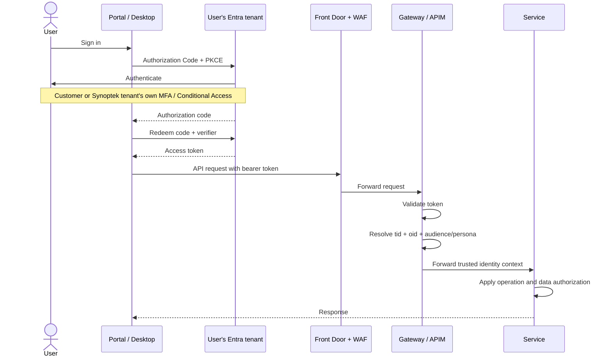
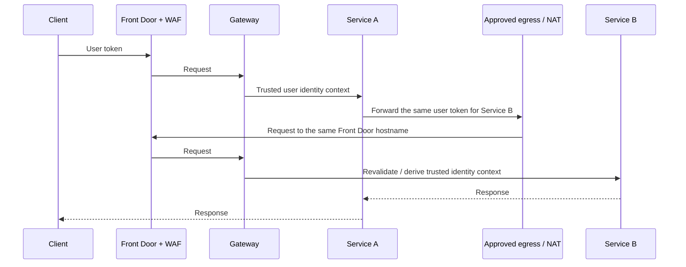
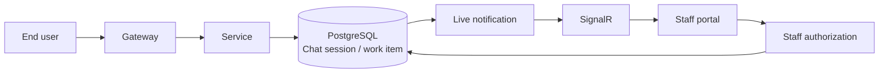
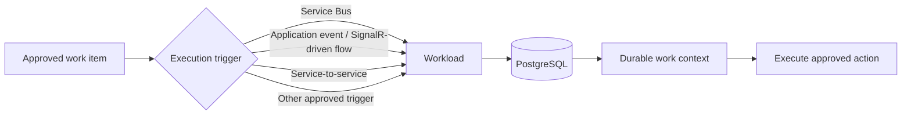

# Synoptek Identity Plane

**Status:** Architecture of record

## 1. Purpose

Synoptek is a managed service provider (MSP) that operates an IT-support platform for multiple organisations.

The Identity Plane defines one consistent way to establish:

- who is acting;
- which tenant the work belongs to;
- what kind of principal is acting; and
- what data and operations that principal may access.

For a human user, the platform trusts identity established by Microsoft Entra ID. The primary human identity is **`(tid, oid)`**.

This document owns the identity model: human and Workload principals, tenant binding, persona, authorization, authority propagation, authentication/authorization boundaries, and audit actor semantics. The Overall Architecture owns platform topology and deployment; the RAG & Agentic Architecture owns agent execution; the Product Functional Specification owns user-facing behaviour and Alpha scope.

The platform does not become another identity provider for users. It accepts the identity token issued by the user's own Entra tenant and applies the platform's authorization rules to it.

---

## 2. Vocabulary

These terms have one meaning throughout this document.

| Term | Meaning |
|---|---|
| **Synoptek** | The managed service provider and the **Operator tenant**. |
| **Customer** | Any tenant other than the Synoptek Operator tenant that uses the platform. |
| **End user** | A customer-tenant employee using a customer surface, or a Synoptek employee using a customer surface. |
| **Staff** | A Synoptek user holding one or more of the independent staff roles `technician`, `senior_technician`, `administrator`. The roles are disjoint capabilities, not a ranking (§5.2). |
| **Gateway** | The platform API trust boundary; implemented by APIM. |
| **Customer portal** | Web application for end users. |
| **Staff portal** | Web application for staff. |
| **Desktop app** | Desktop application for end users. |
| **Platform state store** | The authoritative store for tenant mapping, work state and audit data. Its implementation is defined by the Overall Architecture. |
| **tid** | Microsoft Entra tenant ID from a validated human token. A Workload token may technically contain a `tid`, but it is never used as the customer tenant context. |
| **oid** | Microsoft Entra object ID of the acting user or workload service principal. |
| **Workload** | The non-human execution principal used to perform background or triggered work. This is the only term used for workload identity. |
| **Chat session** | One conversation and its durable execution context, identified by an opaque job ID. A Chat session is 1:1 with a Case and 1:1 with a work item. |
| **Case** | The ServiceNow incident anchoring a Chat session in the system of record. |
| **Tenant** | A platform customer identity boundary represented by an Entra `tid`. |
| **Tenant mapping** | The platform record that maps an Entra `tid` to the platform tenant and related external identifiers such as the customer's ServiceNow tenant ID. |

A person can be both a **Staff** member and an **End user**. The surface and API audience determine which persona applies to the current request.

### Document boundary

The Identity Plane defines **who/which principal**, **which tenant context**, **which persona**, and **which authority** applies to a request. It does not define Azure resource topology, network subnets, service deployment, product screens, RAG graph structure, or 
---

## 3. Core identity rules

### 4.1 Human identity

A human request is established from a validated Microsoft Entra access token.

- `tid` identifies the Entra tenant.
- `oid` identifies the user inside that tenant.
- `email`, `upn`, `preferred_username` and user-supplied values are not identity keys.
- Tenant or user identity must never be taken from request headers, query parameters, route values, request bodies, chat text, model output or messages.

### 4.2 Workload identity

A Workload is a separate non-human principal.

A Workload uses its own managed identity and app-only token when it calls an API that requires a Workload principal. It never impersonates the human requester by reusing the user's token.

The Workload's Entra token identifies the **Workload itself**. The Workload does not establish or carry customer-tenant authority. The customer tenant for which it is executing is resolved only from the durable Chat session / work item in PostgreSQL.

The Workload is an **identity, not a deployment unit**. A runtime that holds the Workload managed identity acts as the Workload for that execution leg. Co-locating the Workload identity with a runtime that also serves delegated user traffic is a deployment choice that does not change any rule in this section; it is recorded as a risk wherever it is taken.

Therefore there are two different identity contexts:

```text
Human request:
    tid = human's Entra tenant
    oid = human's Entra user

Workload request:
    oid = Workload service principal
    customer tenant = resolved from Chat session / work item
```

The Workload token's `tid`, if present, is only part of the Workload's own Entra provenance. It must never be interpreted as the customer tenant and must never replace `work_item.tenant_id`.

### 4.3 Tenant mapping

PostgreSQL maintains the authoritative platform mapping for each onboarded tenant.

At minimum, the mapping represents:

```text
Entra tid
   ↓
Platform tenant
   ├── status
   └── ServiceNow tenant ID
```

The ServiceNow tenant ID is an external system identifier. It is not an identity claim and must never be accepted from an end-user request as an authority source.

### 4.4 Tenant lifecycle and offboarding

Customer onboarding requires administrator consent in the customer's Entra tenant. This creates the service principal needed for the multitenant application.

Offboarding has two server-side controls:

1. Remove the platform's service principal from the customer's Entra tenant so new authentication cannot be obtained through that application.
2. Mark the tenant `suspended` or `offboarded` in the platform's PostgreSQL tenant mapping so the platform stops accepting work for that tenant.

The PostgreSQL tenant status is the platform's authoritative operational control. A request that reaches our platform with an otherwise valid user token is still refused when its tenant is not `active`.

A service-principal removal does not retroactively erase already-issued bearer tokens. Therefore the platform must not depend on service-principal deletion alone for immediate containment.

**Gateway remains stateless.** Tenant status is not read or cached by APIM. If performance requires caching, the cache is a service-side optimization of the PostgreSQL registry, has a bounded lifetime, and must fail closed for an unknown or stale status. PostgreSQL remains authoritative. This keeps the tenant registry in one place and avoids creating a second authorization state at the gateway.

### 4.5 Canonical identity and authority rules

The following rules apply to every synchronous request, asynchronous trigger, realtime event, AI interaction and external-system call. They are stated once here and referenced by the later flow sections.

**Identity is not transport metadata.** HTTP headers, query parameters, route values, request bodies, Service Bus messages, SignalR events, chat text, retrieved documents and model output are never authoritative sources of tenant, principal, role, approval or execution authority.

**Actor and target are different concepts.** The actor is the authenticated principal performing the current operation. The target/customer tenant is the trusted platform context that the operation is being performed against. For customer users the target tenant is normally derived from the human `tid`. For staff it comes from the trusted platform object being operated on, such as a Chat session, work item or ticket. For Workload execution it comes from the approved work item.

**Async work inherits authority from durable state, not from the trigger.** A trigger wakes the Workload; the work item determines tenant, requester, resolved action, target and approval state.

**On-behalf-of provenance is preserved.** When a Workload executes an approved action, the executing actor is the Workload, while the originating human remains the `requested_by_oid` / `on_behalf_of_oid` recorded on the work item. Workload does not become the human and does not inherit the human token. For executions performed directly by a human client or another approved execution mechanism, `executed_by` records the actual execution actor.

**Tenant binding is monotonic.** Once a unit of work is bound to a tenant, later components may consume that binding but may not replace or widen it from untrusted input. Any tenant transition requires a new explicitly authorized platform operation.

---

## 4. Personas and surfaces

### 5.1 The three surfaces

| Surface | Who can use it | Resulting persona | API audience |
|---|---|---|---|
| **Customer portal** | Customer employees and Synoptek employees | End user | Customer API |
| **Desktop app** | Customer employees and Synoptek employees | End user | Customer API |
| **Staff portal** | Synoptek users only | Staff, if role-assigned | Staff API |

### 5.2 Staff rules

- Staff always belongs to the Synoptek tenant.
- A user from another tenant cannot become staff through the platform.
- A Synoptek user without a recognized staff role cannot use staff capabilities.
- A staff user may hold several Entra staff roles at once.
- If a staff token contains no recognized staff role, staff access is refused; it is never silently downgraded.
- Staff RBAC is represented in the staff portal UI, but the backend remains the security boundary.

#### Staff roles are disjoint capabilities, not a ranking

The three staff roles are **independent capabilities**. Each names work a person does; none contains another:

```text
technician          senior_technician          administrator
     │                      │                        │
  its own              its own                   its own
capabilities         capabilities              capabilities
```

There is **no precedence, no seniority ordering and no implication between roles.** `administrator` does not confer what `technician` confers. A person who performs two kinds of work holds two roles, and holding the higher-sounding one is never a substitute for holding the other.

The consequence is concrete and is deliberately part of the 
A principal's staff authority is therefore a **set**, and authorization is **set intersection**:

```text
principal's roles  ∩  roles the operation accepts  ≠  ∅   →  permitted
                                                    = ∅   →  refused
```

An operation declares the roles it accepts. It does not declare a minimum, because there is no scale on which to take one.

Two rules follow, and both are binding:

- **The role set must survive to the service.** Collapsing it to a single value destroys authority: a principal holding `{technician, administrator}` who arrives as `administrator` alone has silently lost the capability that lets them approve. §9.4 therefore carries the whole set.
- **Order is not information.** The set is unordered. A token listing `["administrator","technician"]` and one listing `["technician","administrator"]` describe the same principal and must produce byte-identical trusted context, so the Gateway emits the set in a canonical order. Token array order must never change any decision.

### 5.3 Staff on customer surfaces

A Synoptek staff member using the customer portal or desktop app is an **end user for that request**.

This is intentional:

```text
Synoptek user
   ├── staff portal → Staff permissions
   └── customer portal / desktop → End-user permissions
```

The client surface and API audience determine the available authorization model; a user cannot promote themselves by choosing a different claim or request parameter.

---

## 5. Customer authorization and staff authorization

### 6.1 End users

End users are isolated at two levels:

```text
Tenant boundary:
    only their own tenant

Within that tenant:
    only their own user-owned records, where the product data model is user-owned
```

Therefore an end user from Customer A cannot access data outside Customer A, and one end user in Customer A cannot automatically read another end user's private records in Customer A.

The data-access layer is the final enforcement point for these boundaries.

### 6.2 Staff

Staff are different because the MSP operating model requires them to support multiple customers.

A staff token represents the **Synoptek Operator tenant**, not the customer currently being worked on.

Therefore staff authorization cannot use the token's `tid` as the customer target.

Instead, staff views and actions operate on platform objects such as active chat sessions, work items, tickets and approval requests. Those objects carry their own trusted customer/tenant context.

For example:

```text
Staff identity
    +
selected chat session / work item
    ↓
customer tenant
    ↓
ServiceNow tenant mapping
    ↓
customer data / action
```

A staff member may therefore see approval work from multiple customers in one staff portal session without changing their identity or tenant in Entra.

### 6.3 Staff data access

Staff are intentionally allowed to access customer data across tenants according to the roles they hold and the roles each operation accepts (§5.2).

That does **not** mean the staff API should accept an arbitrary `tenant_id` and trust it. The customer context for an operation should come from a trusted platform object, record or staff-authorized workflow.

This gives us:

```text
Staff authentication scope:
    Synoptek

Staff business scope:
    multiple customer tenants

Customer target:
    resolved by the platform context being operated on
```

---

## 6. Entra application model

The identity model separates three API audiences from the three user-facing clients.

### 7.1 Resource APIs

1. **Customer API** — delegated user access for end users.
2. **Staff API** — delegated user access for staff.
3. **Workload API** — app-only access for Workload.

### 7.2 Clients

1. Customer portal web client.
2. Staff portal web client.
3. Customer desktop client.

All user-facing clients are public clients and use authorization code + PKCE. The desktop uses the system browser rather than an embedded authentication experience.

### 7.3 Workload application identity

The Workload uses a managed identity rather than a client secret stored in the application.

The Workload is granted application permission to the Workload API. Its token is app-only and is accepted only by workload-designated endpoints.

The Workload API must not accept ordinary delegated user tokens.

---

## 7. Authentication flow



A client obtains a credential; it does not decide authorization.

Authentication and authorization are different:

```text
Entra:
    authenticates the user

Gateway:
    validates the Entra token and establishes the trusted request identity

Service:
    applies operation, tenant and record authorization

PostgreSQL:
    provides the final data boundary
```

---

## 8. Gateway authentication and authorization

The Gateway is the common trust boundary for token-bearing API traffic.

At a conceptual level, every request follows this sequence:

```text
1. Request enters through Front Door/WAF
2. Gateway validates the bearer token
3. Gateway establishes credential class
       - delegated user
       - workload / app-only
4. Gateway resolves identity
       - human: tid + oid
       - workload: workload tid + workload oid
5. Gateway determines the API audience / persona
6. Gateway applies the operation's gateway-level authorization rules
7. Gateway forwards trusted identity context to the service
8. Service applies its own authorization and data scope
```

### 9.1 Customer request

```text
validated user token
    ↓
customer audience
    ↓
end_user
    ↓
customer tenant = tid
    ↓
service/data layer
    ↓
customer tenant + user ownership rules
```

The customer pipeline does not use staff roles as customer authorization.

### 9.2 Staff request

```text
validated user token
    ↓
staff audience
    ↓
Synoptek tid required
    ↓
collect the full set of assigned staff roles
    ↓
staff operation authorization by set intersection
    ↓
service/data layer
    ↓
customer context comes from the platform object being operated on
```

### 9.3 Workload request

```text
validated app-only token
    ↓
workload audience
    ↓
validate workload provenance / application permission
    ↓
identify Workload by oid
    ↓
service receives workload identity
    ↓
service loads Chat session / work item
    ↓
customer tenant comes from durable work state
```

The workload token's `tid` and `oid` never replace the customer tenant and requester information stored on the work item.

### 9.4 Gateway-to-service identity contract

The Gateway-derived identity context has one closed contract. Services do not invent alternative identity headers or re-derive the principal. The Gateway owns these fields and the service ingress boundary ensures callers cannot set them directly.

| Header | Meaning | Source | Service rule |
|---|---|---|---|
| `X-Idp-Tenant-Id` | Entra tenant of the current principal | validated token `tid`, or the approved workload context where applicable | authoritative tenant identity for the current request |
| `X-Idp-Principal-Id` | Entra object ID of the current principal | validated token `oid` | authoritative principal identity |
| `X-Idp-Roles` | The complete set of the principal's roles, in canonical order | Gateway role/provenance resolution | authoritative value; exact lowercase values from the canonical set below; absent, unordered, duplicated or invalid is a refusal |
| `X-Idp-Credential-Class` | `delegated` or `app` | Gateway validation | service refuses a class it does not support |
| `X-Idp-Client-Surface` | client application identifier, where applicable | validated `azp` | attribution/policy input only; never tenant authority |

The Gateway deletes any inbound copy of these headers before validation and sets them on the outbound request. A service accepts them only from the approved Gateway path. A direct request that bypasses that path is a network failure, not a second authentication path.

The access token may be forwarded unchanged when the next hop is another Gateway-mediated API call. Services do not parse that token to create a second identity decision.

#### Canonical `X-Idp-Roles` values

`X-Idp-Roles` carries a **set**, serialised as one or more of these lowercase values separated by a single comma, with no spaces:

```text
end_user
technician
senior_technician
administrator
none
```

The meanings are fixed:

| Credential/API context | `X-Idp-Roles` | Meaning |
|---|---|---|
| Customer API, delegated | `end_user` | Customer-surface end-user persona |
| Staff API, delegated | any non-empty subset of `administrator`, `senior_technician`, `technician` | every staff capability the principal holds |
| Workload API, app-only | `none` | the Workload has no role/persona |

##### Serialisation

The set is serialised in **ascending lexicographic order**, so one principal always produces one byte sequence:

```text
administrator
technician
administrator,senior_technician
administrator,senior_technician,technician
```

Canonical ordering is a security property, not tidiness. It is what makes "token array order never decides anything" (§5.2) checkable at the boundary rather than trusted: a service can refuse an unordered header outright instead of tolerating two spellings of the same authority.

A service must refuse the header when it is absent or empty, when the values are not in ascending order, when a value repeats, when any value is outside the canonical set, when whitespace surrounds a value, or when the case does not match exactly. Matching is ordinal and case-sensitive throughout.

##### The two sentinels

`end_user` and `none` are **single-member sets** and never combine with anything:

- `none` means *no roles*. It is not a privilege and not a persona, and it is valid only for the app-only Workload context.
- `end_user` is the customer-surface persona, not a staff capability.

A set mixing either sentinel with a staff role — `end_user,technician`, `administrator,none` — is an invalid identity context and is refused. The delegated customer context must never emit a staff role or `none`; the staff context must never emit `end_user` or `none`; the Workload context must never emit a human role.

The Workload path performs provenance and application-permission validation and emits `none`; it performs no role resolution.

##### Authorization is intersection

An operation declares the roles it accepts, and the request is permitted when the two sets intersect (§5.2). There is no minimum and no ranking: `administrator` does not satisfy an operation that accepts `technician` unless the principal also holds `technician`.

---

## 9. Service-to-service calls

The architecture supports both human-context and Workload-context service calls.

### 10.1 Service call on behalf of a human

When Service A needs Service B to perform work as the same human principal, the human authorization context must remain the same. Service A must call Service B through the Front Door/WAF and Gateway path; there is no direct service-to-service application route.



The receiving service does not trust identity headers supplied by Service A. The Gateway re-establishes the trusted user identity for the next API call.

A service should not silently change the principal by substituting its own identity when the operation is intended to remain under the user's authority.

### 10.2 Workload-initiated service call

When Workload performs background execution, it does not reuse the user's token.

```text
Workload
   ↓
its managed identity
   ↓
app-only workload token
   ↓
Gateway / workload API
   ↓
validate workload token
   ↓
service
   ↓
load Chat session / work item
   ↓
resolve customer tenant and authorized action
```

This is the main reason the Workload API is a separate audience.

---

## 10. Asynchronous work and Chat sessions

A Chat session is an **opaque job ID**. It is not an identity token and it does not contain authoritative tenant information.

When a request becomes asynchronous, PostgreSQL stores the context needed to continue it.

A work item conceptually contains:

```text
chat_session / job_id
    ├── tenant_id
    ├── case_ref
    ├── requested_by_oid
    ├── requester role / authority at request time
    ├── requested action
    ├── resolved target
    ├── approval state
    ├── approved_by_oid / approval timestamp (when approval occurs)
    ├── execution validity (`expires_at`, `cancelled_at`)
    ├── execution state
    └── outcome / audit information
```

The identity-bearing fields come from a validated human request. They are not supplied later by a queue message, SignalR event, model output or Workload request.

A Chat session has exactly one work item, and a work item carries **at most one approval**. Non-consequential operations within the session execute under an `AUTO` policy decision and create no approval record. Where a second approval-requiring operation arises in the same session, the session escalates rather than raising a second approval.

### 11.1 Approval flow



For an approval-required request:

1. End user creates the work item.
2. The required approval and customer context are stored.
3. Staff portal receives a SignalR notification and updates the approval list without a page refresh.
4. Staff submits approve/reject through a normal staff API request with a fresh staff token.
5. PostgreSQL records the staff action, `approved_by_oid`, approval timestamp and the new work state. PostgreSQL is the authoritative approval record; the approval and its outcome are mirrored to the Case for queue, notification and ITSM audit purposes, and an inbound external state change never authorizes execution.
6. When approval is granted, the work item receives an execution expiry of **15 minutes from `approved_at`** and remains executable only until that time unless it is cancelled first.
7. A later trigger may start execution if the work was approved and the execution validity window has not expired.

### 11.2 Workload execution

The execution trigger is deliberately independent of Workload identity.

The trigger is an **untrusted wake-up signal**. It must carry only the opaque `job_id` (and correlation information where needed). It must not carry or override tenant, requester, role, action, target or approval state.

The Workload then:

1. authenticates as itself using its managed identity;
2. loads the work item by the opaque `job_id`;
3. verifies the work is still `approved`, the tenant is still active, `cancelled_at` is null, and the current time is before `expires_at`;
4. atomically claims the work before performing it;
5. executes only the resolved action and target stored on the work item; and
6. records execution outcome and audit information.

The claim is the idempotency boundary: duplicate or at-least-once trigger delivery must not cause the same work item to execute twice.

For audit and traceability, the execution preserves three business actors where applicable:

```text
requested_by = requested_by_oid from the immutable work item
approved_by  = approved_by_oid from the immutable approval record
executed_by  = actual principal that performed the execution
```

For a Workload execution:

```text
executed_by = Workload
on_behalf_of = requested_by_oid from the immutable work item
target tenant = tenant_id from the immutable work item
```

For other approved execution paths, `executed_by` identifies the actual execution principal, such as the human using the Desktop app or another approved platform execution principal. The audit record may additionally identify the downstream execution mechanism or external principal used to perform the action.

This preserves who requested the work, who approved it, who actually executed it, and which customer tenant the action affected.

Possible triggers include:

- Service Bus message;
- SignalR/application event;
- service-to-service event or request;
- another controlled scheduler or platform trigger.

The trigger is only a way to wake or invoke the Workload. It is never the authority for tenant, user or approval state.



The 
### 11.3 What happens after approval

Once the work is approved, execution no longer depends on the requester's current Entra access token.

This is deliberate. A user's token may expire or the user's access may be withdrawn while already-approved work is waiting to execute.

The execution authority becomes:

```text
approved work item
      +
active tenant
      +
Workload identity
      ↓
execution
```

Therefore revoking the original user's access does **not** by itself cancel already-approved work. The work item becomes non-executable when `cancelled_at` is set, when `now >= expires_at`, or when the tenant is no longer active.

For the 
The 
This is the fundamental reason a Workload identity exists.

---

## 11. Workload execution model

### 12.1 Workload identity validation

Whenever Workload calls a protected workload API, the Gateway validates an app-only token.

The workload path must establish all of the following:

```text
1. token is cryptographically valid
2. issuer is Synoptek / Operator tenant
3. audience is the Workload API
4. token is app-only, not a delegated user token
5. required Workload application permission is present
6. Workload caller is an allowed managed identity
```

The Workload is identified by its own `oid`.

The customer tenant is then obtained from the Chat session / work item.

### 12.2 Workload access to PostgreSQL

Workload may access PostgreSQL using its managed identity rather than a stored database credential.

The database permission model must prevent Workload from changing identity-bearing authorization fields on an existing work item.

For example, these fields are conceptually immutable after creation:

```text
tenant_id
requested_by_oid
requester_role
requested action
target
approval requirement
approved_by_oid (once approval is recorded)
approved_at (once approval is recorded)
```

Workload may update execution-owned fields such as:

```text
status
lease / execution state
outcome
executed_by / execution actor
execution mechanism / downstream principal metadata
execution timestamps
```

The protection must be enforced at the database permission boundary, not only in application code.

### 12.3 Workload calls to external/customer systems

When Workload performs an action against a customer system such as ServiceNow:

```text
Workload identity
     ↓
validated work item
     ↓
customer platform tenant
     ↓
Entra tid → platform tenant → ServiceNow tenant mapping
     ↓
credential for that customer/system
     ↓
external system
```

The external credential is selected from trusted tenant context. It is never selected by a tenant identifier supplied by request text, model output, message content or an arbitrary parameter.

---

## 12. Real-time authorization boundary

Azure SignalR is used for **live updates** and similar realtime application behaviour.

Examples include:

- a staff approval request appearing immediately in the approval list;
- work-state changes appearing in an open chat/session;
- execution progress or completion updates;
- other server-to-client events that would otherwise require polling or page refresh.

### 13.1 SignalR is not the user's authorization boundary

Normal business operations still use authenticated API requests. SignalR is a delivery mechanism, not an authority mechanism. A socket may tell a client that work exists or that state changed; it must not be the mechanism by which a consequential approval, execution or tenant-selection decision is authorized.

For example:

```text
SignalR:
    "Approval 123 is waiting"

HTTP/API:
    "Approve approval 123"
```

The second operation is authorized using a fresh staff token.

### 13.2 SignalR can participate in internal event flows

SignalR/application events may also be used as one possible trigger in a workflow that wakes Workload or another service.

The same rule still applies:

> **The event triggers work; the durable work record provides the authority and tenant context.**

An event containing a tenant ID or user ID does not become authoritative merely because it came from an internal component.

### 13.3 Tenant offboarding and active clients

When a tenant is offboarded, the server can publish a tenant-scoped event to connected end-user clients so their applications immediately clear local session state and return to the sign-in screen.

This is a **client-side response to an offboarding event**, not a replacement for Entra token revocation.

The server-side security control remains:

```text
PostgreSQL tenant status
        ↓
API/service request check
        ↓
reject inactive tenant
```

This avoids introducing a separate token-revocation system while still giving users a fast visible response.

---

## 13. Tenant offboarding and revocation model

There are three different events and they should not be confused. The canonical tenant-state rule is §4.4; this section describes how the three effects appear in the platform.

### 14.1 Stop future sign-in

Remove the platform service principal from the customer's Entra tenant.

This prevents new tokens for the application from being issued through that service principal.

### 14.2 Stop platform access

Mark the tenant `suspended` or `offboarded` in PostgreSQL. Services, and Workload when it is executing tenant-bound work, check this authoritative state before execution. A bounded service-side cache may optimize the lookup; APIM does not read tenant status.

### 14.3 Stop existing client sessions quickly

The platform may publish a tenant-scoped SignalR offboarding event to connected clients. Clients use that event to clear local session state and return to sign-in.

This is **server-directed client session invalidation**, not Entra token revocation. The server remains secure because every API operation still performs the authoritative tenant-status check.

### 14.4 Remaining bearer-token window

An already-issued access token may remain cryptographically valid until it expires. Therefore this architecture does not claim instantaneous per-user Entra token revocation. Customer-wide offboarding is contained faster by the server-side tenant status, while the residual principal-revocation window remains bounded by token lifetime.

---

## 14. Security model for AI and target selection

The AI layer does not become an identity authority.

For a live customer chat:

```text
validated user identity
        ↓
chat session bound to tenant
        ↓
retrieval/action context
        ↓
only that tenant's data
```

For Workload execution:

```text
approved work item
        ↓
bound customer tenant
        ↓
Workload
        ↓
only that customer's data/action
```

Retrieval is **strictly tenant-scoped**: a tenant filter is mandatory and non-bypassable on every retrieval query, and there is no cross-tenant grounding corpus.

AI/model output, prompt text, categorization, retrieval results and user-provided target names may help determine **what** the user wants, but they cannot determine **which tenant's authority** is being used.

For high-impact actions, the approval requirement belongs to the resolved action, not to a category chosen by the model.

---

## 15. Audit and observability

### 16.1 Telemetry

Telemetry should allow an engineer to follow a unit of work across:

```text
Client
  → Front Door/WAF
  → Gateway
  → Service
  → PostgreSQL / trigger
  → Workload
  → external system
```

Correlation IDs and distributed tracing connect the stages.

Identity attributes used for telemetry come from the trusted identity/work context, not from arbitrary headers or message content.

### 16.2 Audit

Audit is separate from telemetry. Telemetry explains system behaviour; audit records authoritative business and security actions.

For any consequential action, the audit model must preserve the lifecycle of the action rather than assuming that the person who requested it is the person who executed it. The minimum actor chain is:

```text
requested_by  →  approved_by  →  executed_by
```

These represent different responsibilities:

- **`requested_by`** — the human who initiated the work. For asynchronous work this comes from the immutable `requested_by_oid` on the work item.
- **`approved_by`** — the staff member who approved the work, when approval is required. This is recorded when the approval action occurs and becomes immutable for that approval decision.
- **`executed_by`** — the principal that actually performed the action. This is execution-path dependent and must not be assumed to be the requester or approver.

### 16.2.1 Execution actor model

`executed_by` is intentionally polymorphic because the platform can support more than one execution path. Examples include:

| Execution path | `executed_by` | Additional audit context |
|---|---|---|
| Workload execution | Workload | Workload identity / execution mechanism |
| Desktop-initiated script | Human End user | Desktop client, script catalogue identifier and version, execution context |
| Direct authenticated service operation | Authenticated human or approved platform principal | API/service and operation |
| Microsoft Graph operation | Workload or human that invoked Graph | Graph operation / downstream principal where relevant |
| Third-party connector | Workload or human that invoked the connector | Connector, target system and credential reference |
| MCP/tool execution | Workload or human that invoked the MCP/tool | Tool/server and target system reference |

The downstream identity used by an external system is **not automatically the platform `executed_by`**. The audit should distinguish the platform execution actor from any downstream/external principal or credential used to perform the action. For example:

```text
requested_by      = user A
approved_by       = staff B
executed_by       = Workload
execution_method  = Microsoft Graph
downstream_actor  = platform application / Graph principal
target_tenant     = tenant from immutable work item
```

If a Desktop app directly executes an approved script under the signed-in human's authority, the audit instead records the human as `executed_by` and identifies the Desktop/script execution mechanism.

Scripts executed this way are **predefined, versioned and platform-owned**. The decision to run one is made server-side; the client holds no policy and executes only an instruction it has fetched over an authenticated Customer API call bound to the work item. Because this path depends on the signed-in human, it cannot complete while that human is absent, and an approved desktop execution that is not performed within the execution-validity window expires like any other work item.

### 16.2.2 Audit record requirements

A consequential audit record should be able to answer at minimum:

- which tenant was involved;
- which Chat session / job / work item was involved;
- who requested the action (`requested_by`);
- who approved it (`approved_by`), when approval was required;
- who actually executed it (`executed_by`);
- what execution mechanism was used;
- whether a downstream system, connector, Graph API, MCP server or other tool was involved;
- which action was performed;
- which target/resource was affected;
- when the request, approval and execution occurred;
- what the result was; and
- which correlation/trace identifiers connect the audit event to the surrounding telemetry.

The authoritative actor and tenant values must come from the validated request, immutable work item, approval record or authenticated execution context. They must never be accepted from arbitrary headers, queue messages, chat text, model output or client-supplied audit fields.

Audit should be append-oriented: execution events and consequential state transitions should create durable records rather than rewriting historical actor identities. `requested_by` and the original request context are immutable; `approved_by` is immutable once the approval decision is recorded; `executed_by` is recorded from the actual execution context for each execution attempt/result.

Bearer tokens, managed-identity credentials, connector secrets and other sensitive credentials must not be stored in telemetry or audit. Store stable principal identifiers and non-secret credential references instead.

---

## 16. Architecture summary

> **Users authenticate through Microsoft Entra ID. Human identity is `(tid, oid)`; Workload identity is a separate non-human principal. Tenant context, persona, authorization and execution authority are derived only from trusted identity and durable platform state. Customer users are tenant-scoped; Staff capabilities are limited to the Operator tenant and may operate on explicitly authorized customer context; asynchronous work inherits authority from its immutable work item; realtime delivery is never an authorization channel; and model output, trigger payloads and client-supplied tenant or identity fields cannot create or widen authority.**
