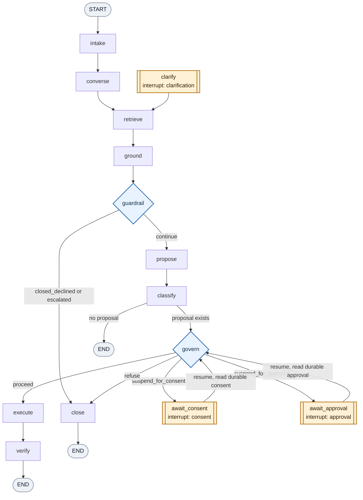
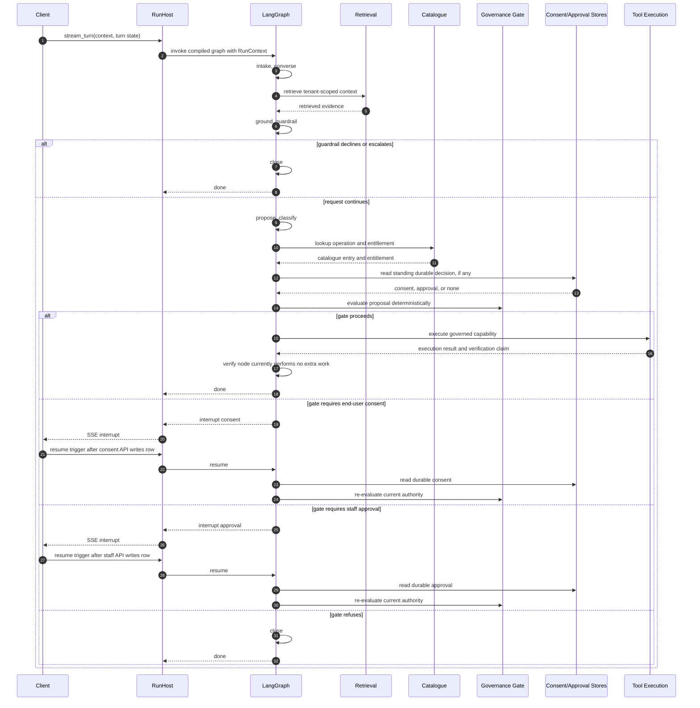
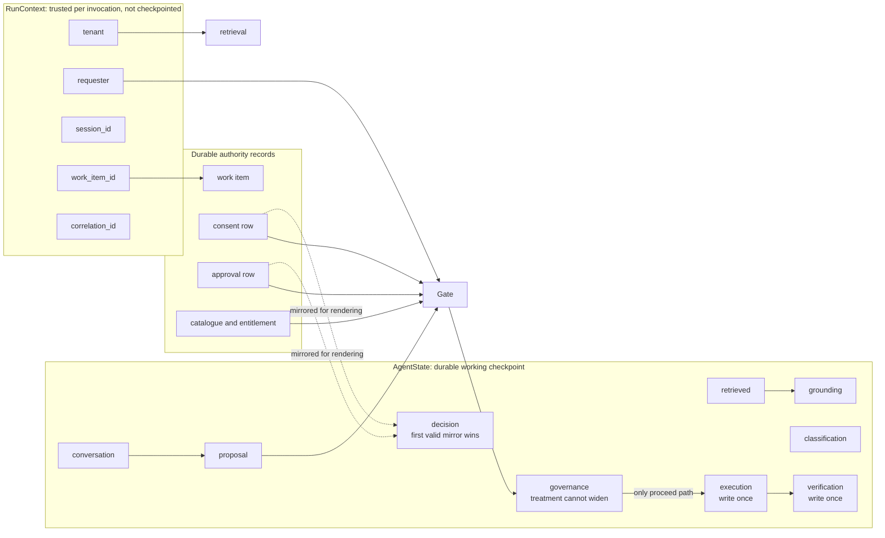

# RagCore LangGraph Visual Flow

This diagram is derived from `ragcore/src/ragcore/graph/builder.py` and the node modules under
`ragcore/src/ragcore/graph/nodes`. It shows the compiled control shape, not a speculative product
workflow.

## Control Graph

Note: `builder.py` registers `clarify` and defines `clarify -> retrieve`, but the current builder
does not define an incoming edge from `converse` or any router into `clarify`. In the current graph
shape, the clarification interrupt node is present but unreachable.

## Runtime Flow

## Node Responsibilities

| Node | Writes or changes | External reads/calls | Routes to |
|---|---|---|---|
| `intake` | Triage-derived `session_state`, `work_item_id` mirror | Deterministic triage over conversation; `RunContext.work_item_id` | `converse` |
| `converse` | `session_state = resolving` | None in current scaffold | `retrieve` |
| `clarify` | Appends end-user answer, clears interrupt | Suspends via LangGraph interrupt | `retrieve` |
| `retrieve` | Appends `retrieved` evidence | Tenant-scoped retrieval port | `ground` |
| `ground` | `grounding` assessment | Confidence logic over retrieved evidence | `guardrail` |
| `guardrail` | May set `closed_declined` or `escalated` | Deterministic scope classifier | `propose` or `close` |
| `propose` | No write in current scaffold; later model output lands in `proposal` | None in current scaffold | `classify` |
| `classify` | `classification` | Operation catalogue and entitlement | `govern` or `END` |
| `govern` | `governance`, `pending_interrupt` | Catalogue, entitlement, durable consent/approval | `execute`, `await_consent`, `await_approval`, or `close` |
| `await_consent` | Mirrors durable consent decision, clears interrupt | Suspends, then reads consent repository | `govern` |
| `await_approval` | Mirrors durable staff verdict, clears interrupt | Suspends, then reads approval repository | `govern` |
| `execute` | Sealed `execution` and `verification` records | Tool execution port | `verify` |
| `verify` | No write in current scaffold | None in current scaffold | `END` |
| `close` | Clears pending interrupt and closes session path | None | `END` |

## Authority Flow

The important security property is structural: `execute` has exactly one incoming control edge,
from `govern` through `route_after_govern`. Retrieval, proposal, classification, and human resume
payloads cannot route directly to execution.

## Branch Summary

| Branch point | Condition source | Possible outcomes |
|---|---|---|
| `_route_after_guardrail` | `session_state` written by `guardrail` | `propose` unless session is `closed_declined` or `escalated`; otherwise `close` |
| `_route_after_propose` | Presence of `proposal` | `govern` when a proposal exists; `END` for conversational/no-op turns |
| `route_after_govern` | `governance.disposition` from deterministic gate | `execute`, `await_consent`, `await_approval`, or `close` |

## Flow Invariants

- Guardrail withholds or passes through; it does not authorize.
- Classification is a catalogue reading; governance re-reads catalogue data before deciding.
- Consent and approval interrupt nodes ignore resume payload authority and re-read durable rows.
- Consent and approval route back to `govern`, never forward to `execute`.
- `execution` and `verification` state channels are write-once.
- Governance treatment may become stricter on re-evaluation, but not more permissive.
