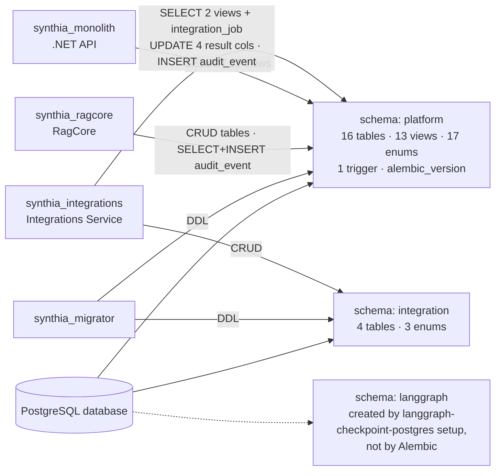
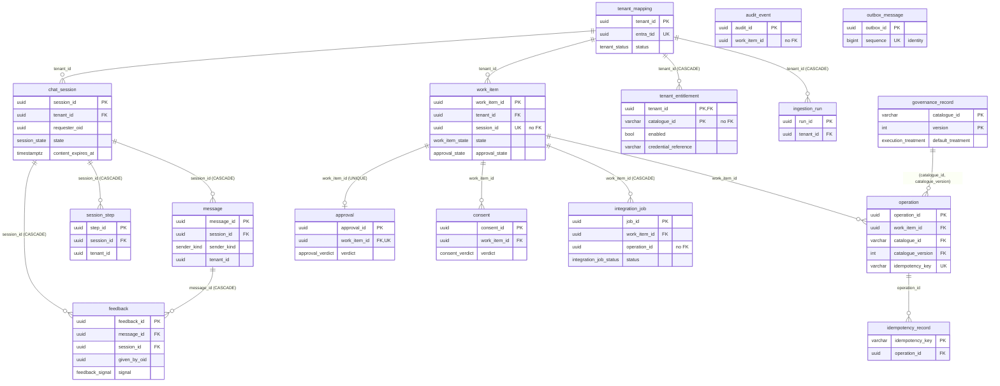
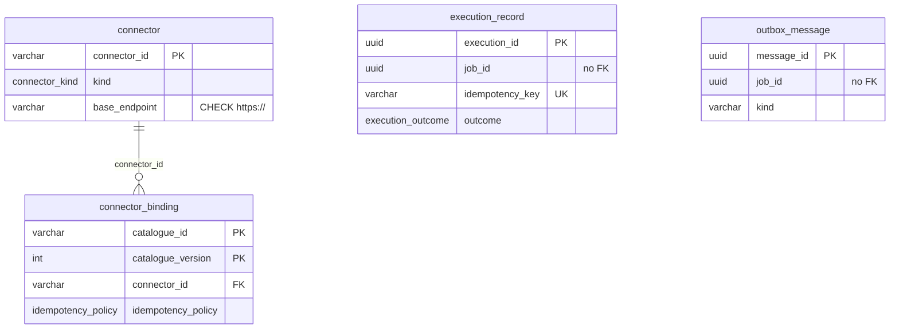
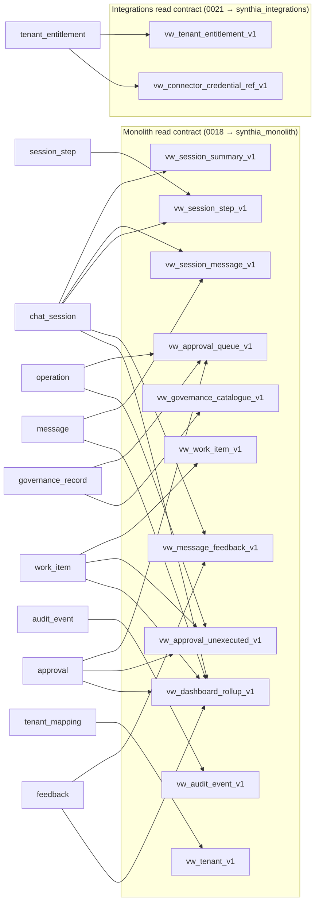

# Database — current implementation

Source of truth: `ragcore/migrations/versions/0001`–`0024` (Alembic, raw DDL) and `ragcore/src/ragcore/persistence/views.py` (view definitions used by revisions 0018 and 0021).

One PostgreSQL database, two schemas, four roles. All DDL is applied by the gated migration job (`build/docker/migrate.job.yaml`); no service runs DDL at startup.

Roles are `NOLOGIN` with no password; managed identities are granted role membership at deployment (0019, 0021).

## A. ER diagrams

### `platform` schema

`audit_event` and `outbox_message` have no foreign keys. `work_item.session_id` and `audit_event.work_item_id` are deliberately not FKs, so chat retention deletes never cascade into authority or audit rows (0007, 0013).

### `integration` schema

Cross-schema links are logical only (no FK): `connector_binding (catalogue_id, catalogue_version)` ↔ `platform.governance_record`; `execution_record.job_id` / `outbox_message.job_id` ↔ `platform.integration_job.job_id`.

### Views (all in `platform`)

## B. Table summary

| Schema | Table | Purpose |
| ------ | ----- | ------- |
| platform | `tenant_mapping` | Organisation registry. `entra_tid` is the only key matched against a token-derived tenant. |
| platform | `chat_session` | Conversation session and its 9-state lifecycle; `content_expires_at` drives chat retention. |
| platform | `message` | Conversation turns (end user, agent or staff). |
| platform | `session_step` | Progress trail shown to users; carries no authority fields. |
| platform | `feedback` | Current thumbs signal per (message, user); upserted, never appended. |
| platform | `work_item` | Durable authority record for one request. Six authority fields are immutable once set (trigger, 0017). |
| platform | `governance_record` | Versioned capability catalogue: treatment, accepted roles, risk tier, commands. |
| platform | `tenant_entitlement` | Which capabilities an organisation may use, plus the Key Vault secret *name* for its credential. |
| platform | `operation` | A proposed/executed operation, bound to one catalogue version. |
| platform | `approval` | Staff approval for a work item; at most one per work item. |
| platform | `consent` | End-user consent decision; separate from approval by design. |
| platform | `audit_event` | Append-only audit log with its own 7-year retention. |
| platform | `outbox_message` | RagCore transactional outbox for triggers and integration commands. |
| platform | `idempotency_record` | Idempotency boundary 2 for RagCore-side operations; stores the replayable outcome. |
| platform | `ingestion_run` | Record of a knowledge-ingestion run and its watermark; no document content. |
| platform | `integration_job` | Durable instruction RagCore hands to the Integrations Service; result written back in four columns. |
| integration | `connector` | Registered external system and its base HTTPS endpoint. |
| integration | `connector_binding` | How a catalogue entry version executes: connector, path, signing profile, idempotency policy. |
| integration | `execution_record` | One row per execution attempt; unique `idempotency_key` prevents a second external effect. |
| integration | `outbox_message` | Integrations Service outbox for result announcements; no payload column. |

## C. Field summary

**Common columns** (not repeated below): most tables carry `created_at`, `updated_at` (`timestamptz NOT NULL DEFAULT now()`), `created_by`, `updated_by` (`varchar(256)`, nullable) and `version` (`int NOT NULL DEFAULT 1`, optimistic concurrency). Exceptions: `message`, `session_step`, `feedback`, `consent`, `audit_event`, `outbox_message` (platform), `ingestion_run` have no `created_by/updated_by`; `idempotency_record` has neither `created_by/updated_by` nor `version`; `governance_record.version` is the catalogue version (part of the PK, no default).

Enum values are defined once in 0001 (platform) / 0020, 0022, 0023.

### Tables

| Object | Field | Type | Key/Constraint | Purpose |
| ------ | ----- | ---- | -------------- | ------- |
| tenant_mapping | tenant_id | uuid | PK | Platform organisation id |
| tenant_mapping | entra_tid | uuid | UNIQUE, NOT NULL | Entra tenant id used for admission |
| tenant_mapping | display_name | varchar(256) | NOT NULL | Display name |
| tenant_mapping | status | tenant_status | NOT NULL, idx | `active` / `suspended` / `offboarded` |
| tenant_mapping | retention_overrides | jsonb | | Per-organisation retention windows |
| chat_session | session_id | uuid | PK | Session id |
| chat_session | tenant_id | uuid | FK tenant_mapping, NOT NULL | Owning organisation |
| chat_session | requester_oid | uuid | NOT NULL | End user who owns the session |
| chat_session | state | session_state | NOT NULL | `conversational` … `closed_declined` (9 values) |
| chat_session | case_reference | varchar(128) | | External case id |
| chat_session | closed_at | timestamptz | | Terminal-state time |
| chat_session | content_expires_at | timestamptz | partial idx (NOT NULL) | Null while active; retention cut-off after close |
| message | message_id | uuid | PK | Message id |
| message | session_id | uuid | FK chat_session CASCADE | Parent session |
| message | sender_kind | sender_kind | NOT NULL | `end_user` / `agent` / `staff` |
| message | sender_oid | uuid | CHECK null ⇔ agent | Sender principal; null for agent |
| message | body | text | NOT NULL | Message text |
| message | tenant_id | uuid | NOT NULL, idx (tenant, session, created_at) | Denormalised tenant filter |
| session_step | step_id | uuid | PK | Step id |
| session_step | session_id | uuid | FK chat_session CASCADE | Parent session |
| session_step | kind | varchar(64) | NOT NULL | Step type |
| session_step | summary | varchar(512) | NOT NULL | User-visible label |
| session_step | tenant_id | uuid | NOT NULL | Tenant filter |
| feedback | feedback_id | uuid | PK | Row id |
| feedback | message_id | uuid | FK message CASCADE; UNIQUE (message_id, given_by_oid) | Rated agent message |
| feedback | session_id | uuid | FK chat_session CASCADE | Parent session |
| feedback | given_by_oid | uuid | NOT NULL | Rating user |
| feedback | signal | feedback_signal | NOT NULL | `positive` / `negative` |
| feedback | tenant_id | uuid | NOT NULL | Tenant filter |
| work_item | work_item_id | uuid | PK | Work item id |
| work_item | tenant_id | uuid | FK tenant_mapping; immutable | Organisation |
| work_item | session_id | uuid | UNIQUE, no FK; immutable | Originating session (1:1) |
| work_item | requested_by_oid | uuid | NOT NULL; immutable | Requesting user |
| work_item | case_reference | varchar(128) | write-once | External case id |
| work_item | governed_action | varchar(128) | write-once | Catalogue action being governed |
| work_item | target | jsonb | write-once | Operation target/parameters |
| work_item | state | work_item_state | NOT NULL | `open` … `escalated` (9 values) |
| work_item | approval_state | approval_state | NOT NULL | `none` / `pending` / `approved` / `rejected` / `expired` |
| work_item | expires_at | timestamptz | partial idx (unclaimed) | Execution window end |
| work_item | claimed_at | timestamptz | CHECK paired with claimed_by | Atomic-claim time |
| work_item | claimed_by | varchar(256) | | Claiming executor |
| work_item | outcome | jsonb | | Execution outcome |
| governance_record | catalogue_id | varchar(128) | PK part | Capability id |
| governance_record | version | int | PK part, CHECK ≥ 1 | Catalogue version |
| governance_record | kind | capability_kind | NOT NULL | `read` / `action` |
| governance_record | default_treatment | execution_treatment | NOT NULL | `AUTO` / `END_USER_APPROVAL` / `STAFF_APPROVAL` / `NOT_ALLOWED` |
| governance_record | accepted_roles | text[] | NOT NULL | Roles that may act |
| governance_record | is_reference_fixture | bool | NOT NULL, idx | Inert scaffold fixture flag |
| governance_record | requires_elevation | bool | CHECK = false | Elevation not permitted |
| governance_record | risk_tier | risk_tier | NOT NULL | `informational` / `low_impact` |
| governance_record | commands | jsonb | | Disclosed command set |
| governance_record | content_hash | varchar(128) | | Script integrity hash |
| governance_record | verification_tool | varchar(128) | | Tool used to verify outcome |
| tenant_entitlement | tenant_id | uuid | PK part, FK tenant_mapping CASCADE | Organisation |
| tenant_entitlement | catalogue_id | varchar(128) | PK part | Capability |
| tenant_entitlement | enabled | bool | NOT NULL DEFAULT false, partial idx | Entitlement flag |
| tenant_entitlement | credential_reference | varchar(512) | | Key Vault secret name (never a value) |
| operation | operation_id | uuid | PK | Operation id |
| operation | work_item_id | uuid | FK work_item | Parent work item |
| operation | catalogue_id, catalogue_version | varchar(128), int | composite FK governance_record | Bound catalogue version |
| operation | treatment | execution_treatment | NOT NULL | Treatment applied |
| operation | parameters | jsonb | NOT NULL | Operation parameters |
| operation | idempotency_key | varchar(256) | UNIQUE | Derived key |
| operation | status | operation_status | NOT NULL | `proposed` … `refused` |
| operation | verification | verification_outcome | | `server_confirmed` / `client_attested` / `contradicted` |
| operation | executed_at | timestamptz | | Execution time |
| operation | tenant_id | uuid | NOT NULL | Tenant filter |
| approval | approval_id | uuid | PK | Approval id |
| approval | work_item_id | uuid | FK work_item, UNIQUE | One approval per work item (first verdict wins) |
| approval | requested_at | timestamptz | NOT NULL, partial idx (undecided) | Request time |
| approval | decided_at | timestamptz | CHECK with verdict + decided_by_oid | Decision time |
| approval | decided_by_oid | uuid | | Approver |
| approval | decided_by_roles | text[] | | Approver roles at decision |
| approval | verdict | approval_verdict | | `approved` / `rejected` |
| approval | expires_at | timestamptz | | Execution window after approval |
| approval | tenant_id | uuid | NOT NULL | Tenant filter |
| consent | consent_id | uuid | PK | Consent id |
| consent | work_item_id | uuid | FK work_item | Parent work item |
| consent | consented_by_oid | uuid | NOT NULL | Consenting user |
| consent | decided_at | timestamptz | NOT NULL | Decision time |
| consent | verdict | consent_verdict | NOT NULL | `granted` / `refused` |
| consent | tenant_id | uuid | NOT NULL | Tenant filter |
| audit_event | audit_id | uuid | PK | Audit id |
| audit_event | work_item_id | uuid | partial idx, no FK | Related work item |
| audit_event | occurred_at | timestamptz | NOT NULL, idx (tenant, occurred_at DESC) | Event time |
| audit_event | action | varchar(128) | NOT NULL | Action name |
| audit_event | requested_by_oid / approved_by_oid | uuid | | Actor chain (NULL when written by Integrations) |
| audit_event | executed_by | varchar(256) | NOT NULL | Executing principal |
| audit_event | execution_method | execution_method | NOT NULL | `workload` / `desktop_script` / `none` |
| audit_event | outcome | varchar(256) | NOT NULL | Result |
| audit_event | verification | verification_outcome | | Verification level |
| audit_event | correlation_id | varchar(128) | NOT NULL | Request/journey correlation |
| audit_event | retain_until | timestamptz | NOT NULL, idx | Audit retention cut-off |
| audit_event | tenant_id | uuid | NOT NULL | Tenant filter |
| outbox_message (platform) | outbox_id | uuid | PK | Row id |
| outbox_message (platform) | occurred_at | timestamptz | NOT NULL | Event time |
| outbox_message (platform) | kind | varchar(128) | NOT NULL | Message kind (routing hint) |
| outbox_message (platform) | payload | jsonb | NOT NULL | Envelope body |
| outbox_message (platform) | dispatched_at | timestamptz | | Set after Service Bus send |
| outbox_message (platform) | attempts | int | NOT NULL DEFAULT 0 | Send attempts |
| outbox_message (platform) | tenant_id | uuid | NOT NULL | Tenant |
| outbox_message (platform) | sequence | bigint | GENERATED ALWAYS AS IDENTITY, UNIQUE, partial idx (undispatched) | Publication order |
| idempotency_record | idempotency_key | varchar(256) | PK | Derived key |
| idempotency_record | operation_id | uuid | FK operation | Operation |
| idempotency_record | outcome | jsonb | | Replayed outcome |
| idempotency_record | tenant_id | uuid | NOT NULL | Tenant filter |
| ingestion_run | run_id | uuid | PK | Run id |
| ingestion_run | tenant_id | uuid | FK tenant_mapping CASCADE | Organisation |
| ingestion_run | source | varchar(256) | NOT NULL | Source name |
| ingestion_run | watermark | varchar(512) | | Resume point |
| ingestion_run | document_count | int | NOT NULL DEFAULT 0 | Documents processed |
| ingestion_run | state | ingestion_run_state | NOT NULL | `running` / `completed` / `failed` |
| ingestion_run | started_at / completed_at | timestamptz | started NOT NULL | Run window |
| integration_job | job_id | uuid | PK | Job id (the only id on the command message) |
| integration_job | work_item_id | uuid | FK work_item CASCADE, idx | Authority record |
| integration_job | operation_id | uuid | NOT NULL | Operation (no FK) |
| integration_job | tenant_id | uuid | NOT NULL, idx | Organisation |
| integration_job | catalogue_id / catalogue_version | varchar(128) / int | CHECK version ≥ 1 | Capability to run |
| integration_job | parameters | jsonb | NOT NULL | Instruction parameters |
| integration_job | status | integration_job_status | NOT NULL DEFAULT `created`, partial idx (in flight) | `created` / `dispatched` / `completed` / `failed` / `expired` |
| integration_job | result_status | integration_result_status | CHECK whole result | `executed` / `failed` — writable by Integrations |
| integration_job | result_verification | verification_outcome | | Writable by Integrations |
| integration_job | result_execution_id | uuid | | → `integration.execution_record`; writable by Integrations |
| integration_job | result_recorded_at | timestamptz | CHECK whole result | Writable by Integrations |
| integration_job | dispatched_at | timestamptz | | Dispatch time |
| integration_job | expires_at | timestamptz | NOT NULL | Execution deadline |
| connector | connector_id | varchar(64) | PK | Connector id |
| connector | kind | connector_kind | NOT NULL | `native` / `mcp` |
| connector | base_endpoint | varchar(512) | CHECK `^https://` | Only source of outbound URLs |
| connector | is_reference_fixture | bool | NOT NULL, idx | Fixture flag |
| connector_binding | catalogue_id / catalogue_version | varchar(128) / int | PK, CHECK version ≥ 1 | Catalogue entry version |
| connector_binding | connector_id | varchar(64) | FK connector, idx | Executing connector |
| connector_binding | operation_path | varchar(512) | NOT NULL | Path appended to base endpoint |
| connector_binding | signing_profile | varchar(512) | CHECK rejects inline key material | Key Vault reference |
| connector_binding | idempotency_policy | idempotency_policy | NOT NULL | `derived_key` / `none` |
| execution_record | execution_id | uuid | PK | Attempt id |
| execution_record | job_id | uuid | NOT NULL, idx | Job executed |
| execution_record | tenant_id | uuid | NOT NULL, idx | Organisation |
| execution_record | connector_id | varchar(64) | NOT NULL | Connector used (`none` on refusal) |
| execution_record | catalogue_id / catalogue_version | varchar(128) / int | CHECK version ≥ 1 | Capability |
| execution_record | idempotency_key | varchar(128) | UNIQUE | Idempotency boundary 2 |
| execution_record | external_reference | varchar(256) | | External system id |
| execution_record | outcome | execution_outcome | NOT NULL | `succeeded`, `failed`, `refused_*` (4), `unreachable` |
| execution_record | verification | verification_outcome | CHECK refusal ≠ `server_confirmed` | Verification level |
| execution_record | normalized_result | jsonb | | Normalised response |
| execution_record | correlation_id | varchar(128) | NOT NULL | Correlation |
| execution_record | attempted_at / completed_at | timestamptz | attempted NOT NULL DEFAULT now() | Attempt window |
| outbox_message (integration) | message_id | uuid | PK | Row id |
| outbox_message (integration) | job_id | uuid | NOT NULL | Job announced |
| outbox_message (integration) | kind | varchar(64) | NOT NULL | `integration.completed` / `integration.failed` |
| outbox_message (integration) | correlation_id | varchar(128) | NOT NULL | Correlation |
| outbox_message (integration) | dispatched_at | timestamptz | partial idx (pending) | Set after send |
| outbox_message (integration) | attempts | int | CHECK 0–10 | Send attempts |
| outbox_message (integration) | undispatchable | bool | NOT NULL DEFAULT false | Given up after ceiling |

`work_item` also has trigger `work_item_authority_is_immutable` (BEFORE UPDATE): `tenant_id`, `session_id`, `requested_by_oid` never change; `case_reference`, `governed_action`, `target` may go null → value once.

### Views

Enum columns are published as `text`. Other columns keep the source type.

| Object | Field | Type | Key/Constraint | Purpose |
| ------ | ----- | ---- | -------------- | ------- |
| vw_session_summary_v1 | session_id, tenant_id, requester_oid, case_reference, created_at, updated_at, closed_at | from chat_session | filter: `content_expires_at IS NULL OR > now()` | Session listings |
| vw_session_summary_v1 | state | text | | Session state |
| vw_session_message_v1 | message_id, session_id, tenant_id, sender_oid, body, created_at | from message | join chat_session on (session_id, tenant_id); retention filter | Conversation history |
| vw_session_message_v1 | sender_kind | text | | Sender type |
| vw_session_step_v1 | step_id, session_id, tenant_id, kind, summary, created_at | from session_step | join chat_session; retention filter | Step trail |
| vw_work_item_v1 | work_item_id, tenant_id, session_id, requested_by_oid, case_reference, governed_action, expires_at, claimed_at, claimed_by, created_at, updated_at, version | from work_item | no retention filter; `target`/`outcome` omitted | Work state, read-only |
| vw_work_item_v1 | state, approval_state | text | | Work / approval state |
| vw_approval_queue_v1 | approval_id, work_item_id, tenant_id, requested_at, expires_at, created_at, updated_at, version | from approval | `decided_at IS NULL` | Pending approvals |
| vw_approval_queue_v1 | catalogue_id, catalogue_version | from latest operation | LATERAL latest by created_at | Bound capability |
| vw_approval_queue_v1 | disclosed_commands | text | from governance_record.commands at bound version | Commands shown to approver |
| vw_approval_unexecuted_v1 | approval_id, work_item_id, tenant_id, decided_at, decided_by_oid, expires_at, version | from approval | `verdict='approved'` and work_item.state ≠ `executed` | Approved-but-not-executed |
| vw_approval_unexecuted_v1 | catalogue_id | from latest operation | | Bound capability |
| vw_audit_event_v1 | audit_id, tenant_id, occurred_at, work_item_id, action, requested_by_oid, approved_by_oid, executed_by, outcome, correlation_id, retain_until | from audit_event | `retain_until > now()` | Audit search |
| vw_audit_event_v1 | execution_method, verification | text | | Method / verification |
| vw_governance_catalogue_v1 | catalogue_id, version, accepted_roles, is_reference_fixture, requires_elevation, verification_tool | from governance_record | **no tenant_id** (platform-wide) | Catalogue browsing |
| vw_governance_catalogue_v1 | kind, default_treatment, risk_tier | text | | Classification |
| vw_tenant_v1 | tenant_id, entra_tid, display_name, created_at, updated_at, version | from tenant_mapping | `retention_overrides` omitted | Organisation registry |
| vw_tenant_v1 | status | text | | Tenant status |
| vw_message_feedback_v1 | message_id, session_id, tenant_id, updated_at | from feedback | join chat_session; retention filter | Current signals |
| vw_message_feedback_v1 | signal | text | | Signal |
| vw_dashboard_rollup_v1 | tenant_id, window_start, window_end | uuid, timestamptz | one row per tenant per day | Rollup window |
| vw_dashboard_rollup_v1 | session_count, approval_count, unexecuted_approval_count | bigint | | Daily counts |
| vw_dashboard_rollup_v1 | feedback_rate | double precision | | Share of agent messages with feedback |
| vw_tenant_entitlement_v1 | tenant_id, catalogue_id, enabled | from tenant_entitlement | `credential_reference` omitted | Access check |
| vw_connector_credential_ref_v1 | tenant_id, catalogue_id, credential_reference | from tenant_entitlement | `enabled IS TRUE AND credential_reference IS NOT NULL` | Key Vault secret name lookup |

## D. Ownership

Grants come from migrations 0019, 0021–0024. "Read/Write by" lists the code that actually issues SQL. **(unwired)** means the code exists and is tested but has no running caller: every RagCore worker `main()` and the Integrations `command_consumer.main()` raise `NotImplementedError`, and the LangGraph run host is not built in the running app (see `scenarios.md`).

| Object | Owner (grant) | Read By | Write By |
| ------ | ------------- | ------- | -------- |
| tenant_mapping | RagCore CRUD | RagCore `TenantRegistry.admit_end_user` (every customer request); `.retention_overrides` (retention sweep, unwired) | Not found in current implementation (no insert path; seeded externally) |
| chat_session | RagCore CRUD | RagCore `FeedbackRepository` (ownership join); `SessionRepository` (no live caller) | RagCore `retention_sweep` DELETE (unwired); `SessionRepository.transition` UPDATE (no live caller). **No INSERT path.** |
| message | RagCore CRUD | RagCore `FeedbackRepository` | CASCADE delete only. **No INSERT path.** |
| session_step | RagCore CRUD | — | CASCADE delete only. **No INSERT path.** |
| feedback | RagCore CRUD | — (read only via view) | RagCore `FeedbackRepository.record` (upsert), `.withdraw` (delete) — live |
| work_item | RagCore CRUD | RagCore `WorkItemRepository` (graph/workers, unwired) | RagCore `.claim`, `.transition` UPDATE (unwired); `retention_sweep` (unwired) |
| governance_record | RagCore CRUD | RagCore `OperationCatalogue.lookup` (graph, unwired) | Not found in current implementation (fixtures loaded in tests only) |
| tenant_entitlement | RagCore CRUD | RagCore `OperationCatalogue.is_entitled` (graph, unwired) | Not found in current implementation |
| operation | RagCore CRUD | RagCore `ApprovalRepository/ConsentRepository.decision_for` (graph, unwired) | RagCore `OperationRepository.record_outcome` UPDATE (no live caller) |
| approval | RagCore CRUD | RagCore `.decision_for` (graph, unwired) | RagCore `.record_verdict` (no live caller) |
| consent | RagCore CRUD | RagCore `.decision_for` (graph, unwired) | RagCore `ConsentRepository.record` INSERT…SELECT (no live caller) |
| audit_event | RagCore SELECT+INSERT; Integrations INSERT only; no UPDATE/DELETE for anyone | RagCore `AuditSink.search` (no live caller) | RagCore `AuditSink.record` via `application/audit.py` (no live caller); Integrations `AuditWriter.record` (executor, unwired) |
| outbox_message (platform) | RagCore CRUD | RagCore `Outbox.undispatched` (outbox_dispatch, unwired) | RagCore `Outbox.enqueue`, `.enqueue_integration_command` INSERT; `.mark_dispatched`, `.record_failure` UPDATE (unwired) |
| idempotency_record | RagCore CRUD | RagCore `IdempotencyStore.replay` (no live caller) | RagCore `.remember` UPDATE (no live caller) |
| ingestion_run | RagCore CRUD | — | RagCore `workers/ingestion_run.open_run` INSERT / `close_run` UPDATE (unwired) |
| integration_job | RagCore CRUD; Integrations SELECT + UPDATE(4 `result_*` cols) | RagCore `IntegrationDispatcher.read_result` (no live caller); Integrations `JobRepository.load` | RagCore `IntegrationDispatcher.dispatch` INSERT, `.mark_dispatched` UPDATE (no live caller); Integrations `JobRepository.record_result` UPDATE (unwired) |
| connector | Integrations CRUD | Integrations `ConnectorRegistry.binding_for` | Not found in current implementation |
| connector_binding | Integrations CRUD | Integrations `ConnectorRegistry.binding_for` (live via case-operations) | Not found in current implementation |
| execution_record | Integrations CRUD | Integrations `ExecutionRepository.execution_for_key` | Integrations `ExecutionRepository.record` INSERT (unwired) |
| outbox_message (integration) | Integrations CRUD | Integrations `claim_pending` (no running dispatcher) | Integrations `ExecutionRepository.record` INSERT; `mark_dispatched` / `record_dispatch_failure` UPDATE (no running dispatcher) |
| vw_session_summary_v1, vw_session_message_v1, vw_session_step_v1, vw_message_feedback_v1 | .NET SELECT | .NET `SessionReadModel`, `FeedbackReadModel`; Integrations `TenantResolver.tenant_for_session` ⚠ | — |
| vw_work_item_v1 | .NET SELECT | Integrations `TenantResolver.tenant_for_work_item`, `JobRepository.load` ⚠ (no .NET endpoint reads it) | — |
| vw_approval_queue_v1, vw_approval_unexecuted_v1 | .NET SELECT | .NET `ApprovalReadModel` | — |
| vw_audit_event_v1 | .NET SELECT | .NET `AuditReadModel` | — |
| vw_governance_catalogue_v1 | .NET SELECT | Integrations `CatalogueRepository` ⚠ (no .NET endpoint reads it) | — |
| vw_tenant_v1 | .NET SELECT | .NET `TenantRegistry.FindAsync` (every customer request), `TenantReadModel`; Integrations `JobRepository.load` ⚠ | — |
| vw_dashboard_rollup_v1 | .NET SELECT | .NET `TenantReadModel.GetPlatformAsync` | — |
| vw_tenant_entitlement_v1 | Integrations SELECT | Integrations `CatalogueRepository` | — |
| vw_connector_credential_ref_v1 | Integrations SELECT | Integrations `TenantCredentialResolver` | — |

### Implementation vs grants

⚠ The Integrations Service queries `vw_session_summary_v1`, `vw_work_item_v1`, `vw_governance_catalogue_v1` and `vw_tenant_v1` (`integrations/src/integrations/catalogue/repository.py`, `persistence/jobs.py`), but no migration grants `synthia_integrations` SELECT on them — 0021 grants only `vw_tenant_entitlement_v1` and `vw_connector_credential_ref_v1`. When the service connects as that role, PostgreSQL refuses these statements.
