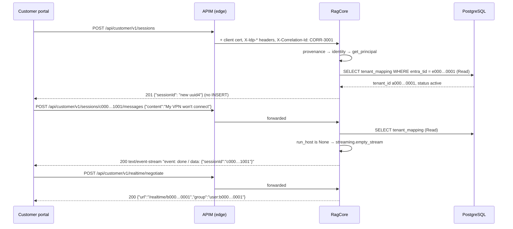
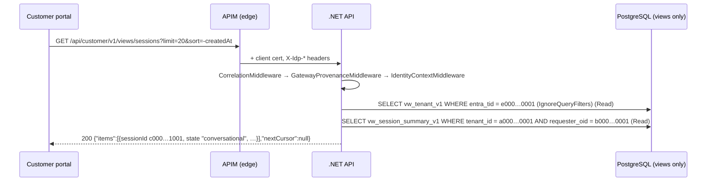
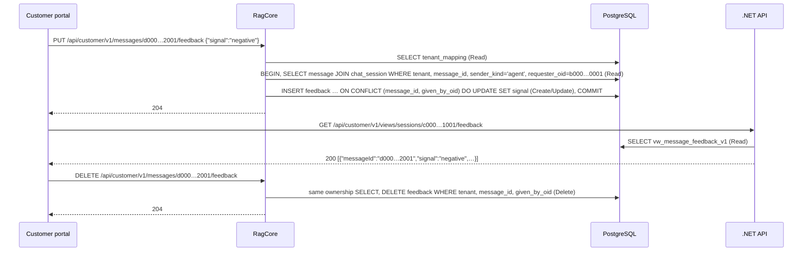
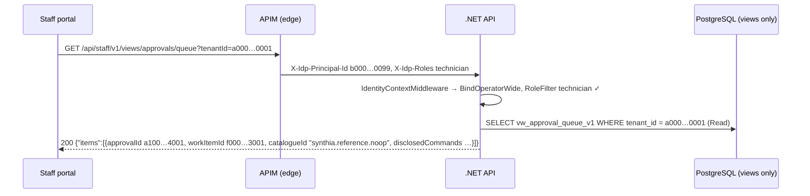
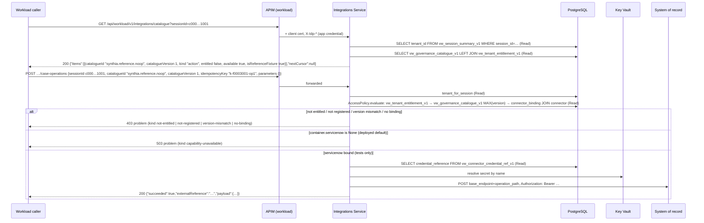
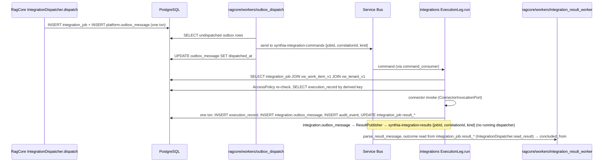

# Endpoints and scenarios — current implementation

Three HTTP services are implemented. Table/view details are in [database.md](database.md); file purposes are in [file-map.md](file-map.md).

| Service | Entry point | Port | DB role |
| ------- | ----------- | ---- | ------- |
| RagCore (FastAPI) | `ragcore.api.app:create_app` | 8000 | `synthia_ragcore` |
| .NET read API ("monolith") | `dotnet/src/Synthia.Api/Program.cs` | 8080 | `synthia_monolith` |
| Integrations Service (FastAPI) | `integrations.api.app:create_app` | 8000 | `synthia_integrations` |

**Common request pipeline.** Every service runs, in order: correlation (`X-Correlation-Id`, minted if absent) → gateway provenance (APIM client-certificate thumbprint allow-list; `/health/*` exempt) → identity (reads the APIM-set `X-Idp-Tenant-Id`, `X-Idp-Principal-Id`, `X-Idp-Roles`, `X-Idp-Credential-Class`, `X-Idp-Client-Surface`; rejects tenant/role/audience in the query). Audience comes from the path prefix: `/api/customer/`, `/api/staff/`, `/api/workload/`. Errors are RFC 9457 problem documents.

**Tenant admission.**
- RagCore: `deps.get_tenant` → `TenantRegistry.admit_end_user` → `SELECT … FROM platform.tenant_mapping WHERE entra_tid = :tid`. Runs only on routes that declare `TenantDep`.
- .NET: `IdentityContextMiddleware` → `TenantRegistry.FindAsync` → `SELECT … FROM platform.vw_tenant_v1 WHERE entra_tid = :tid` on every customer request. Staff requests skip it and get an operator-wide scope.

**What does not run today.**
- RagCore `graph_dependencies()` returns `None`: `Container.execution` is always `None`. So `app.state.run_host` is `None` and no LangGraph turn executes.
- All RagCore workers and the Integrations `command_consumer` have a `main()` that raises `NotImplementedError`.
- No code path inserts `chat_session`, `message`, `session_step`, `work_item`, `approval`, `consent`, `governance_record`, `tenant_entitlement`, `connector` or `connector_binding` rows. The read scenarios below assume those rows were seeded directly.

## A. Endpoint inventory

| Audience | Method | Endpoint | Service | Handler/Function | Purpose |
| -------- | ------ | -------- | ------- | ---------------- | ------- |
| Infra | GET | `/health/live` | RagCore | `api/health.py::live` | Liveness; no dependency check |
| Infra | GET | `/health/ready` | RagCore | `api/health.py::ready` | Readiness; `SELECT 1` on PostgreSQL |
| Infra | GET | `/openapi.json` | RagCore | `api/openapi.py::install_contract_openapi` | Generated OpenAPI (all audiences) |
| Infra | GET | `/docs` | RagCore | FastAPI default | Swagger UI |
| Infra | GET | `/redoc` | RagCore | FastAPI default | ReDoc UI |
| Customer | POST | `/api/customer/v1/sessions` | RagCore | `customer/sessions.py::start_session` | Returns a new session id (201) |
| Customer | POST | `/api/customer/v1/sessions/{sessionId}/messages` | RagCore | `customer/sessions.py::send_message` | Sends a turn; responds `text/event-stream` |
| Customer | POST | `/api/customer/v1/sessions/{sessionId}/answers` | RagCore | `customer/answers.py::answer_clarification` | **501 stub** |
| Customer | PUT | `/api/customer/v1/messages/{messageId}/feedback` | RagCore | `customer/feedback.py::record_feedback` | Records/replaces a thumbs signal (204) |
| Customer | DELETE | `/api/customer/v1/messages/{messageId}/feedback` | RagCore | `customer/feedback.py::withdraw_feedback` | Withdraws the signal (204, idempotent) |
| Customer | POST | `/api/customer/v1/realtime/negotiate` | RagCore | `customer/negotiate.py::negotiate` | Returns SignalR url + derived group |
| Customer | POST | `/api/customer/v1/work/{workItemId}/consent` | RagCore | `customer/routes.py::record_consent` | **501 stub** |
| Customer | GET | `/api/customer/v1/work/{workItemId}/instruction` | RagCore | `customer/routes.py::fetch_instruction` | **501 stub** |
| Customer | POST | `/api/customer/v1/work/{workItemId}/result` | RagCore | `customer/routes.py::record_result` | **501 stub** |
| Customer | POST | `/api/customer/v1/sample-flows/round-trip` | RagCore | `customer/sample_flows.py::begin_round_trip` | **501 stub** |
| Customer | GET | `/api/customer/v1/sample-flows/round-trip/{workItemId}` | RagCore | `customer/sample_flows.py::read_round_trip` | **501 stub** |
| Customer | POST | `/api/customer/v1/sample-flows/service-hop` | RagCore | `customer/sample_flows.py::service_hop` | **501 stub** |
| Staff | POST | `/api/staff/v1/approvals/{approvalId}/verdict` | RagCore | `staff/routes.py::record_verdict` | **501 stub** |
| Staff | POST | `/api/staff/v1/sessions/{sessionId}/takeover` | RagCore | `staff/routes.py::take_over_session` | **501 stub** |
| Staff | POST | `/api/staff/v1/sessions/{sessionId}/messages` | RagCore | `staff/routes.py::send_staff_message` | **501 stub** |
| Staff | POST | `/api/staff/v1/work/{workItemId}/cancel` | RagCore | `staff/routes.py::cancel_work` | **501 stub** |
| Workload | POST | `/api/workload/v1/work/{workItemId}/claim` | RagCore | `workload/routes.py::claim_work` | **501 stub** |
| Workload | POST | `/api/workload/v1/work/{workItemId}/outcome` | RagCore | `workload/routes.py::record_outcome` | **501 stub** |
| Infra | GET | `/health/live` | .NET | `Health/HealthEndpoints.cs::MapSynthiaHealth` | Liveness; no checks |
| Infra | GET | `/health/ready` | .NET | `Health/HealthEndpoints.cs::MapSynthiaHealth` | Readiness; Npgsql check on read DB |
| Infra | GET | `/openapi/customer.json` | .NET | `Contracts/ContractOpenApi.cs` (`MapOpenApi`) | Customer OpenAPI — **Development only** |
| Infra | GET | `/openapi/staff.json` | .NET | `Contracts/ContractOpenApi.cs` (`MapOpenApi`) | Staff OpenAPI — **Development only** |
| Customer | GET | `/api/customer/v1/views/sessions` | .NET | `CustomerViewEndpoints.ListSessionsAsync` | Caller's own sessions (cursor paged) |
| Customer | GET | `/api/customer/v1/views/sessions/{sessionId}` | .NET | `CustomerViewEndpoints.GetSessionAsync` | One own session |
| Customer | GET | `/api/customer/v1/views/sessions/{sessionId}/messages` | .NET | `CustomerViewEndpoints.ListMessagesAsync` | Conversation history (cursor paged) |
| Customer | GET | `/api/customer/v1/views/sessions/{sessionId}/steps` | .NET | `CustomerViewEndpoints.ListStepsAsync` | Step trail, oldest first |
| Customer | GET | `/api/customer/v1/views/sessions/{sessionId}/feedback` | .NET | `CustomerViewEndpoints.ListFeedbackAsync` | Current signals on the session |
| Staff | GET | `/api/staff/v1/views/sessions/live` | .NET | `StaffViewEndpoints.ListLiveSessionsAsync` | Open sessions, all orgs (`technician`) |
| Staff | GET | `/api/staff/v1/views/sessions/{sessionId}` | .NET | `StaffViewEndpoints.GetSessionAsync` | Session + step trail (`technician`) |
| Staff | GET | `/api/staff/v1/views/approvals/queue` | .NET | `StaffViewEndpoints.ListApprovalQueueAsync` | Pending approvals (`technician`) |
| Staff | GET | `/api/staff/v1/views/approvals/unexecuted` | .NET | `StaffViewEndpoints.ListUnexecutedApprovalsAsync` | Approved but not executed (`technician`) |
| Staff | GET | `/api/staff/v1/views/audit` | .NET | `StaffViewEndpoints.SearchAuditAsync` | Audit search (`technician`) |
| Staff | GET | `/api/staff/v1/views/dashboard/platform` | .NET | `StaffViewEndpoints.GetPlatformDashboardAsync` | Platform totals (`administrator`) |
| Staff | GET | `/api/staff/v1/views/tenants` | .NET | `StaffViewEndpoints.ListTenantsAsync` | Organisation registry (`administrator`) |
| Infra | GET | `/health/live` | Integrations | `api/health.py::build_health_router.live` | Liveness |
| Infra | GET | `/health/ready` | Integrations | `api/health.py::build_health_router.ready` | Readiness; `SELECT 1` when a DSN is set |
| Infra | GET | `/api/workload/v1/integrations/openapi.json` | Integrations | FastAPI (`openapi_url`) | Workload OpenAPI (`/docs`, `/redoc` disabled) |
| Workload | GET | `/api/workload/v1/integrations/catalogue` | Integrations | `workload/routes.py::read_catalogue` | Capability set for the org behind a session/work item |
| Workload | POST | `/api/workload/v1/integrations/case-operations` | Integrations | `workload/routes.py::create_case` | Synchronous system-of-record operation |

**Implementation vs specification.** Staff verdict/takeover/messages/cancel, consent, instruction/result, answers, claim/outcome and the sample flows are registered and published in OpenAPI but return `501` with a problem body. `POST /sessions` does not create a `chat_session` row (the spec defers the work record to the triage gate; the code also persists no session).

## B. Shared sample values

Used consistently in every scenario. All ids are UUIDs because every route parameter and header is UUID-validated.

```text
entraTid        = e0000000-0000-4000-8000-000000000001   (X-Idp-Tenant-Id)
tenantId        = a0000000-0000-4000-8000-000000000001   (tenant_mapping.tenant_id, "Contoso", active)
endUserOid      = b0000000-0000-4000-8000-000000000001   (X-Idp-Principal-Id, customer)
technicianOid   = b0000000-0000-4000-8000-000000000099   (X-Idp-Roles: technician)
sessionId       = c0000000-0000-4000-8000-000000001001
agentMessageId  = d0000000-0000-4000-8000-000000002001
workItemId      = f0000000-0000-4000-8000-000000003001
approvalId      = a1000000-0000-4000-8000-000000004001
correlationId   = CORR-3001                               (X-Correlation-Id; ≤128 chars, [A-Za-z0-9._-])
```

Seeded rows assumed by the read scenarios:

```text
platform.tenant_mapping: tenant_id=a000…0001, entra_tid=e000…0001, display_name="Contoso", status=active
platform.chat_session:   session_id=c000…1001, tenant_id=a000…0001, requester_oid=b000…0001,
                         state=conversational, closed_at=NULL, content_expires_at=NULL
platform.message:        message_id=d000…2001, session_id=c000…1001, tenant_id=a000…0001,
                         sender_kind=agent, sender_oid=NULL, body="Try restarting the VPN client."
```

---

## Scenario 1 — Customer starts a chat and opens the realtime channel (RagCore)

Covers `POST /sessions`, `POST /sessions/{sessionId}/messages`, `POST /realtime/negotiate`.



| Step | Detail |
| ---- | ------ |
| Start session | `start_session` depends on `PrincipalDep` + `TenantDep`. DB: **Read** `platform.tenant_mapping`. Returns `uuid4()`; nothing is written. |
| Send message | `send_message` builds `RunContext(tenant, requester=b000…0001, correlation_id=CORR-3001, session_id=c000…1001, work_item_id=None)`, truncates content to 8 000 chars. Because `app.state.run_host` is `None`, it streams a single `done` frame. DB: **Read** `tenant_mapping` only. Response header echoes `X-Correlation-Id: CORR-3001`. |
| Negotiate | `negotiate` uses `PrincipalDep` only. DB: None. Group is always `user:<principal oid>`; no body or query accepted. No SignalR call is made — it only returns the URL/group. |
| Azure | API Management (edge; provenance and identity headers). No other Azure call. |

---

## Scenario 2 — Customer reviews their conversation (.NET read API)

Covers the five `/api/customer/v1/views/*` routes.



| Request | Handler → read model | DB (all **Read**) | Response |
| ------- | -------------------- | ----------------- | -------- |
| `GET …/views/sessions?limit=20&sort=-createdAt&state=conversational` | `ListSessionsAsync` → `SessionReadModel.ListAsync` | `vw_session_summary_v1` | `CursorEnvelope<SessionSummary>` with session `c000…1001` |
| `GET …/views/sessions/c000…1001` | `GetSessionAsync` → `SessionReadModel.FindAsync` | `vw_session_summary_v1` | `SessionSummary`; 404 if not the caller's |
| `GET …/views/sessions/c000…1001/messages?senderKind=agent` | `ListMessagesAsync` → `SessionReadModel.ListMessagesAsync` | `vw_session_summary_v1` (ownership subquery) + `vw_session_message_v1` | Page with message `d000…2001`, `senderKind "agent"`, body "Try restarting the VPN client." |
| `GET …/views/sessions/c000…1001/steps` | `ListStepsAsync` → `SessionReadModel.ListStepsAsync` | `vw_session_summary_v1` + `vw_session_step_v1` | `[]` (no steps seeded) |
| `GET …/views/sessions/c000…1001/feedback` | `ListFeedbackAsync` → `FeedbackReadModel.ListForSessionAsync` | `vw_session_summary_v1` + `vw_message_feedback_v1` | Signals; see Scenario 3 |

Every query also has the EF global filter `tenant_id = a000…0001` (`SynthiaReadContext.TenantScopedView`). Unknown query parameters → 400; `tenantId` on a customer route → 400. Azure: API Management (edge); Key Vault via configuration provider at startup only.

---

## Scenario 3 — Customer rates an agent message, then withdraws it

Covers `PUT` and `DELETE /api/customer/v1/messages/{messageId}/feedback`; the result is read back with Scenario 2's feedback route.



Record after the `PUT`:

```text
platform.feedback:
  feedback_id  = <uuid4>
  message_id   = d0000000-0000-4000-8000-000000002001
  session_id   = c0000000-0000-4000-8000-000000001001
  given_by_oid = b0000000-0000-4000-8000-000000000001
  signal       = negative
  tenant_id    = a0000000-0000-4000-8000-000000000001
```

- Chain: `record_feedback` → `container.unit_of_work()` → `FeedbackRepository.record` (`persistence/repositories.py`).
- A second `PUT` with `{"signal":"positive"}` updates the same row (unique constraint `uq_feedback_message_id_given_by_oid`).
- 404 (not 403) when the message is not an agent message in the caller's own session. `DELETE` returns 204 even if no signal existed.
- Azure: API Management (edge). No message is published; feedback writes no outbox row.

---

## Scenario 4 — Technician and administrator monitor the platform (.NET read API)

Covers the seven `/api/staff/v1/views/*` routes. Staff requests skip tenant admission (`BindOperatorWide`); `tenantId` is accepted only as a narrowing filter. Each route declares its role with `AcceptsRoles` (`Authorization/RoleFilter.cs`).

Additional seeded rows for this scenario:

```text
platform.work_item:  work_item_id=f000…3001, tenant_id=a000…0001, session_id=c000…1001,
                     requested_by_oid=b000…0001, state=awaiting_decision, approval_state=pending
platform.governance_record: catalogue_id="synthia.reference.noop", version=1, kind=action,
                     default_treatment=STAFF_APPROVAL, is_reference_fixture=true, requires_elevation=false
platform.operation:  work_item_id=f000…3001, catalogue_id="synthia.reference.noop", catalogue_version=1, status=gated
platform.approval:   approval_id=a100…4001, work_item_id=f000…3001, requested_at=2026-09-18T09:00Z,
                     decided_at=NULL, verdict=NULL
```



| Request (role) | Handler → read model | DB (all **Read**) | Sample result |
| -------------- | -------------------- | ----------------- | ------------- |
| `GET …/views/sessions/live?state=conversational` (technician) | `ListLiveSessionsAsync` → `SessionReadModel.ListLiveAsync` | `vw_session_summary_v1 WHERE closed_at IS NULL` | Session `c000…1001` |
| `GET …/views/sessions/c000…1001` (technician) | `GetSessionAsync` → `FindAsync` + `ListStepsAsync` | `vw_session_summary_v1`, `vw_session_step_v1` | `{session, steps: []}` |
| `GET …/views/approvals/queue` (technician) | `ListApprovalQueueAsync` → `ApprovalReadModel.ListQueueAsync` | `vw_approval_queue_v1` | Approval `a100…4001` |
| `GET …/views/approvals/unexecuted` (technician) | `ListUnexecutedApprovalsAsync` → `ApprovalReadModel.ListUnexecutedAsync` | `vw_approval_unexecuted_v1` | Empty (approval undecided) |
| `GET …/views/audit?workItemId=f000…3001&occurredFrom=2026-09-18T00:00:00Z&occurredTo=2026-09-19T00:00:00Z` (technician) | `SearchAuditAsync` → `AuditReadModel.SearchAsync` | `vw_audit_event_v1` | Empty (no audit writer runs) |
| `GET …/views/dashboard/platform` (administrator) | `GetPlatformDashboardAsync` → `TenantReadModel.GetPlatformAsync` | `vw_dashboard_rollup_v1` (summed in memory) | `{sessionCount:1, approvalCount:0, unexecutedApprovalCount:0, …}`; 404 if no rows |
| `GET …/views/tenants?status=active` (administrator) | `ListTenantsAsync` → `TenantReadModel.ListAsync` | `vw_tenant_v1` | Contoso `a000…0001` |

A technician calling `dashboard/platform` or `tenants` gets 403 (`RoleFilter`); roles are disjoint, not a ladder. Azure: API Management (edge).

---

## Scenario 5 — Workload reads the capability catalogue and runs a case operation (Integrations)

Covers `GET /api/workload/v1/integrations/catalogue` and `POST /api/workload/v1/integrations/case-operations`. Caller: a workload principal via APIM (e.g. RagCore's `platform_clients/integrations.py::IntegrationsClient`, which is constructed but has no live caller).



| Step | Detail |
| ---- | ------ |
| Catalogue | `read_catalogue` requires exactly one of `sessionId` / `workItemId` (else 400). Unknown object → 404. `TenantResolver` → `CatalogueRepository.capabilities_for`. `available` is hard-coded `true` (no reachability check runs). DB: **Read** only. |
| Case operation | `create_case` → `TenantResolver.tenant_for_session` → `AccessPolicy.evaluate` (entitled → registered version → binding) → `ServiceNowAdapter.create_case`. `idempotencyKey` must be ≥ 8 chars. DB: **Read** only; nothing is written on this path. |
| Deployed behaviour | The Dockerfile runs `create_app()` → `build_container()` with no secret resolver, so `servicenow` is `None`. A request that passes the policy check returns **503**. |
| Azure | API Management (edge). Key Vault only on the bound-adapter branch, via `SecretResolverPort`. No concrete Key Vault resolver exists in `integrations/src` (Not found in current implementation). |

---

## Scenario 6 — Registered-but-unimplemented routes return 501

Covers the 13 RagCore stub routes. All return `501` with `application/problem+json`, built by `middleware/problems.py::not_implemented`.

```text
POST /api/staff/v1/approvals/a1000000-0000-4000-8000-000000004001/verdict
  X-Idp-Roles: technician, X-Correlation-Id: CORR-3001
  body {"verdict":"approved","note":"ok"}
    ↓ provenance → identity → get_principal (audience=staff)
    ↓ staff/routes.py::record_verdict
    ↓ DB: None
  501 {"type": ".../not-implemented", "status": 501, "correlationId": "CORR-3001", …}
```

| Route | Dependencies resolved before 501 | DB |
| ----- | -------------------------------- | -- |
| `POST …/sessions/{sessionId}/answers` | Principal, Tenant, Container | **Read** `tenant_mapping` |
| `POST …/sample-flows/round-trip`, `GET …/sample-flows/round-trip/{workItemId}`, `POST …/sample-flows/service-hop` | Principal, Tenant | **Read** `tenant_mapping` |
| `POST …/work/{workItemId}/consent` `{"verdict":"granted"}`, `GET …/instruction`, `POST …/result` `{"exitStatus":0}` | Principal only | None |
| Staff `verdict`, `takeover`, `messages` `{"content":"…"}`, `cancel` | Principal only | None |
| Workload `claim`, `outcome` `{"status":"done","verification":"client_attested"}` | Principal only | None |

Body validation still runs, so a malformed body returns 422, not 501. Azure: API Management (edge) only.

---

## Scenario 7 — Probes and API documents

| Request | Service | Behaviour | DB | Azure |
| ------- | ------- | --------- | -- | ----- |
| `GET /health/live` | all three | 200, no checks; exempt from provenance/identity | None | None |
| `GET /health/ready` | RagCore | `engine.connect()` + `SELECT 1`; 503 if unreachable | Read (`SELECT 1`) | None |
| `GET /health/ready` | .NET | `AddNpgSql` check tagged `ready` against `ReadDatabase:ConnectionString` | Read (`SELECT 1`) | None |
| `GET /health/ready` | Integrations | `ReadinessRegistry.all_ready()`; `SELECT 1` registered only when a DSN is configured | Read (`SELECT 1`) | None |
| `GET /openapi.json`, `/docs`, `/redoc` | RagCore | Generated from `app.routes`; behind gateway provenance | None | None |
| `GET /openapi/customer.json`, `/openapi/staff.json` | .NET | Mapped only when `ASPNETCORE_ENVIRONMENT=Development` | None | None |
| `GET /api/workload/v1/integrations/openapi.json` | Integrations | Generated; behind provenance | None | None |

---

## Asynchronous paths in code (not triggered by any endpoint)

These are implemented and unit-tested as functions, but nothing runs them today: every worker `main()` raises `NotImplementedError`, and no route calls `IntegrationDispatcher.dispatch`. They are shown so a developer can find the code; they are not part of the endpoint coverage below.



Other worker functions: `expiry_sweep.sweep_expired` (UPDATE `work_item` state), `retention_sweep.sweep_tenant` (DELETE `chat_session` + cascades, LangGraph checkpoint threads), `ingestion_run.open_run/close_run` (INSERT/UPDATE `ingestion_run`), `resume_worker` (parses `synthia-triggers`, dead-letters unhandled kinds).

---

## C. Scenario coverage matrix

| Endpoint | Scenario | DB Operation | Azure Component | Covered |
| -------- | -------- | ------------ | --------------- | ------- |
| RagCore `GET /health/live` | 7 | DB: None | Azure: None | ✓ |
| RagCore `GET /health/ready` | 7 | Read (`SELECT 1`) | Azure: None | ✓ |
| RagCore `GET /openapi.json` | 7 | DB: None | Azure: None | ✓ |
| RagCore `GET /docs` | 7 | DB: None | Azure: None | ✓ |
| RagCore `GET /redoc` | 7 | DB: None | Azure: None | ✓ |
| `POST /api/customer/v1/sessions` | 1 | Read `tenant_mapping` | APIM | ✓ |
| `POST /api/customer/v1/sessions/{sessionId}/messages` | 1 | Read `tenant_mapping` | APIM | ✓ |
| `POST /api/customer/v1/sessions/{sessionId}/answers` | 6 | Read `tenant_mapping` | APIM | ✓ |
| `PUT /api/customer/v1/messages/{messageId}/feedback` | 3 | Read `tenant_mapping`, `message`, `chat_session`; Create/Update `feedback` | APIM | ✓ |
| `DELETE /api/customer/v1/messages/{messageId}/feedback` | 3 | Read `tenant_mapping`, `message`, `chat_session`; Delete `feedback` | APIM | ✓ |
| `POST /api/customer/v1/realtime/negotiate` | 1 | DB: None | APIM | ✓ |
| `POST /api/customer/v1/work/{workItemId}/consent` | 6 | DB: None | APIM | ✓ |
| `GET /api/customer/v1/work/{workItemId}/instruction` | 6 | DB: None | APIM | ✓ |
| `POST /api/customer/v1/work/{workItemId}/result` | 6 | DB: None | APIM | ✓ |
| `POST /api/customer/v1/sample-flows/round-trip` | 6 | Read `tenant_mapping` | APIM | ✓ |
| `GET /api/customer/v1/sample-flows/round-trip/{workItemId}` | 6 | Read `tenant_mapping` | APIM | ✓ |
| `POST /api/customer/v1/sample-flows/service-hop` | 6 | Read `tenant_mapping` | APIM | ✓ |
| `POST /api/staff/v1/approvals/{approvalId}/verdict` | 6 | DB: None | APIM | ✓ |
| `POST /api/staff/v1/sessions/{sessionId}/takeover` | 6 | DB: None | APIM | ✓ |
| `POST /api/staff/v1/sessions/{sessionId}/messages` | 6 | DB: None | APIM | ✓ |
| `POST /api/staff/v1/work/{workItemId}/cancel` | 6 | DB: None | APIM | ✓ |
| `POST /api/workload/v1/work/{workItemId}/claim` | 6 | DB: None | APIM | ✓ |
| `POST /api/workload/v1/work/{workItemId}/outcome` | 6 | DB: None | APIM | ✓ |
| .NET `GET /health/live` | 7 | DB: None | Azure: None | ✓ |
| .NET `GET /health/ready` | 7 | Read (`SELECT 1`) | Azure: None | ✓ |
| .NET `GET /openapi/customer.json` | 7 | DB: None | Azure: None | ✓ |
| .NET `GET /openapi/staff.json` | 7 | DB: None | Azure: None | ✓ |
| `GET /api/customer/v1/views/sessions` | 2 | Read `vw_tenant_v1`, `vw_session_summary_v1` | APIM | ✓ |
| `GET /api/customer/v1/views/sessions/{sessionId}` | 2 | Read `vw_tenant_v1`, `vw_session_summary_v1` | APIM | ✓ |
| `GET /api/customer/v1/views/sessions/{sessionId}/messages` | 2 | Read `vw_tenant_v1`, `vw_session_summary_v1`, `vw_session_message_v1` | APIM | ✓ |
| `GET /api/customer/v1/views/sessions/{sessionId}/steps` | 2 | Read `vw_tenant_v1`, `vw_session_summary_v1`, `vw_session_step_v1` | APIM | ✓ |
| `GET /api/customer/v1/views/sessions/{sessionId}/feedback` | 2, 3 | Read `vw_tenant_v1`, `vw_session_summary_v1`, `vw_message_feedback_v1` | APIM | ✓ |
| `GET /api/staff/v1/views/sessions/live` | 4 | Read `vw_session_summary_v1` | APIM | ✓ |
| `GET /api/staff/v1/views/sessions/{sessionId}` | 4 | Read `vw_session_summary_v1`, `vw_session_step_v1` | APIM | ✓ |
| `GET /api/staff/v1/views/approvals/queue` | 4 | Read `vw_approval_queue_v1` | APIM | ✓ |
| `GET /api/staff/v1/views/approvals/unexecuted` | 4 | Read `vw_approval_unexecuted_v1` | APIM | ✓ |
| `GET /api/staff/v1/views/audit` | 4 | Read `vw_audit_event_v1` | APIM | ✓ |
| `GET /api/staff/v1/views/dashboard/platform` | 4 | Read `vw_dashboard_rollup_v1` | APIM | ✓ |
| `GET /api/staff/v1/views/tenants` | 4 | Read `vw_tenant_v1` | APIM | ✓ |
| Integrations `GET /health/live` | 7 | DB: None | Azure: None | ✓ |
| Integrations `GET /health/ready` | 7 | Read (`SELECT 1`) | Azure: None | ✓ |
| Integrations `GET /api/workload/v1/integrations/openapi.json` | 7 | DB: None | Azure: None | ✓ |
| `GET /api/workload/v1/integrations/catalogue` | 5 | Read `vw_session_summary_v1` or `vw_work_item_v1`, `vw_governance_catalogue_v1`, `vw_tenant_entitlement_v1` | APIM | ✓ |
| `POST /api/workload/v1/integrations/case-operations` | 5 | Read `vw_session_summary_v1`, `vw_tenant_entitlement_v1`, `vw_governance_catalogue_v1`, `connector_binding`, `connector` (+ `vw_connector_credential_ref_v1` when bound) | APIM; Key Vault when adapter bound | ✓ |

## D. Implementation traceability

| Endpoint | Route/Handler | Main Function/Service | DB Objects | CRUD | Azure/External Component |
| -------- | ------------- | --------------------- | ---------- | ---- | ------------------------ |
| `POST …/customer/v1/sessions` | `ragcore/api/customer/sessions.py::start_session` | `deps.get_tenant` → `TenantRegistry.admit_end_user` | `tenant_mapping` | R | APIM |
| `POST …/sessions/{id}/messages` | `sessions.py::send_message` | `RunHost.stream_turn` if hosted, else `streaming.empty_stream` | `tenant_mapping` | R | APIM |
| `POST …/sessions/{id}/answers` | `customer/answers.py::answer_clarification` | `problems.not_implemented` | `tenant_mapping` | R | APIM |
| `PUT …/messages/{id}/feedback` | `customer/feedback.py::record_feedback` | `FeedbackRepository.record` | `tenant_mapping`, `message`, `chat_session`, `feedback` | R, C/U | APIM |
| `DELETE …/messages/{id}/feedback` | `customer/feedback.py::withdraw_feedback` | `FeedbackRepository.withdraw` | `tenant_mapping`, `message`, `chat_session`, `feedback` | R, D | APIM |
| `POST …/realtime/negotiate` | `customer/negotiate.py::negotiate` | `group_for` | — | — | APIM |
| `POST/GET …/work/{id}/consent\|instruction\|result` | `customer/routes.py` | `not_implemented` | — | — | APIM |
| `POST/GET …/sample-flows/*` | `customer/sample_flows.py` | `get_tenant` → `not_implemented` | `tenant_mapping` | R | APIM |
| `POST …/staff/v1/*` (4 routes) | `ragcore/api/staff/routes.py` | `not_implemented` | — | — | APIM |
| `POST …/workload/v1/work/{id}/claim\|outcome` | `ragcore/api/workload/routes.py` | `not_implemented` | — | — | APIM |
| RagCore `/health/*`, `/openapi.json`, `/docs`, `/redoc` | `ragcore/api/health.py`, `api/openapi.py` | `ready` → `engine.connect` | — | R (`SELECT 1`) | — |
| `GET …/customer/v1/views/sessions[/{id}]` | `dotnet/.../Endpoints/CustomerViewEndpoints.cs` | `IdentityContextMiddleware` → `TenantRegistry.FindAsync`; `SessionReadModel.ListAsync/FindAsync` | `vw_tenant_v1`, `vw_session_summary_v1` | R | APIM |
| `GET …/views/sessions/{id}/messages\|steps` | `CustomerViewEndpoints.cs` | `SessionReadModel.ListMessagesAsync/ListStepsAsync` | `vw_session_summary_v1`, `vw_session_message_v1`, `vw_session_step_v1` | R | APIM |
| `GET …/views/sessions/{id}/feedback` | `CustomerViewEndpoints.cs` | `FeedbackReadModel.ListForSessionAsync` | `vw_session_summary_v1`, `vw_message_feedback_v1` | R | APIM |
| `GET …/staff/v1/views/sessions/live\|{id}` | `dotnet/.../Endpoints/StaffViewEndpoints.cs` | `SessionReadModel.ListLiveAsync/FindAsync/ListStepsAsync` | `vw_session_summary_v1`, `vw_session_step_v1` | R | APIM |
| `GET …/views/approvals/queue\|unexecuted` | `StaffViewEndpoints.cs` | `ApprovalReadModel.ListQueueAsync/ListUnexecutedAsync` | `vw_approval_queue_v1`, `vw_approval_unexecuted_v1` | R | APIM |
| `GET …/views/audit` | `StaffViewEndpoints.cs` | `AuditReadModel.SearchAsync` | `vw_audit_event_v1` | R | APIM |
| `GET …/views/dashboard/platform\|tenants` | `StaffViewEndpoints.cs` | `TenantReadModel.GetPlatformAsync/ListAsync` | `vw_dashboard_rollup_v1`, `vw_tenant_v1` | R | APIM |
| .NET `/health/*`, `/openapi/*.json` | `dotnet/.../Health/HealthEndpoints.cs`, `Contracts/ContractOpenApi.cs` | Npgsql health check | — | R (`SELECT 1`) | — |
| `GET …/integrations/catalogue` | `integrations/api/workload/routes.py::read_catalogue` | `TenantResolver`, `CatalogueRepository.capabilities_for` | `vw_session_summary_v1`/`vw_work_item_v1`, `vw_governance_catalogue_v1`, `vw_tenant_entitlement_v1` | R | APIM |
| `POST …/integrations/case-operations` | `workload/routes.py::create_case` | `AccessPolicy.evaluate` → `ConnectorRegistry.binding_for` → `ServiceNowAdapter.create_case` → `TenantCredentialResolver.resolve` | above + `connector_binding`, `connector`, `vw_connector_credential_ref_v1` | R | APIM; Key Vault; system of record over HTTPS |
| Integrations `/health/*`, `openapi.json` | `integrations/api/health.py`, `api/app.py` | `ReadinessProbeAdapter.check` | — | R (`SELECT 1`) | — |

### Coverage Check

```text
Implemented endpoints: 44   (RagCore 23, .NET 16, Integrations 5)
Endpoints covered by scenarios: 44
Database tables: 20   (platform 16, integration 4)
Database views: 13
Azure components referenced by code: 8
  API Management (edge gateway provenance, AI Gateway model egress, Integrations client base URL),
  Key Vault, Service Bus, Entra ID managed identity (DefaultAzureCredential),
  Azure Monitor / Application Insights, AI Search, Cache for Redis, SignalR Service
  (PostgreSQL is reached by DSN; "Azure Database for PostgreSQL" appears only in build/infra and build/policy.)
```
